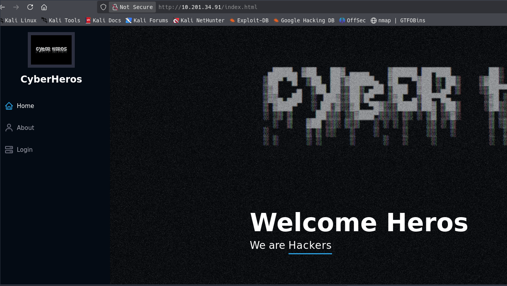
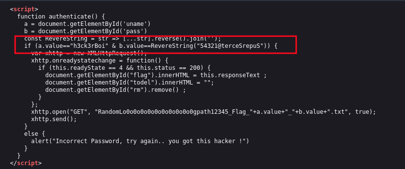
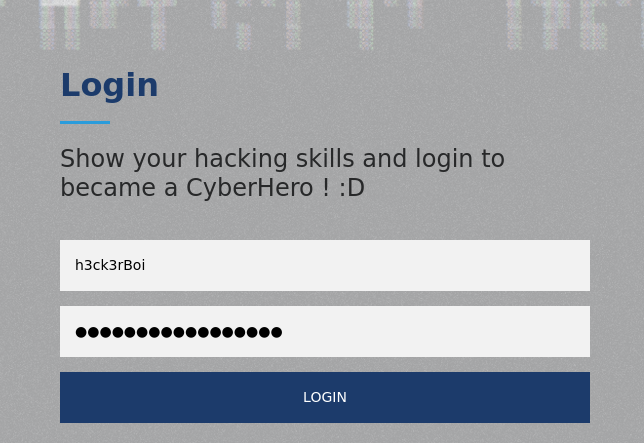
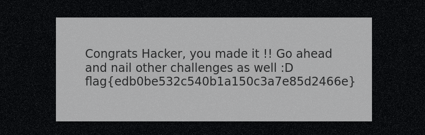

# CyberHeroes

## Enumeration

### Nmap

```bash
nmap -p- --open -sS --min-rate 5000 -n -Pn 10.201.34.91 -oN allPorts.txt

PORT   STATE SERVICE
22/tcp open  ssh
80/tcp open  http
```

Enumeración de servicios y vulnerabilidades mas comunes

```bash
nmap -sC -sV -p22,80 10.201.34.91 -oN target.txt

PORT   STATE SERVICE VERSION
22/tcp open  ssh     OpenSSH 8.2p1 Ubuntu 4ubuntu0.4 (Ubuntu Linux; protocol 2.0)
| ssh-hostkey: 
|   3072 2f:e3:f1:96:65:4c:55:4a:32:9a:a0:0b:5a:1b:85:cc (RSA)
|   256 4e:f5:c3:04:ff:d3:6b:b2:0b:42:fb:c3:9f:01:0b:cc (ECDSA)
|_  256 3d:b7:f3:40:51:3d:5f:b0:f1:26:45:50:2a:94:3e:74 (ED25519)
80/tcp open  http    Apache httpd 2.4.48 ((Ubuntu))
|_http-server-header: Apache/2.4.48 (Ubuntu)
|_http-title: CyberHeros : Index
Service Info: OS: Linux; CPE: cpe:/o:linux:linux_kernel
```

### HTTP

```bash
whatweb http://10.201.34.91         
http://10.201.34.91 [200 OK] Apache[2.4.48], Bootstrap, Country[RESERVED][ZZ], HTML5, HTTPServer[Ubuntu Linux][Apache/2.4.48 (Ubuntu)], IP[10.201.34.91], Lightbox, Script, Title[CyberHeros : Index]
```





```bash
h3ck3rBoi / 54321@terceSrepuS

echo "54321@terceSrepuS" | rev             
SuperSecret@12345
```

## Exploit

| user | pass |
|---|---|
| h3ck3rBoi | SuperSecret@12345 |




